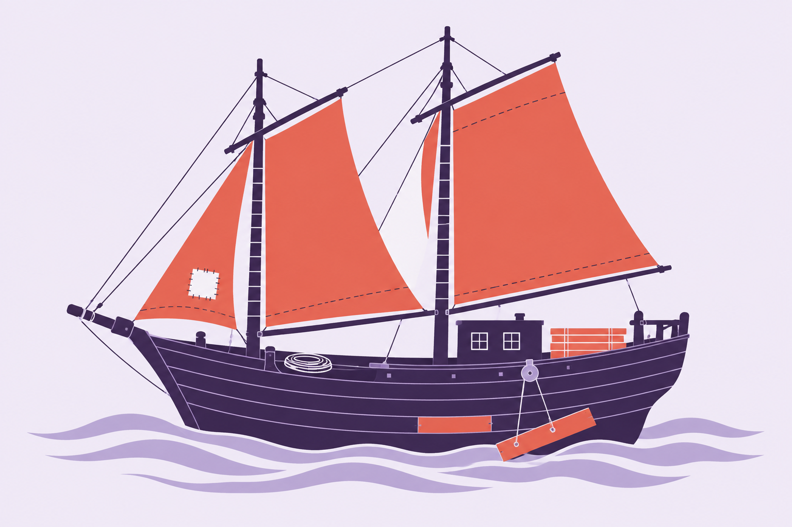
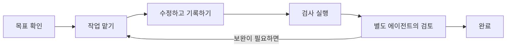

<p align="center">
  
</p>

<h1 align="center">N E U R A T H</h1>
<p align="center"><strong>대화가 끝나도, 작업은 이어지도록.</strong></p>
<p align="center">Claude Code와 Codex를 위한 하네스 키트.<br>하던 일을 이어가고, 경험을 쌓으며 작업 방식을 다듬습니다.</p>
<p align="center"><a href="README.md">English</a> · <strong>한국어</strong></p>
<p align="center"><a href="#시작하기">시작하기</a> · <a href="#작동-방식">작동 방식</a> · <a href="ONBOARDING.md">설치 안내</a> · <a href="CONTRIBUTING.md">개발 참여</a> · <a href="docs/validation.md">검증 결과</a></p>

---

에이전트와 오래 작업하다 보면 대화를 새로 열거나, 중단했던 작업을 다시 시작할 때가 있습니다.
그때마다 목표와 진행 상황을 처음부터 설명해야 한다면 개발 흐름이 끊깁니다.

Neurath는 목표와 결정, 진행 상황, 작업하며 얻은 교훈을 프로젝트에 남깁니다.
Claude Code나 Codex에서 새 대화를 열면 관련 기록을 자동으로 불러옵니다.
실패를 해결한 실행 방법은 다음 세션에서 시험하고 검증해 유지하며, 다시 실패하면 철회합니다.

이름은 항해 중에도 배를 고쳐 나간다는 **노이라트의 배**에서 가져왔습니다.
개발을 이어가면서 작업 방식도 다듬어 나가자는 뜻입니다.
사용 중인 프로젝트에 설치하고, 그 프로젝트의 문서와 개발 도구에 맞춰 연결하세요.

## 시작하기

이 저장소를 복제하거나 내려받은 뒤, 하네스를 사용할 Git 저장소 경로를 지정하세요.

```sh
./setup /absolute/path/to/your-project
```

설치에 필요한 Python 3.14와 Neurath 전용 실행 환경은 uv로 자동 준비합니다.
프로젝트에 하네스를 설치한 뒤 정상적으로 설치됐는지 확인합니다.
기존 프로젝트의 의존성과 `.venv`는 그대로 두며, Claude Code와 Codex를 모두 설정합니다.
다른 프로젝트를 설치하거나 갱신해도 이 프로젝트의 실행 환경은 바뀌지 않습니다.

기존 스킬과 이름이 겹치면 `./setup /path/to/project --skill-prefix neurath-`로 설치하세요.
Neurath 스킬을 `/neurath-debug`처럼 호출하며, 기존 스킬을 보존합니다.
업데이트할 때는 설치 시 선택한 접두어를 유지합니다.

설치한 프로젝트의 에이전트에게 다음과 같이 요청하세요.

> `.neurath/policy.md`와 `.neurath/project.json`을 읽고, 이 프로젝트의 실제 문서와
> 검증 명령을 연결해주세요. 설치된 훅을 확인하고 Neurath로 첫 작업을 시작해주세요.

사용하는 에이전트에서 설치된 훅을 확인한 뒤 새 세션을 시작하세요.
Codex에서는 `/hooks`를 열어 Neurath 훅을 신뢰하도록 설정해야 합니다.
한쪽 에이전트에만 설치하거나, 설치 내용을 미리 보고 싶다면 [설치 안내](ONBOARDING.md)를 참고하세요.
업데이트와 제거 방법도 함께 설명합니다.

<details>
<summary>설치 후 자주 쓰는 명령</summary>

```sh
neurath setup /path/to/another-project
neurath setup --dry-run
.neurath/run doctor --protocol
.neurath/run verify check   # 프로젝트의 check 명령을 연결한 뒤 실행
```

`neurath` 명령을 찾을 수 없다고 나오면, 설치가 끝날 때 안내된 실행 파일의 전체 경로를 사용하세요.

</details>

## 작동 방식



| 이런 작업을 돕습니다 | 이렇게 동작합니다 |
| --- | --- |
| 새 대화나 다른 에이전트에서 이어가기 | 프로젝트에 남긴 기억과 인계 내용을 자동으로 불러옵니다. |
| 경험을 다음 작업에 반영하기 | 교훈을 이어받고, 실행 방법을 시험·검증해 유지하거나 철회합니다. |
| 여러 에이전트와 협력하기 | provider를 선택하고, 독립 작업끼리 대화하며 작업별 수정 권한을 유지합니다. |
| 실제로 검사가 통과했는지 확인하기 | 실행 명령과 결과, 변경 내역, 테스트별 통과 여부를 기록합니다. |
| 검토를 거쳐 작업 마무리하기 | 별도 에이전트가 결과를 검토하고, 담당 에이전트가 그 결과를 확인합니다. |
| 프로젝트에 맞춰 사용하기 | 기존 문서, 검사 명령, 작성 언어, 보호할 파일을 직접 지정합니다. |
| 설치 전 상태로 돌아가기 | 설치 전 파일을 보관해 되돌리기와 제거에 사용합니다. |

계획부터 구현, 리뷰, 검증까지 **31개 스킬**을 두 에이전트에서 함께 사용합니다.
이 중 29개에는 각 단계를 진행하거나 완료하기 위한 조건이 정해져 있습니다.
프로젝트의 검사 명령과 문서는 `.neurath/project.json`에 지정합니다.

## 다른 에이전트와 함께 작업하기

원하는 provider와 모델에게 의견을 묻거나, 같은 프로젝트에서 진행 중인 다른 작업에 연락할 수
있습니다. 독립 작업과 서브에이전트가 각자의 주소로 질문·답변하고 변경 소식을 구독합니다.
메시지는 중단 뒤에도 남으며 연결된 worktree에서도 공유합니다.

```sh
.neurath/run delegate run --provider claude-code --model claude-fable-5-1 \
  --assignment "이 설계의 문제점과 대안을 검토해주세요"
.neurath/run agent discover
```

두 호스트에서 같은 명령을 사용합니다. 호스트의 메시지 도구가 있으면 즉시 알리고, 그 외에는
수신자의 다음 훅이나 재개 때 전달합니다. 각 작업은 자신의 목표와 권한을 유지합니다.
[Provider 선택과 작업 간 대화](docs/agents.md)에 명령·전달 상태·지원 범위를 정리했습니다.

**Newsroom**에서는 서로 다른 주제를 맡은 active 서브에이전트와 세션이 발견을 공유합니다.
기사는 30자 이내 제목과 본문으로 나누고, 동료의 다음 호스트 훅에는 제목과 조회 ID만
전달합니다. 각 에이전트는 자신의 작업에 관련 있는 기사만 본문을 읽습니다. 대기·종료된
에이전트는 참여하지 않으며, 재개할 때 놓친 알림을 몰아서 보내거나 알림 때문에 세션을
깨우지 않습니다. shell 없는 worker도 설치된 전용 MCP 도구로 기사 발행과 조회를 할 수 있습니다.

## 대화가 바뀌어도 남는 기억

새 대화에서 “작업 기록 내보내기를 이어서 구현해주세요”라고 요청할 수 있습니다.
같은 로컬 Git 저장소와 연결된 worktree에서 남긴 목표, 결정, 할 일을 현재 요청에 맞춰 불러옵니다.
요청과 관측된 명령 실행은 작업 중에도 기록하며, 명령을 사용한 턴이 끝날 때 인계가 빠져 있으면
훅이 작성을 요청합니다. 강제로 중단해도 그전에 저장한 기록은 남습니다.

기억·회고·개선 후보 검증은 작업 중인 세션에서 기본으로 수행합니다. 매번 학습을 지시할
필요는 없습니다. 피드백과 실패에서 얻은 교훈도 인계에 담습니다. 명령 실행 방법은 더 엄격하게 다룹니다.
같은 작업에서 실패한 방법과 성공한 대안을 관측하고, 프로젝트 검사를 통과하면 다음 세션에
시험 적용합니다. 다른 세션에서 재사용하고 검사까지 통과하면 유지하고, 이후 실패하면 철회합니다.
명령 출력에 “성공”이라고 적혀 있다는 이유만으로 통과 처리하지 않습니다.

```sh
.neurath/run memory recall --query "작업 기록 내보내기"
.neurath/run learning status
```

기억은 훅이 활성화된 같은 로컬 저장소에서 공유합니다. 별도로 복제한 저장소나 다른 컴퓨터까지
동기화하지는 않으며, 저장하기 전에 사라진 내용은 복구할 수 없습니다. 과거 대화 전체를 매번
불러오는 대신 관련 기록을 고릅니다. 학습으로 달라지는 것은 에이전트의 작업 지침과 실행 전략이며,
Neurath 소스 코드가 저절로 바뀌는 기능은 아닙니다. [기억과 학습 안내](docs/memory.ko.md)에 동작 범위를 정리했습니다.

## 기존 프로젝트를 위한 구성

- **프로젝트의 언어와 도구를 그대로 사용합니다.** 별도의 앱 구조나 프레임워크를 추가하지 않습니다.
- **작업 기록은 로컬에 보관합니다.** 진행 기록은 `.neurath/local`에, 설치 변경 내역은 Git의 로컬 디렉터리에 저장합니다.
- **기존 설정을 보존합니다.** 에이전트 지침, 훅, 권한, 직접 수정한 프로젝트 설정을 유지합니다.
- **설치와 실행을 각각 확인합니다.** 파일이 올바르게 설치됐는지, 실제 에이전트에서 동작하는지, 검사와 검토를 통과했는지 따로 확인합니다.

지원 환경은 **macOS 또는 Linux, Git, Claude Code 또는 Codex**입니다.
Python 3.14는 설치 과정에서 준비합니다. 에이전트별 동작과 지금까지 확인한 범위는
[호스트 안내](docs/hosts.md)와 [검증 결과](docs/validation.md)에서 볼 수 있습니다.

## Neurath 개선하기

Neurath를 개발할 때도 이 하네스를 사용합니다. 개발용 환경과 하네스 실행 환경은 따로 관리합니다.

```sh
uv sync --locked
uv run --locked python tools/check.py
./setup --self
```

실행 코드나 설치 자산을 수정한 뒤에는 무결성 검사 목록인 manifest를 갱신하고 검사를 실행하세요.
그다음 `./setup --self`를 다시 실행하면 이 저장소에도 수정한 하네스가 적용됩니다.
자세한 절차는 [CONTRIBUTING.md](CONTRIBUTING.md)에 정리했습니다.

[기억과 학습](docs/memory.ko.md) · [구조](docs/architecture.md) · [프로젝트 연결](docs/profiles.md) ·
[설치와 복구](ONBOARDING.md) · [검증](docs/validation.md) · [개발 출처](NOTICE.md)

[하네스 용어 안내](docs/terminology.md)
