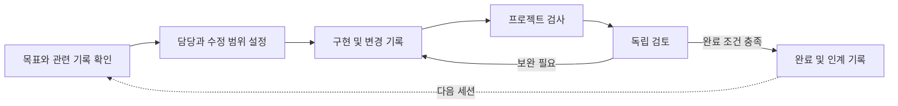

<!-- date: 2026-09-07; synced_from: source and documentation at e1487a1718056b37b999d1343a1007b7e25f5c8c; English and Korean editions updated together -->
  

<h1 align="center">N E U R A T H</h1>

<strong>작업의 맥락을 잇고, 검증된 경험을 쌓다.</strong>

Claude Code와 Codex를 위한 개발 하네스. 프로젝트 기억, 에이전트 협업, 실행 검증을 하나의 작업 흐름으로 연결합니다.

<a href="README.md">English</a> · <strong>한국어</strong>

<a href="#시작하기">시작하기</a> · <a href="#작동-방식">작동 방식</a> · <a href="docs/ko/usage/installation.md">설치 안내</a> · <a href="docs/ko/contributing/index.md">개발 참여</a> · <a href="docs/ko/contributing/validation.md">검증 결과</a>

---

에이전트를 활용한 개발이 길어질수록 코드 작성 외에 관리해야 할 일이 늘어납니다.
새 대화에 앞선 결정을 전달하고, 여러 에이전트의 수정 범위를 조율하며,
완료 보고를 실제 변경·검사·검토 결과와 대조해야 합니다.

**노이라트(Neurath)는 이 과정을 프로젝트 안에서 관리하는 개발 하네스입니다.**
하네스는 에이전트의 작업 절차와 실행을 관리하는 계층입니다. 노이라트는 Claude Code와 Codex에
공통 스킬, 실행 훅, 상태 관리를 연결해 작업의 맥락과 근거가 다음 단계까지 이어지도록 합니다.
사용자는 원하는 결과를 요청하고, 에이전트가 설치·프로젝트 연결·검증·기억·협업을 처리합니다.
기존 Git 프로젝트에 설치하며, 프로젝트가 사용하는 언어·프레임워크·검사 도구에 맞춰 동작합니다.

## 목적에 맞는 안내 찾기

| 하려는 일 | 시작할 문서 |
| --- | --- |
| 자신의 프로젝트에서 Neurath 사용 | [사용 안내](docs/ko/usage/index.md): 설치, 첫 작업, 검증, 작업 이어가기와 문제 해결 |
| Neurath 자체 개선 | [기여자 안내](docs/ko/contributing/index.md): 소스 구성, 개발 환경, 변경별 검사와 리뷰 준비 |

상세 문서는 `docs/en/`과 `docs/ko/`에 같은 `usage/`·`contributing/` 경로로 관리합니다.
각 문서에서 번역판으로 이동할 수 있습니다.

## 노이라트를 사용하는 이유

### 대화와 도구가 바뀌어도 이어지는 작업

목표, 결정, 진행 상황, 남은 일을 프로젝트에 기록하고 새 세션의 요청과 관련된 내용을
자동으로 불러옵니다. 같은 로컬 저장소와 연결된 worktree에서는 Claude Code와 Codex가
이 기억을 공유합니다. 한 도구에서 검토한 설계를 다른 도구에서 구현하거나, 중단한 작업을
새 대화에서 재개할 때 앞선 결정을 다시 전달하는 부담을 줄입니다.

### 실행 근거에 따른 완료 판단

작업 단계마다 진행과 완료에 필요한 조건을 두고, 명령 실행 결과·파일 변경·검토 결과를
각각 확인합니다. 독립 검토가 필요한 절차에서는 별도 에이전트의 평가를 완료 조건에 포함합니다.
따라서 사용자는 무엇을 수정했고, 어떤 검사를 통과했으며, 무엇이 아직 확인되지 않았는지
구분할 수 있습니다. 검증에는 프로젝트가 지정한 명령과 성공 조건을 사용합니다.

### 수정 권한과 맥락을 지키는 에이전트 협업

작업별 수정 권한을 관리하고, 다른 에이전트에게 질문하거나 특정 도구와 모델에 검토를 맡길 수
있습니다. 작업 공간의 소유권을 확인해 여러 에이전트가 같은 공간을 동시에 수정하는 일을
제한합니다. **Newsroom**은 작업 중 얻은 유용한 발견을 활성 동료에게 제목으로 알립니다.
각 에이전트는 관련 있는 본문만 조회하므로 다른 작업의 전체 대화를 넘겨받지 않고도 발견을 공유합니다.

### 검증을 거쳐 축적되는 실행 경험

같은 작업에서 실패한 명령과 성공한 대안을 관측하면 개선 후보로 기록합니다.
프로젝트 검사를 통과한 후보를 다른 세션에서 시험하고, 재사용과 검증이 확인되면
지속적으로 제공할 지침으로 전환합니다. 이후 실패가 관측되면 철회합니다.
프로젝트에서 실제로 확인한 실행 방법을 다음 작업에 반영하는 구조입니다.

이 네 가지 기능은 **기존 개발 환경을 보존하는 설치 방식** 위에서 동작합니다.
노이라트의 실행 환경은 프로젝트 의존성과 분리되며, 기존 에이전트 지침·훅·권한 설정을
보존합니다. 프로젝트별 업데이트와 설치 전 상태로의 복구도 지원합니다.

이름은 항해를 계속하면서 배를 수리한다는 **노이라트의 배**에서 가져왔습니다.
개발을 이어가는 동안, 그 과정에서 검증한 경험으로 작업 방식도 개선한다는 뜻을 담고 있습니다.

## 작동 방식

계획, 구현, 리뷰, 검증을 위한 **31개 스킬**을 제공합니다. 이 중 29개에는 단계별 진행·완료
조건을 정의한 실행 계약이 있습니다. 에이전트가 요청의 목적에 맞는 스킬을 선택하고,
노이라트는 해당 절차의 상태와 실행 근거를 관리합니다. 다음은 검토가 필요한 작업의 대표 흐름입니다.

에이전트가 프로젝트의 실제 문서와 검사 절차를 찾아 연결합니다.
계획 수립, 오류 분석, 코드 검토 등 개별 스킬의 용도는 [스킬 안내](docs/ko/usage/skills.md)에 정리했습니다.

## 시작하기

Codex 또는 Claude Code에서 프로젝트를 열고 다음과 같이 요청하세요.

> https://github.com/E5presso/neurath 의 설치 실행 참조를 읽고 이 프로젝트에 Neurath를
> 설치해주세요. 기존 지침·훅·권한·스킬·의존성을 보존하고 실제 문서와 검사를 연결해주세요.
> 결과와 제가 직접 해야 할 호스트 설정을 알려주세요.

에이전트가 Python 3.14와 Neurath 전용 실행 환경을 준비하고, 하네스를 설치한 뒤 검사합니다.
프로젝트의 의존성과 개발 환경은 보존합니다.
사용자가 직접 해야 하는 호스트 로그인과 신뢰 결정은 안내에 따라 진행하고,
필요하면 새 세션을 시작하세요.

이후 에이전트에게 작업을 요청하면 됩니다.

> 작업 기록 내보내기를 재시도하면 행이 중복됩니다. 문제를 재현하고 내보내기 형식을
> 바꾸지 않으면서 수정·검증해주세요. 달라진 점과 아직 검증하지 못한 부분을 알려주세요.

**Neurath 명령을 실행하거나 스킬을 직접 고를 필요는 없습니다.** 에이전트가 절차를 관리합니다.
일상적인 요청은 [사용 안내](docs/ko/usage/index.md)에,
업데이트와 복구는 [설치와 유지 관리](docs/ko/usage/installation.md)에 정리했습니다.

## 다른 에이전트와 함께 작업하기

원하는 도구와 모델에게 의견을 묻거나, 같은 프로젝트에서 진행 중인 다른 작업에 연락할 수
있습니다. 독립 작업과 서브에이전트가 각자의 주소로 질문·답변하고 변경 소식을 구독합니다.
메시지는 중단 뒤에도 남으며 연결된 worktree에서도 공유합니다.

> 다른 에이전트에게 이 설계를 검토하도록 맡기고, 코드를 바꾸기 전에 결과를 알려주세요.

위임과 메시지 처리는 에이전트가 수행합니다. 호스트의 메시지 도구가 있으면 즉시 알리고, 그 외에는
수신자의 다음 훅이나 재개 때 전달합니다. 각 작업은 자신의 목표와 권한을 유지합니다.
[Provider 선택과 작업 간 대화](docs/ko/usage/agents.md)에 요청 방법·전달 상태·지원 범위를 정리했습니다.

예를 들어 API를 구현하던 에이전트가 재시도 시 중복 저장되는 조건을 발견했다면,
Newsroom에 재현 근거와 함께 발행할 수 있습니다. 같은 프로젝트의 다른 활성 에이전트는
제목을 받고, 자신의 작업에 영향을 주는 경우 본문을 읽어 활용합니다.
발행 여부와 내용은 에이전트가 판단하며, 제목은 수신자의 다음 훅에서 전달합니다.
대기·종료된 세션을 알림 때문에 깨우지는 않습니다.

## 대화가 바뀌어도 남는 기억

새 대화에서 “작업 기록 내보내기를 이어서 구현해주세요”라고 요청할 수 있습니다.
같은 로컬 Git 저장소와 연결된 worktree에서 남긴 목표, 결정, 할 일을 현재 요청에 맞춰 불러옵니다.
요청과 관측된 명령 실행은 작업 중에도 기록하며, 명령을 사용한 턴이 끝날 때 인계가 빠져 있으면
훅이 작성을 요청합니다. 강제로 중단해도 그전에 저장한 기록은 남습니다.

기억·회고·개선 후보 검증은 작업 중인 세션에서 기본으로 수행합니다. 매번 학습을 지시할
필요는 없습니다. 피드백과 실패에서 얻은 교훈도 인계에 담습니다. 명령 실행 방법은 더 엄격하게 다룹니다.
같은 작업에서 실패한 방법과 성공한 대안을 관측하고, 프로젝트 검사를 통과하면 다음 세션에
시험 적용합니다. 다른 세션에서 재사용하고 검사까지 통과하면 유지하고, 이후 실패하면 철회합니다.
명령 출력에 “성공”이라고 적혀 있다는 이유만으로 통과 처리하지 않습니다.

> 작업 기록 내보내기의 이전 결정과 남은 검증을 요약해주세요.

기억은 훅이 활성화된 같은 로컬 저장소에서 공유합니다. 별도로 복제한 저장소나 다른 컴퓨터까지
동기화하지는 않으며, 저장하기 전에 사라진 내용은 복구할 수 없습니다. 과거 대화 전체를 매번
불러오는 대신 관련 기록을 고릅니다. 학습으로 달라지는 것은 에이전트의 작업 지침과 실행 전략이며,
Neurath 소스 코드가 저절로 바뀌는 기능은 아닙니다. [기억과 학습 안내](docs/ko/usage/memory.md)에 동작 범위를 정리했습니다.

## 설치와 지원 범위

| 항목 | 동작 |
| --- | --- |
| 개발 환경 | 별도의 앱 구조나 프레임워크를 추가하지 않으며, 프로젝트 의존성과 `.venv`를 보존합니다. |
| 기존 설정 | 에이전트 지침, 훅, 권한, 직접 수정한 프로젝트 연결 설정을 유지합니다. |
| 업데이트와 복구 | 각 프로젝트의 설치 버전을 명시적으로 갱신하며, 설치 전 원문을 보관해 복구와 제거에 사용합니다. |
| 로컬 기록 | 작업 기록은 `.neurath/local`에, 설치 변경 내역은 Git의 로컬 디렉터리에 보관합니다. |
| 검증 범위 | 배포 파일 무결성, 설치 상태, 테스트 실행, 독립 검토, 실제 호스트 활성화를 각각 확인합니다. |

지원 환경은 **macOS 또는 Linux, Git, Claude Code 또는 Codex**입니다.
Python 3.14는 설치 과정에서 준비합니다. 에이전트별 동작과 지금까지 확인한 범위는
[호스트 안내](docs/ko/contributing/hosts.md)와 [검증 결과](docs/ko/contributing/validation.md)에서 볼 수 있습니다.

## Neurath 개선하기

Neurath를 개발할 때도 이 하네스를 사용합니다. 에이전트에게 개선할 내용과 완료 조건을
전달하면 개발 환경 준비, 원본 수정, 관련 검사와 필요한 자기 설치 갱신을 수행합니다.
개발 환경과 설치된 하네스 환경은 따로 유지합니다.
[개발 참여 안내](docs/ko/contributing/index.md)는 소스 구성, 검증 기준과 에이전트 실행 참조를 제공합니다.

[기억과 학습](docs/ko/usage/memory.md) · [구조](docs/ko/contributing/architecture.md) · [프로젝트 연결](docs/ko/usage/profiles.md) ·
[설치와 복구](docs/ko/usage/installation.md) · [검증](docs/ko/contributing/validation.md)

[하네스 용어 안내](docs/ko/terminology.md)
