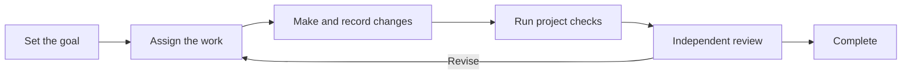

<p align="center">
  
</p>

<h1 align="center">N E U R A T H</h1>
<p align="center"><strong>Pick up where you left off.</strong></p>
<p align="center">A harness kit for Claude Code and Codex.<br>Carry work forward. Learn from what happens along the way.</p>

<p align="center">
  
  
  
</p>
<p align="center"><strong>English</strong> · <a href="README.ko.md">한국어</a></p>
<p align="center"><a href="#start-here">Get started</a> · <a href="#how-it-works">How it works</a> · <a href="ONBOARDING.md">Installation guide</a> · <a href="CONTRIBUTING.md">Contributing</a> · <a href="docs/validation.md">Verification</a></p>

---

Long tasks rarely fit into a single conversation. You start a new session, switch agents,
or return after an interruption — and have to explain the work all over again.

Neurath keeps project memory across conversations: goals, decisions, progress, and lessons
from the work. A fresh Claude Code or Codex session receives relevant records automatically.
Successful command recoveries become trial guidance; reuse and verification in another
session can promote them, while a regression withdraws them.

The name comes from **Neurath's boat**: a ship repaired while still at sea.
Keep working, and improve how you work along the way. Install the kit in an existing
project and connect it to the documentation and tools you already use.

## Start here

Clone or download this repository, then install into an existing Git project:

```sh
./setup /absolute/path/to/your-project
```

The installer prepares Python 3.14 and an isolated Neurath tool environment using uv,
applies the harness, and checks the installation. Your project's dependencies and `.venv`
are preserved. Both Claude Code and Codex are enabled by default.
Each project keeps its installed runtime until you explicitly update that project.

If the project already has skills with the same names, use
`./setup /path/to/project --skill-prefix neurath-` to call Neurath skills as
`/neurath-debug`, for example. Existing skills are preserved; updates retain the chosen prefix.

Then, in your coding agent:

> Read `.neurath/policy.md` and `.neurath/project.json`. Connect this project's actual
> documentation and verification commands, check the installed hooks, and help me start
> a task with Neurath.

Review hooks in your host — Codex uses `/hooks` for hook trust — and start a new session.
[The installation guide](ONBOARDING.md) covers host selection, previews, updates, and removal.

<details>
<summary>Already installed? A few useful commands</summary>

```sh
neurath setup /path/to/another-project
neurath setup --dry-run
.neurath/run doctor --protocol
.neurath/run verify check   # after binding your project's check command
```

Use the absolute executable path printed by the installer if `neurath` is not on your PATH.

</details>

## How it works



| What you need | What Neurath provides |
| --- | --- |
| Continue in a new session or switch hosts | Shared project memory, automatic recall, and saved handoffs |
| Improve through use | Reflections carried forward; command recoveries tested, promoted, or withdrawn |
| Coordinate agents | Provider selection, conversations between tasks, and explicit ownership |
| Check what actually happened | Command results, file changes, and individual test outcomes |
| Review before finishing | A separate agent's review, checked by the agent responsible for the work |
| Use your project's conventions | Your choice of documents, check commands, language, and protected files |
| Undo an installation | Original files saved for rollback and removal |

The kit includes **31 skills** for planning, implementation, review, and verification,
available in both hosts. Twenty-nine skills have execution contracts that define when each
step may proceed or finish. Connect your project's documents and check commands in
`.neurath/project.json`.

## Work with other agents

Ask Claude Code or Codex to consult a specific provider and model, or contact another task
already working in the same project. Peer messages persist across interruptions and linked
worktrees. Agents can reply, wait for answers, and subscribe to another task's updates.

```sh
.neurath/run delegate run --provider claude-code --model claude-fable-5-1 \
  --assignment "Review this design and explain the tradeoffs"
.neurath/run agent discover
```

Both hosts use the same commands. Native messaging tools can notify compatible tasks
immediately; otherwise messages wait for the recipient's next hook or resume. Each task
keeps its own goal and permissions. [Provider and peer messaging guide](docs/agents.md)
documents the commands, delivery states, and local scope.

**Newsroom** shares discoveries across active subagents and sessions in both hosts, across
topics and linked worktrees. Agents publish a title of up to 30 characters and a separate
body. Only the title and lookup IDs reach peers through their next native hook; each agent
reads a body only when relevant. Idle and ended agents do not participate, and resuming
does not replay their missed headlines. Newsroom never wakes a session. The installed
communication MCP tool also lets shell-free workers publish and read articles.

## Memory that stays with the project

You can ask “Continue implementing work log export” in a fresh conversation. Neurath brings back
relevant goals, decisions, and remaining work from the same local Git repository, including
its linked worktrees. Hooks save incoming requests and observed command records as work
happens. After command work, the end-of-turn hook asks the agent to leave a concise handoff
if one is missing. A forced interruption retains the records already saved.

Remembering, reflecting, and validating new recoveries are default behavior during active
sessions; no separate request to learn is needed. Lessons from feedback and failures travel
with those handoffs. Command recovery has a
stricter feedback loop: observed failure → successful alternative for the same operation →
project check → trial in another session → active guidance. A later failure withdraws it.
The learner never treats a command's printed “success” as its exit status.

```sh
.neurath/run memory recall --query "work log export"
.neurath/run learning status
```

Memory covers installed, active hooks in the same local repository. It does not synchronize
separate clones or computers, recover text that was never saved, or load every past message
into every prompt. Learned guidance improves how agents work; it does not rewrite Neurath's
source code by itself. [Memory and learning](docs/memory.md) explains the lifecycle and limits.

## Built for existing projects

- **Stack independent.** No application scaffold or framework dependency is installed.
- **Local state.** Work records live in `.neurath/local`; installation records stay in Git's local directory.
- **Keep existing settings.** Existing agent instructions, hook groups, permissions, and edited project bindings are retained.
- **Check each step.** Package integrity, test execution, host activation, and independent evaluation are checked separately.

Supported environment: **macOS or Linux, Git, and Claude Code or Codex**. Python 3.14 is
prepared by the quick installer. [Host behavior and limits](docs/hosts.md) and
[verification coverage](docs/validation.md) describe what has actually been tested.

## Work on Neurath

Neurath uses its own harness. The development environment and the installed harness stay separate.

```sh
uv sync --locked
uv run --locked python tools/check.py
./setup --self
```

After changing runtime code or assets, regenerate the manifest, run the checks, then refresh
self-installation. See [CONTRIBUTING.md](CONTRIBUTING.md) for the complete loop.

| Read more | |
| --- | --- |
| [Architecture](docs/architecture.md) | How the package and runtime fit together |
| [Memory and learning](docs/memory.md) | What persists, what is recalled, and how guidance evolves |
| [Project bindings](docs/profiles.md) | Connect documentation and verification commands |
| [Installation](ONBOARDING.md) | Setup, update, recovery, and uninstall |
| [Verification](docs/validation.md) | Regression coverage and native host evidence |
| [Origins](NOTICE.md) | Where Neurath began |

[Harness terminology](docs/terminology.md)
