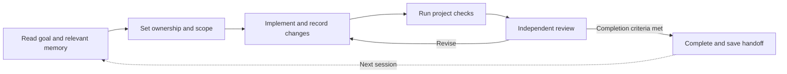

<p align="center">
<!-- date: 2026-09-07; synced_from: source and documentation at 3563609329437641570a5e45d87ceb99064e4c02; English and Korean editions updated together -->
  
</p>

<h1 align="center">N E U R A T H</h1>
<p align="center"><strong>Carry context forward. Build on verified experience.</strong></p>
<p align="center">A development harness for Claude Code and Codex.<br>Project memory, agent collaboration, and execution checks in one workflow.</p>

<p align="center">
  
  
  
</p>
<p align="center"><strong>English</strong> · <a href="README.ko.md">한국어</a></p>
<p align="center"><a href="#start-here">Get started</a> · <a href="#how-it-works">How it works</a> · <a href="ONBOARDING.md">Installation guide</a> · <a href="CONTRIBUTING.md">Contributing</a> · <a href="docs/validation.md">Verification</a></p>

---

As development with coding agents grows beyond a single conversation, more of the work
falls to coordination: carrying decisions into a new session, separating agents' editing
responsibilities, and checking completion reports against actual changes, tests, and reviews.

**Neurath manages that work inside your project.** It is a development harness: a layer
that governs how agents carry out tasks. It connects shared skills, execution hooks, and
state management to Claude Code and Codex so that context and evidence carry through each
stage of the work. Install it into an existing Git project and bind it to your own
documentation and tools, regardless of language or framework.

## Why Neurath

### Continuity across conversations and tools

Neurath records goals, decisions, progress, and remaining work, then automatically recalls
records relevant to a new session's request. Claude Code and Codex share this memory within
the same local repository and its linked worktrees. You can move from design review in one
tool to implementation in another, or resume interrupted work in a fresh conversation with
less context to reconstruct.

### Completion backed by execution evidence

Workflow stages have explicit conditions for progress and completion. Neurath checks command
results, file changes, and review outcomes separately; procedures that require independent
review include another agent's evaluation in their completion criteria. You can distinguish
what changed, which checks passed, and what still needs verification. Checks use the commands
and success conditions defined by your project.

### Collaboration with clear editing boundaries

Agents can ask another task a question or consult a specific provider and model while keeping
their own goals and editing permissions. Worktree ownership checks restrict concurrent edits
to the same workspace. **Newsroom** distributes headlines about useful discoveries to active
peers. Each agent retrieves only the articles relevant to its work, sharing findings without
taking on another task's full conversation.

### Execution guidance that earns its place

When Neurath observes a failed command and a successful alternative for the same operation,
it records a recovery candidate. Passing the project check makes that candidate available
for trial in another session. Successful reuse and verification promote it to active guidance;
a later failure withdraws it. Future work benefits from execution methods verified in the
project itself.

These capabilities come with an installation designed to **preserve your existing environment**.
Neurath runs separately from project dependencies and retains existing agent instructions,
hooks, and permissions. Each project can be updated explicitly or restored using its saved
installation history.

The name comes from **Neurath's boat**: a ship repaired while still at sea. Development
continues while verified experience helps improve the way the work gets done.

## How it works

Neurath provides **31 skills** for planning, implementation, review, and verification.
Twenty-nine have execution contracts defining the conditions for each stage to proceed or
finish. Agents select a skill based on the task's purpose; Neurath manages its state and
execution evidence. A task requiring review follows a flow such as this:



Connect project documents and check commands in `.neurath/project.json`.
The [skill guide](docs/skills.md) covers individual tasks such as planning, debugging,
and code review.

## Start here

Clone or download this repository, then install into an existing Git project:

```sh
./setup /absolute/path/to/your-project
```

The installer prepares Python 3.14 and an isolated Neurath tool environment using uv,
applies the harness, and checks the installation. Your project's dependencies and `.venv`
are preserved. Both Claude Code and Codex are enabled by default.
Each project keeps its installed runtime until you explicitly update that project.

If the project already has skills with the same names, use
`./setup /path/to/project --skill-prefix neurath-` to call Neurath skills as
`/neurath-debug`, for example. Existing skills are preserved; updates retain the chosen prefix.

Then, in your coding agent:

> Read `.neurath/policy.md` and `.neurath/project.json`. Connect this project's actual
> documentation and verification commands, check the installed hooks, and help me start
> a task with Neurath.

Review hooks in your host — Codex uses `/hooks` for hook trust — and start a new session.
[The installation guide](ONBOARDING.md) covers host selection, previews, updates, and removal.

<details>
<summary>Already installed? A few useful commands</summary>

```sh
neurath setup /path/to/another-project
neurath setup --dry-run
.neurath/run doctor --protocol
.neurath/run verify check   # after binding your project's check command
```

Use the absolute executable path printed by the installer if `neurath` is not on your PATH.

</details>

## Work with other agents

Ask Claude Code or Codex to consult a specific provider and model, or contact another task
already working in the same project. Peer messages persist across interruptions and linked
worktrees. Agents can reply, wait for answers, and subscribe to another task's updates.

```sh
.neurath/run delegate run --provider claude-code --model claude-fable-5-1 \
  --assignment "Review this design and explain the tradeoffs"
.neurath/run agent discover
```

Both hosts use the same commands. Native messaging tools can notify compatible tasks
immediately; otherwise messages wait for the recipient's next hook or resume. Each task
keeps its own goal and permissions. [Provider and peer messaging guide](docs/agents.md)
documents the commands, delivery states, and local scope.

For example, an agent implementing an API might discover that retries can create duplicate
records. It can publish the finding and reproduction evidence to Newsroom. Other active
agents in the project receive the headline and read the article if it affects their work.
Agents decide what to publish; headlines arrive through each recipient's next hook.
Notifications never wake idle or ended sessions.

## Memory that stays with the project

You can ask “Continue implementing work log export” in a fresh conversation. Neurath brings back
relevant goals, decisions, and remaining work from the same local Git repository, including
its linked worktrees. Hooks save incoming requests and observed command records as work
happens. After command work, the end-of-turn hook asks the agent to leave a concise handoff
if one is missing. A forced interruption retains the records already saved.

Remembering, reflecting, and validating new recoveries are default behavior during active
sessions; no separate request to learn is needed. Lessons from feedback and failures travel
with those handoffs. Command recovery has a
stricter feedback loop: observed failure → successful alternative for the same operation →
project check → trial in another session → active guidance. A later failure withdraws it.
The learner never treats a command's printed “success” as its exit status.

```sh
.neurath/run memory recall --query "work log export"
.neurath/run learning status
```

Memory covers installed, active hooks in the same local repository. It does not synchronize
separate clones or computers, recover text that was never saved, or load every past message
into every prompt. Learned guidance improves how agents work; it does not rewrite Neurath's
source code by itself. [Memory and learning](docs/memory.md) explains the lifecycle and limits.

## Installation and support

| Area | Behavior |
| --- | --- |
| Development environment | No application scaffold or framework dependency is added. Project dependencies and `.venv` are preserved. |
| Existing configuration | Agent instructions, hooks, permissions, and edited project bindings are retained. |
| Updates and recovery | Each project is updated explicitly. Original files are saved for recovery and removal. |
| Local records | Work records live in `.neurath/local`; installation history stays in Git's local directory. |
| Verification | Distribution integrity, installation state, test execution, independent review, and native host activation are checked separately. |

Supported environment: **macOS or Linux, Git, and Claude Code or Codex**. Python 3.14 is
prepared by the quick installer. [Host behavior and limits](docs/hosts.md) and
[verification coverage](docs/validation.md) describe what has actually been tested.

## Work on Neurath

Neurath uses its own harness. The development environment and the installed harness stay separate.

```sh
uv sync --locked
uv run --locked python tools/check.py
./setup --self
```

After changing runtime code or assets, regenerate the manifest, run the checks, then refresh
self-installation. See [CONTRIBUTING.md](CONTRIBUTING.md) for the complete loop.

| Read more | |
| --- | --- |
| [Architecture](docs/architecture.md) | How the package and runtime fit together |
| [Memory and learning](docs/memory.md) | What persists, what is recalled, and how guidance evolves |
| [Project bindings](docs/profiles.md) | Connect documentation and verification commands |
| [Installation](ONBOARDING.md) | Setup, update, recovery, and uninstall |
| [Verification](docs/validation.md) | Regression coverage and native host evidence |

[Harness terminology](docs/terminology.md)
