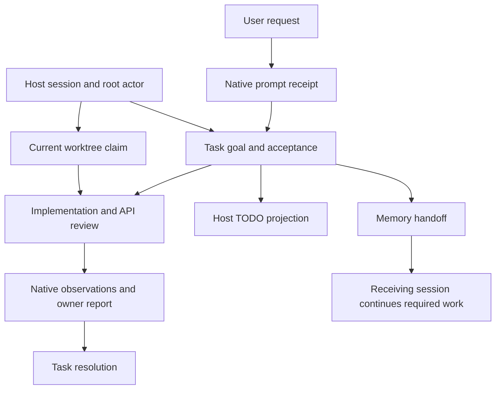

<!-- last_updated: 2026-09-14; synced_from: 243400e58ca74c7fd79bcdd86b488953fa743b97 -->
# How Neurath keeps an agent's work connected

[한국어](../../ko/contributing/architecture.md)

Neurath is an installable harness for Claude Code and Codex. It adds project instructions, skills, host hooks, and named MCP tools around the coding agent. The host still runs the model and its native editing tools. Neurath records which request the work serves, who owns it, and what evidence supports the reported outcome.

Consider a user request: “The saved filter disappears after refreshing the page. Fix it.” A useful result is a filter that survives save and reload. Reproducing the failure, changing persistence code, reviewing the API contract, and running a regression check are ways to reach that result. The architecture keeps these methods connected to the request even when several agents participate or the work continues in another session.

## The objects the system connects

A **goal** states the result the user needs. A **task** records a bounded part of that result with its instruction sources and **acceptance conditions**: observations that distinguish delivery from an unsuccessful attempt. In the example, “the chosen filter remains selected after saving and reloading” is an acceptance condition; “run a test” alone does not describe the requested behavior.

A **session** is a host conversation recognized by Neurath. An **actor** is an agent participating in it. Its **root actor** has no parent and owns the session's task list; a subagent has a recorded parent and a delegated assignment. An independent provider session has its own root. None of these roles gives an agent authority to change the user's request.

A **worktree** is the current Git checkout. A **claim** records the native actor that owns coordinated work there. Its lease epoch and fencing token distinguish the current ownership record from older records. A **receipt** is a durable record of a particular observed or reported event. Its meaning depends on its producer: a native tool receipt, an agent's task result, and a review outcome establish different facts.

A **workflow** organizes a skill run. Its **phases** record progress through that procedure, such as investigation and review. A **review** is a scoped assessment of work by another participant, with a report that the owner consumes. Tasks describe required outcomes; phases and review organize how the owner obtains and assesses them.

The diagram describes relationships, not a promise that every request launches a reviewer or migrates sessions. The user request and applicable skill determine which work is necessary.

## Four implementation layers

| Layer | Responsibility | Source location |
| --- | --- | --- |
| Installation and assets | Package independent runtime assets and project projections; preserve existing project configuration | `src/neurath/install/`, `src/neurath/_assets/` |
| Host adapters | Validate native events, bind exact tool calls, observe tool results and evaluate normal Stop | `src/neurath/hosts/`, `src/neurath/agents/hooks.py` |
| Task and service adapters | Validate named tool inputs and route them to a domain operation | `src/neurath/runtime/`, `src/neurath/agents/mcp.py` |
| Durable domain state | Keep task, actor, workflow, ownership, artifact, and delivery records consistent | `src/neurath/_assets/scripts/agent_harness/`, `src/neurath/runtime/database.py` |

`src/neurath/_assets` is the package's own executable asset source. Installed `.agents/skills` and `.neurath/rules` are projections. An implementation change belongs in source, followed by the asset manifest and applicable validation; editing a projected skill alone does not update the package.

The runtime activates bundled modules with an explicit target root. The target project supplies its profile and registered checks, while the bundle supplies the harness. Another repository is not a build input.

## How a request reaches durable state

At native prompt intake the host adapter establishes the foreground turn and its prompt receipt. Before a named MCP call, a host event binds the exact request to that actor, session, turn, worktree, and invocation. The MCP process does not acquire the caller's authority merely by starting. The dispatcher validates the closed input schema and the live binding before invoking the service.

Canonical mutable runtime state is stored in `.neurath/local/runtime.sqlite3` under the Git-common-derived control root. Linked worktrees share that database; unrelated clones and computers do not automatically synchronize. Namespaces, codecs, revisions, and digests keep domain records distinct. Installation plans, restoration originals, and private process artifacts retain purpose-specific files.

The private database path rejects symlink components in its managed directory chain and symlink database or journal paths. It creates managed directories with owner-only `0700` permissions and database files with `0600` permissions. Imported legacy records retain the original content digest: a changed, replaced, or unavailable legacy source rejects access instead of silently accepting drift. These checks protect the state used for identity and revision decisions; they do not synchronize another checkout or grant execution authority.

Task admission and task writes share a SQLite transaction with the relevant session state checks. The transaction verifies that the native participant and current prompt still match. Revision comparisons prevent a write based on an older task list from silently replacing newer work. Content-addressed artifacts retain the result report associated with the task definition.

After the native tool completes, its host event closes the invocation capability. A later call needs its own binding. This is why copying an old `_neurath_binding` value into another invocation is invalid, and why a session identifier is a target identifier rather than proof of caller authority.

## Applying the architecture to the filter repair

The root records the persisted-filter goal and reproduces save followed by reload. If independent API review is useful and authorized, it gives that participant a bounded question: whether the save/load contract preserves the selected filter. The implementer changes the relevant code. The review report, regression result, and observed save/reload behavior become evidence to assess against acceptance.

During a long investigation, the goal reminder brings the recorded purpose back into context. It can prompt the agent to reconsider an unnecessary test-harness rewrite while retaining the unresolved filter behavior. The reminder cannot change a task, approve work, or decide success.

If another native session must continue, memory preview supplies context and adoption performs the explicit state transfer after its prerequisites hold. A saved lesson about the correct project test command can help the receiver choose the right check. Historical memory still needs comparison with the current checkout and current command configuration.

## Which evidence answers which question

| Question | Evidence to inspect |
| --- | --- |
| Does the package contain the expected source assets? | Manifest and source-integrity validation |
| Can the built distribution execute? | Package execution results |
| Did installation preserve and project the intended configuration? | Installation results and installed state |
| Did this native host admit the request and observe the tool? | Host activation, prompt and invocation records |
| Did the saved filter survive refresh? | Reproduction and regression evidence for that behavior |
| Did the owner record that result? | Task result artifact and current ledger |
| Was a review completed for the relevant change? | Scoped review report and consumption, including reviewed revision |

These observations can be collected together, but one does not establish all the others. In particular, the task service labels result assurance `agent-report`; receipt integrity preserves provenance without independently proving the report's meaning.

Continue with [host integration](hosts.md), [runtime lifecycle](runtime-lifecycle.md), and the [task and TODO contract](task-todo-contract.md). The [capability map](capability-map.md) locates tools by the work they support.
