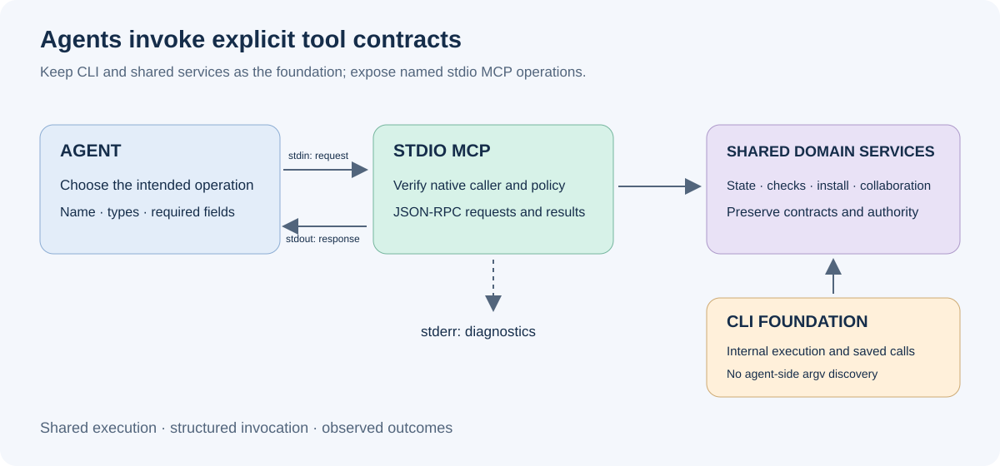
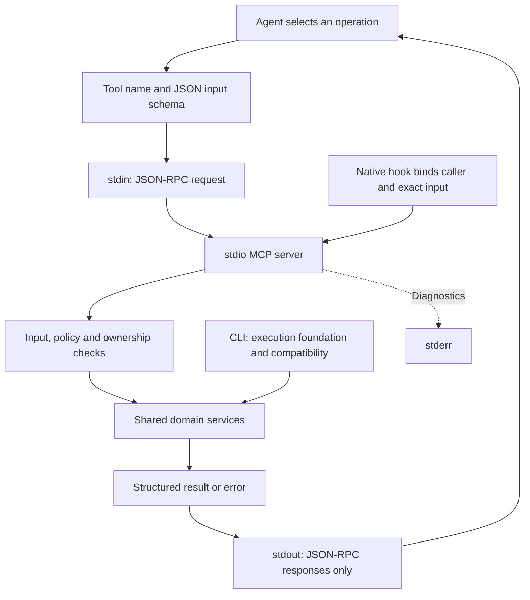
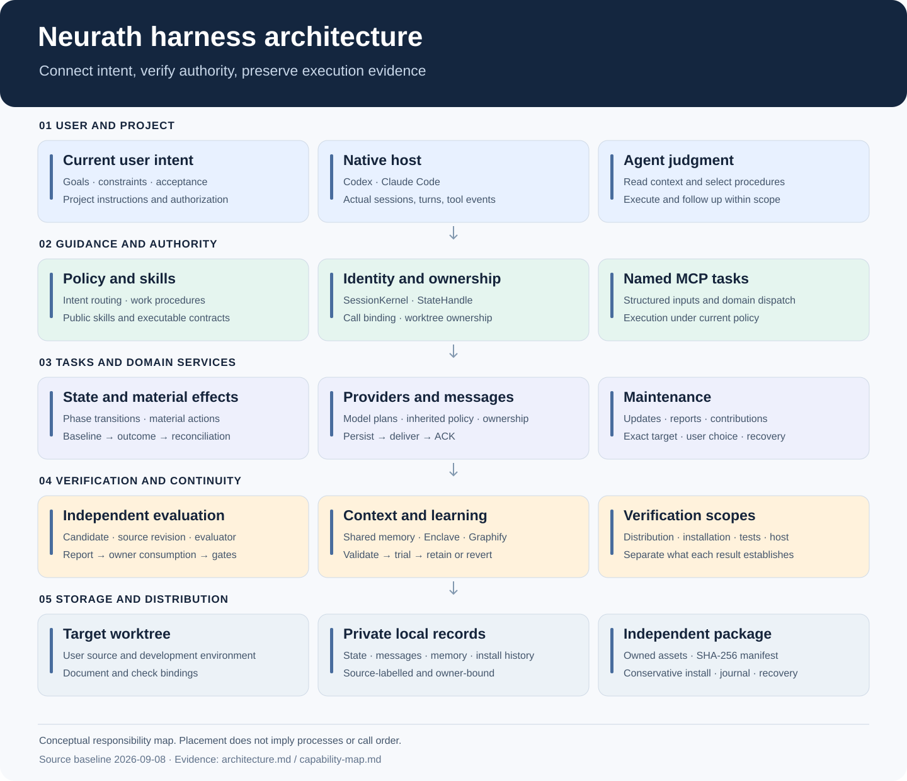
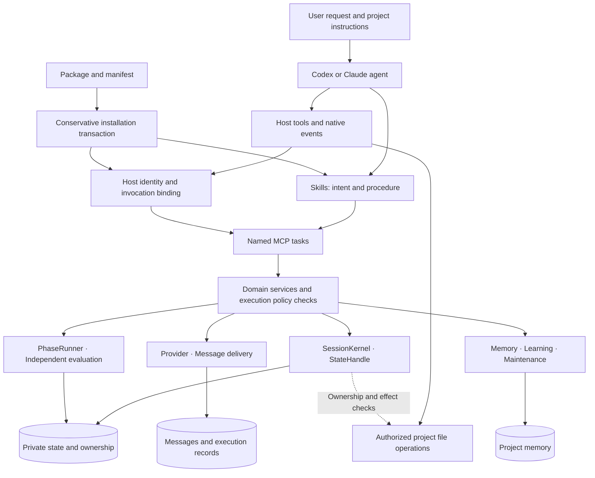
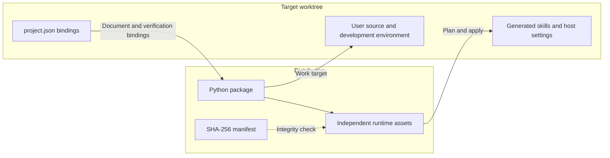

# Neurath harness architecture

<!-- date: 2026-09-09; synced_from: baseline f69cb6402683bb2e0bfe56ed04c63f808b263f06 plus current working-tree stdio MCP changes; scope: source, not live-host certification -->

**English** · [한국어](../../ko/contributing/architecture.md)

[Contributor guide](index.md) · [Design philosophy](design-principles.md) · [Runtime lifecycle](runtime-lifecycle.md) · [Capability map](capability-map.md)

Neurath is an **independent harness kit connecting coding-agent work to project context, actual host authority, and verifiable execution records**. While the agent decides its next action, the harness tracks who acts in which worktree, what evidence exists, and whether it permits the next transition.

This documentation describes the current source. Implemented behavior, properties covered by tests, and behavior observed on installed hosts are distinct evidence scopes. Diagrams summarize principal responsibilities and flows rather than every function call or database schema.

## CLI foundation and MCP agent interface

Neurath cannot assume that a model was pretrained on its CLI syntax. Discovering subcommands and flags
through help over several turns adds exploration calls and tokens, while string assembly creates opportunities
for invalid options and argument combinations. The CLI and shared domain services therefore remain the
execution foundation, while **every agent-facing harness capability is exposed as a named MCP operation
with typed inputs, constraints and structured results**.

Wrapping the same command string in `agent(argv)` does not achieve this design. Agents choose operations
such as `phase_current`, `phase_evidence_prepare` and `monitor_start`, then provide structured arguments.
Internal adapters invoke the existing kernel, installation and verification services. Tool count alone does
not establish efficiency gains: help exploration, invalid inputs, retries and total tokens require measurement.

The transport is **stdio**: requests arrive on stdin and responses leave on stdout. Only protocol frames
belong on stdout; diagnostics go to stderr. Initial bootstrap, server process startup and host event callbacks
are execution infrastructure, distinct from the agent interface for everyday harness operations.
Project source editing, Git and builds continue to use the host's existing tools.

Migration covers implementation, installed policy and skills, notifications and recovery guidance, and public
documentation together. Operations whose current host restrictions cannot be enforced return a specific
unsupported result. A named schema is not evidence of successful execution, and CLI replay is not a recovery bypass.

## Reading paths

| Question | Document |
| --- | --- |
| What are the major components? | The diagrams and storage boundaries below |
| Why is the system organized this way? | [Design principles and philosophy](design-principles.md) |
| How do requests, execution, evaluation, and recovery connect? | [Runtime lifecycle](runtime-lifecycle.md) |
| Where are the implementation and verification sources for each feature and skill? | [Capability map](capability-map.md) |
| How do I request everyday work? | [Usage guide](../usage/index.md) |

## System overview

Vertical placement does not imply a single process or sequential execution.

## Guidance, enforcement, and continuity

**Guidance:** policy explains common boundaries and terminology; skills describe procedures selected by primary intent and input authority. Executable contracts specify phases, evidence, and terminal conditions. Reading instructions differs from passing a contract. Public names such as `implement-issue` can map to internal identifiers such as `process-ticket`; `skill_names.py` owns that mapping.

**Enforcement:** host adapters handle session, user-input, and tool events. `SessionKernel` models session, actor, turn, workflow, and delegation state. `StateHandle` binds the actual caller to state access. The worktree registry checks ownership. Host editing and shell tools perform file changes; material-action services connect baselines, invocation outcomes, and post-action observations. `material_prepare` does not edit files.

**Continuity:** shared memory supplies relevant goals and decisions to later sessions. Messaging manages delivery and acknowledgment, while providers manage independent runs and reporting through owned connections. Recall does not transfer ownership, and ACK does not approve task completion.

## Source responsibilities

Paths are relative to the repository root. The [capability map](capability-map.md) links implementation and regression tests.

| Source | Responsibility | Boundary |
| --- | --- | --- |
| `src/neurath/resources.py`, `src/neurath/manifest.json` | Assets and integrity | Target projects are not build inputs |
| `src/neurath/install/` | Plans, projection, merging, conflicts, apply, uninstall, recovery | Preserve user files and settings |
| `src/neurath/hosts/` | Events, native identity, processes, invocations | Payload assertions cannot create authority |
| `src/neurath/runtime/` | Schemas, dispatch, policy, verification, state, models, maintenance | Defined operations rather than arbitrary shell or state patches |
| `src/neurath/_assets/scripts/agent_harness/` | Kernel, ownership, effects, adaptive control, evaluation | Check goal, revision, evidence, actor |
| `src/neurath/_assets/scripts/skill_harness/` | Contracts, phase progression, finalization | Reject completion without required evidence |
| `src/neurath/_assets/.agents/` | Rule, skill, and contract sources | Distinct from installed copies |
| `src/neurath/providers/` | Model planning, policy inheritance, runs, cancellation, recovery | Verify actual settings and owners |
| `src/neurath/agents/` | Messages, reports, delivery, Newsroom, MCP | Separate persistence, submission, receipt, acceptance |
| `src/neurath/memory/` | Records, selection, learning, rollback | Reference data is not current authority |
| `src/neurath/updates.py`, `src/neurath/release_install.py`, `src/neurath/reporting.py` | Release notices, updates, reports, contributions | Exact targets, consent, recovery, privacy |
| `tests/`, `tests/runtime/`, `tools/` | Regressions, contracts, builds, checks | Distinct verification scopes |

## Distribution root and work root

`_assets` contains independent resources owned by the harness. Installation projects content into a target, while the engine explicitly uses the packaged asset root. `runtime/engine.py` checks that modules exist in the bundle and operates in the target root. Public launchers use isolated Python execution so a target package named `scripts` cannot shadow the harness. Project dependencies and the harness tool environment remain separate.

## Storage boundaries

| Data | Location and scope |
| --- | --- |
| Source, public docs, project bindings | Version-controlled Git worktree |
| Installation ownership inventory | Target `.neurath/install.json`; restoration records in private Git storage |
| Kernel execution state and resource ownership | `.neurath/local/runs` and `.neurath/local/resources` beneath the Git common control root |
| Project memory and learning | `.neurath/local/memory/project.sqlite3` beneath the same control root |
| Messages and execution records | `.neurath/local/agents` beneath the same control root |
| Update and reporting choices | Feature-specific private Git state, bound to exact versions, drafts, and targets |

The control root is derived from the Git common directory. Linked worktrees share memory; separate clones and computers are not automatically synchronized. Memory and messaging use SQLite transactions. Kernel state and installation journals are not all stored in that database.

## Separate verifiable claims

| Question | Evidence | What this alone cannot establish |
| --- | --- | --- |
| Is distribution content correct? | Manifest and integrity checks | Host hook trust |
| Are files installed? | Plan, apply, placement checks | Current-session activation |
| Are event formats handled? | Protocol fixtures | Actual identity and permissions |
| Are there regressions? | Relevant tests and registered checks | App access and real model round trips |
| May this actor execute? | Activation, policy, ownership | Material effects and independent evaluation |
| Is the goal attained? | Goal-specific outcomes, evaluation, evidence consumption | Publication and remote integration |

Observe each question separately. [Validation](validation.md) explains checks, and [runtime lifecycle](runtime-lifecycle.md) explains evidence production and consumption. Read [collaboration](collaboration-contract.md) and [model planning](model-planning-mcp.md) as requirement contracts, and [task tools](task-tools.md) as the current control surface.
