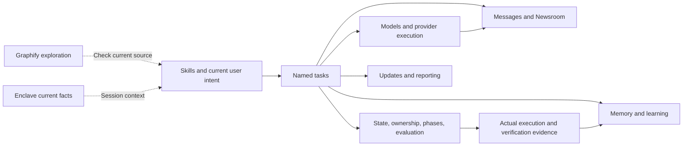

# Capability, source, and verification map

<!-- date: 2026-09-09; synced_from: baseline f69cb6402683bb2e0bfe56ed04c63f808b263f06 plus current working-tree stdio MCP changes; scope: source, not live-host certification -->

**English** · [한국어](../../ko/contributing/capability-map.md)

[Architecture](architecture.md) · [Design philosophy](design-principles.md) · [Runtime lifecycle](runtime-lifecycle.md)

This map indexes the major package capabilities and all 31 current public skills. Each row connects a responsibility with representative implementation and regression sources. A linked test file is an entry point, not a claim that it alone verifies every behavior in the row or actual host operation.

## Capability responsibilities and evidence

| Capability | Responsibility | Implementation and regression entry points |
| --- | --- | --- |
| Distribution and isolation | Own assets and a manifest identify harness code independently of the target environment. | [resources.py](../../../src/neurath/resources.py) · [Regression](../../../tests/test_installer.py) |
| Install, uninstall, recovery | Plans, originals, and journals support conservative application, conflicts, and recovery. | [transaction.py](../../../src/neurath/install/transaction.py) · [Regression](../../../tests/test_installer.py) |
| Profiles, bindings, names | Owns the generic profile, document/check bindings, public aliases and skill prefixes. | [projection.py](../../../src/neurath/install/projection.py) · [Regression](../../../tests/test_publication.py) |
| Host identity and lifecycle | Binds actual start, resume, invocations, and child relationships to the current session. | [identity.py](../../../src/neurath/hosts/identity.py) · [Regression](../../../tests/test_host_lifecycle.py) |
| Kernel and state access | Explicitly models sessions, actors, turns, workflows, and delegations with checked transitions. | [session_kernel.py](../../../src/neurath/_assets/scripts/agent_harness/session_kernel.py) · [Regression](../../../tests/runtime/agent_harness/test_session_kernel.py) |
| Worktree ownership | Checks worktree and owning actor against lease and fencing information. | [worktree_registry.py](../../../src/neurath/_assets/scripts/agent_harness/worktree_registry.py) · [Regression](../../../tests/runtime/agent_harness/test_worktree_registry.py) |
| Material effects | Reconciles prepared targets, invocation results, and post-action observations. | [material_action.py](../../../src/neurath/_assets/scripts/agent_harness/material_action.py) · [Regression](../../../tests/runtime/agent_harness/test_material_action.py) |
| Phase contracts | Checks required evidence, current phase, and terminal conditions. | [phase_runner.py](../../../src/neurath/_assets/scripts/skill_harness/phase_runner.py) · [Regression](../../../tests/runtime/skill_harness/test_phase_runner.py) |
| Adaptive control and evaluation | Binds goals, ambiguity, evidence, counterevidence, and stagnation to source and evaluator authority. | [adaptive_control_authority.py](../../../src/neurath/_assets/scripts/agent_harness/adaptive_control_authority.py) · [Regression](../../../tests/runtime/agent_harness/test_adaptive_control_authority.py) |
| Named tasks and MCP | Dispatches structured input to domain services under native invocation binding. | [tasks.py](../../../src/neurath/runtime/tasks.py) · [Regression](../../../tests/test_communication_mcp.py) |
| Project verification | Checks configured argv, cwd, success conditions, deadline, and before/after fingerprints. | [verification.py](../../../src/neurath/runtime/verification.py) · [Regression](../../../tests/test_learning.py) |
| Model planning | Records actual inventory, selection rationale, constraints, alternatives, and plan revisions. | [model_planning.py](../../../src/neurath/providers/model_planning.py) · [Regression](../../../tests/test_model_planning.py) |
| Policy inheritance and execution | Preserves the immediate creator policy and manages durable runs, cancellation, and recovery. | [jobs.py](../../../src/neurath/providers/jobs.py) · [Regression](../../../tests/test_inherited_provider_modes.py) |
| Messages, assignment, reporting | Persists peer requests, task acceptance, and status reports with issuer responsibility. | [lifecycle.py](../../../src/neurath/agents/lifecycle.py) · [Regression](../../../tests/test_provider_jobs.py) |
| Delivery and recovery | Manages post-commit notification, redelivery, ACK, and recovery holds. | [delivery.py](../../../src/neurath/agents/delivery.py) · [Regression](../../../tests/test_delivery_recovery.py) |
| Newsroom | Notifies active participants with titles; bodies, revisions, and comments have separate reads. | [newsroom.py](../../../src/neurath/agents/newsroom.py) · [Regression](../../../tests/test_newsroom_mcp.py) |
| Project memory | Stores source-labelled requests, checkpoints, and execution history and selects relevant context. | [store.py](../../../src/neurath/memory/store.py) · [Regression](../../../tests/test_project_memory.py) |
| Enclave | Maintains bounded latest-fact snapshots within the session. | [enclave_store.py](../../../src/neurath/_assets/scripts/agent_harness/enclave_store.py) · [Regression](../../../tests/runtime/agent_harness/test_enclave_store.py) |
| Execution strategy learning | Validates, trials, retains, and reverts or invalidates observed recovery strategies. | [learning.py](../../../src/neurath/memory/learning.py) · [Regression](../../../tests/test_learning.py) |
| Updates and choices | Connects notices, exact distribution preparation, native choice, apply, and recovery. | [release_install.py](../../../src/neurath/release_install.py) · [Regression](../../../tests/test_user_choices_mcp.py) |
| Common reports and contributions | Manages privacy-reviewed drafts, consent-scoped submission, and reconciliation. | [reporting.py](../../../src/neurath/reporting.py) · [Regression](../../../tests/test_reporting.py) |

## Where capabilities meet



A common task surface does not merge authority, stores, or completion semantics. Model inventory observations are persisted, release notices record consumption, and maintenance choices validate exact user input. Inspect schemas and effects even for operations that look like reads.

## Named task surface

The current registry defines 132 named operations. [Task tools](task-tools.md) lists every exact name; [task_schema.py](../../../src/neurath/runtime/task_schema.py) owns schemas. These groups provide navigation.

| Group | Representative tasks | Boundary |
| --- | --- | --- |
| Diagnostics and routes | session_status, provider_capabilities, provider_route | Diagnostics and routes are not execution or authority |
| State and material actions | session_inspect, worktree_claim, material_prepare | Preserve actual actor, ownership, revision |
| Workflows and evaluation | phase_start, evaluation_prepare, evaluation_consume | Creation, reporting, consumption, finalization differ |
| Models and execution | provider_models, provider_plan, provider_run | Separate inventory, plans, actual-model read-back |
| Collaboration and reports | collaboration_assign, collaboration_accept, collaboration_report | Peer requests differ from user authorization |
| Message delivery | collaboration_message, collaboration_ack, delivery_redrive | Separate body read, receipt, effect acceptance |
| Newsroom | newsroom_headlines, newsroom_read, newsroom_publish | Active title notification differs from body read |
| Memory and learning | memory_recall, memory_checkpoint, learning_status | Reference reporting differs from validated strategies |
| Verification | verification_run | Registered checks and current native execution policy |
| Maintenance | releases_prepare, reporting_submit, maintenance_choice_prepare | Exact target, consent, outcome reconciliation |

Registry count is not readiness or a host pass count. Read the currently exposed schema and select a supported execution route.

## All public skills

Source links use internal directories. [skill_names.py](../../../src/neurath/skill_names.py) maps public names to internal identifiers. `explain-code` and `graphify` are supporting skills without state-owning phase contracts; the other 29 have executable contracts. This table describes capabilities; reading it does not authorize external publication or new execution.

| Public skill | Primary role | Internal identifier |
| --- | --- | --- |
| [`plan`](../../../src/neurath/_assets/.agents/skills/plan-issues/SKILL.md) | Clarify new product intent and decisions into documents and issues | `plan-issues` |
| [`review-spec`](../../../src/neurath/_assets/.agents/skills/audit-spec/SKILL.md) | Audit ambiguity, contradictions, and policy drift before implementation | `audit-spec` |
| [`create-issue`](../../../src/neurath/_assets/.agents/skills/create-ticket/SKILL.md) | Create issues from approved plans and follow-up work | `create-ticket` |
| [`update-status`](../../../src/neurath/_assets/.agents/skills/update-project-status/SKILL.md) | Update issue and project status metadata | `update-project-status` |
| [`create-worktree`](../../../src/neurath/_assets/.agents/skills/create-worktree/SKILL.md) | Prepare an isolated workspace for issue work | `create-worktree` |
| [`implement-issue`](../../../src/neurath/_assets/.agents/skills/process-ticket/SKILL.md) | Execute analysis, implementation, checks, and PR flow for an approved item | `process-ticket` |
| [`autopilot`](../../../src/neurath/_assets/.agents/skills/autopilot/SKILL.md) | Orchestrate explicitly requested multi-item implementation, review, and merge | `autopilot` |
| [`debug`](../../../src/neurath/_assets/.agents/skills/investigate/SKILL.md) | Reproduce defects or failed checks and isolate causes | `investigate` |
| [`qa`](../../../src/neurath/_assets/.agents/skills/automate-qa/SKILL.md) | Compare deployed surfaces and persistence with expected behavior | `automate-qa` |
| [`review-code`](../../../src/neurath/_assets/.agents/skills/review-code/SKILL.md) | Review changes using concrete defect signals | `review-code` |
| [`review-pr`](../../../src/neurath/_assets/.agents/skills/pr-review/SKILL.md) | Publish verified local review against the exact PR head | `pr-review` |
| [`pr-feedback`](../../../src/neurath/_assets/.agents/skills/triage-comments/SKILL.md) | Assess review feedback and document acceptance or disagreement | `triage-comments` |
| [`watch-pr`](../../../src/neurath/_assets/.agents/skills/monitor-pr/SKILL.md) | Preserve PR changes and wake the responsible task | `monitor-pr` |
| [`commit`](../../../src/neurath/_assets/.agents/skills/commit/SKILL.md) | Commit authorized and verified changes | `commit` |
| [`create-pr`](../../../src/neurath/_assets/.agents/skills/create-pr/SKILL.md) | Push and create a PR within authorized delivery scope | `create-pr` |
| [`checkpoint`](../../../src/neurath/_assets/.agents/skills/checkpoint/SKILL.md) | Preserve a reversible work-in-progress checkpoint | `checkpoint` |
| [`finish-session`](../../../src/neurath/_assets/.agents/skills/finish-session/SKILL.md) | Perform authorized commit, push, Graphify update, and claim release | `finish-session` |
| [`audit-deps`](../../../src/neurath/_assets/.agents/skills/dependency-audit/SKILL.md) | Audit dependency security, licenses, freshness, and workspace drift | `dependency-audit` |
| [`update-deps`](../../../src/neurath/_assets/.agents/skills/update-dependencies/SKILL.md) | Update and verify dependencies within a controlled scope | `update-dependencies` |
| [`sync-design`](../../../src/neurath/_assets/.agents/skills/sync-design/SKILL.md) | Synchronize repository tokens and component mappings into design | `sync-design` |
| [`design-ui`](../../../src/neurath/_assets/.agents/skills/explore-ui/SKILL.md) | Explore and select a UI direction on canvas before implementation | `explore-ui` |
| [`implement-ui`](../../../src/neurath/_assets/.agents/skills/implement-ui/SKILL.md) | Implement the exact approved design node | `implement-ui` |
| [`review-ui`](../../../src/neurath/_assets/.agents/skills/review-ui/SKILL.md) | Compare approved design with runtime capture for user judgment | `review-ui` |
| [`sync-docs`](../../../src/neurath/_assets/.agents/skills/sync-docs/SKILL.md) | Route and coordinate developer or user documentation synchronization | `sync-docs` |
| [`dev-docs`](../../../src/neurath/_assets/.agents/skills/sync-dev-docs/SKILL.md) | Synchronize developer docs with current code and behavior | `sync-dev-docs` |
| [`user-docs`](../../../src/neurath/_assets/.agents/skills/sync-user-docs/SKILL.md) | Document approved and implemented behavior for users | `sync-user-docs` |
| [`optimize-harness`](../../../src/neurath/_assets/.agents/skills/optimize-harness/SKILL.md) | Reduce injected prompts while preserving capability and enforcement | `optimize-harness` |
| [`memory-to-rules`](../../../src/neurath/_assets/.agents/skills/promote-memory/SKILL.md) | Review recurring personal memory for approved project-rule promotion | `promote-memory` |
| [`test-harness`](../../../src/neurath/_assets/.agents/skills/evaluate-harness/SKILL.md) | Evaluate declared versus enforced behavior through failure scenarios | `evaluate-harness` |
| [`explain-code`](../../../src/neurath/_assets/.agents/skills/explain-code/SKILL.md) | Explain code from current source and tests | `explain-code` |
| [`graphify`](../../../src/neurath/_assets/.agents/skills/graphify/SKILL.md) | Build and query a code/document knowledge graph | `graphify` |

## Graphify and documentation

Graphify supports structural exploration. Use nodes, relationships, and source locations to find modules, then read current source and tests. Graph updates, document fact checks, and live-host verification are distinct results. Deleted-file nodes or old policy descriptions can survive in a graph, so graph output must not become current product documentation without checking.

The Mermaid and SVG assets in this series are reviewable explanatory diagrams. They select principal responsibilities rather than automatically rendering the entire graph. Read the accompanying text to distinguish data flow from authority checks.

## Agent verification reference

Check locale, link, and publication rules for documentation with:

```sh
uv run --locked pytest -q tests/test_publication.py
```

The full development check covers distribution integrity, Python diagnostics, package/installation tests, and runtime contracts in a temporary repository:

```sh
uv run --locked python tools/check.py
```

Passing these checks still leaves actual activation, provider model round trips, and app behavior as separate observations. Documentation-only work does not imply runtime asset changes or require self-installation merely because prose changed. See the [contributor guide](index.md) for manifest, build, and installation steps when runtime assets change.

## Extending the explanation

For a new capability, update this map, the relevant detailed references, and both locales. Identify unimplemented requirements as requirements, as in the [collaboration contract](collaboration-contract.md). Do not collapse source implementation, tests, and host observations into one status. Each document's date and synced_from identify its source baseline rather than certify a release.
