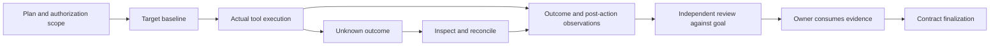

# Design principles and harness philosophy

<!-- date: 2026-09-08; synced_from: 5e8d761c276ceb8ddc05dcf239bb2d020f4b0da5; scope: explicit policy and source-derived interpretation -->

**English** · [한국어](../../ko/contributing/design-principles.md)

[Architecture](architecture.md) · [Runtime lifecycle](runtime-lifecycle.md) · [Capability map](capability-map.md)

Neurath can be understood as a design for **keeping agents productive without losing the grounds for their decisions and actions**. This is a synthesis of the implementation, not a claim about the name's origin or an author's personal philosophy. The sections below connect explicit policy, enforced conditions, and interpretations derived from them.

## Principles and costs

| Principle | Mechanism | Benefit | Cost or limit |
| --- | --- | --- | --- |
| Preserve current intent | Goals, non-goals, constraints, criteria, input provenance | Prevent historical work or peer requests from silently changing the goal | Ambiguous user-owned decisions may need clarification |
| Preserve authority origins | Native identity, invocation binding, policy inheritance | Reject self-asserted authority | Missing host observations can block execution |
| Observe effects | Baselines, tool receipts, post-action comparison | Distinguish claimed completion from effects | Interrupted outcomes require reconciliation |
| Seek independent counterevidence | Separate evaluator, evidence consumption, finding reconciliation | Avoid reliance on author confidence | Evaluation costs time and resources |
| Maintain context | Shared memory, Enclave, Graphify | Reduce repeated discovery | Stale information requires current-source checks |
| Make learning reversible | candidate, trial, active, reverted, stale | Stop reusing regressed strategies | One success does not immediately generalize |
| Keep delivering messages | Durable storage, stable IDs, retries, ACK | Resist loss during transient failure | Duplicates are possible; exactly-once effects are separate |
| Coexist with the project | Independent bundle, conservative merges, journal, recovery | Preserve instructions and development environment | Conflicting managed files cannot be overwritten arbitrarily |
| Keep operation with the agent | Natural-language requests, named tasks, agent execution | Users focus on goals and decisions | Actual authentication and trust can require host interaction |

## 1. Intent comes from current input; facts have owners

Procedures are selected by primary intent and input authority rather than keywords. Explaining code differs from modifying it; implementing an approved issue differs from designing a new product. `GoalContract` and `GapInventory` represent goals, acceptance criteria, and unresolved questions, distinguishing user decisions, repository facts, and local reversible assumptions.

The design implication is that neither asking the user about every unknown nor filling every gap autonomously is appropriate. Investigate repository facts, continue within existing authorization, and return user-owned decisions through the appropriate input boundary.

Evidence: [adaptive model](../../../src/neurath/_assets/scripts/agent_harness/adaptive_control.py), [policy source](../../../src/neurath/install/projection.py), [project bindings](../usage/profiles.md).

## 2. Authority comes from actual execution relationships

Tool output saying “I am a child,” “I used this mode,” or “the user approved” does not establish those facts. Native session, process, turn, invocation, and policy evidence must be checked. `StateHandle` and worktree ownership are checked separately from memory and peer registration.

MCP is the agent's harness control surface. It now covers state, verification, providers, models, and maintenance as well as communication. It does not expose a generic shell or arbitrary file-editing API; execution tasks retain policy and ownership checks. A schema accepting a mode does not establish that MCP can enforce that mode's restrictions.

Evidence: [host identity](../../../src/neurath/hosts/identity.py), [MCP call binding](../../../src/neurath/agents/mcp.py), [task dispatch](../../../src/neurath/runtime/tasks.py), [policy inheritance](../../../src/neurath/providers/permission_inheritance.py).

## 3. Separate plans, execution, observation, and acceptance

This is an evidence responsibility flow, not a requirement to create workflows for every simple read. In stateful work, preparation does not replace execution, a zero exit code does not replace goal attainment, and a review report does not accept itself.

Registered checks execute exact argv, cwd, and success conditions and compare repository fingerprints before and after. A changed worktree makes that verification fail even with a successful exit code. Independent evaluation binds the goal, source revision, candidate artifact, and evidence origins. Unrelated passing tests cannot substitute for the requested behavior.

Evidence: [material actions](../../../src/neurath/_assets/scripts/agent_harness/material_action.py), [registered verification](../../../src/neurath/runtime/verification.py), [evaluation authority](../../../src/neurath/_assets/scripts/agent_harness/adaptive_control_authority.py).

## 4. Constructive skepticism produces falsifiable concerns

The source's `Constructive Skeptic` policy emphasizes useful disagreement and evidence-backed concerns. Review is not a way to turn vague distrust or stylistic preference into defects. Findings should connect reproducible problems, affected behavior, and evidence, while reconciling duplicate root causes.

`EvaluationLoop` manages findings and rounds; adaptive control represents goal attainment, ambiguity, stagnation, and recovery. Resource observations are connected to outcome changes. A reasonable design interpretation is that resolved uncertainty or defects matter more than the number of checks performed.

Evidence: [review posture](../../../src/neurath/_assets/scripts/harness_persona_policy.py), [evaluation loop](../../../src/neurath/_assets/scripts/agent_harness/evaluation_loop.py), [efficiency observations](../../../src/neurath/_assets/scripts/agent_harness/efficiency_assessment.py).

## 5. Memory supplies continuity; current state supplies authority

| Mechanism | Question answered | Scope and authority |
| --- | --- | --- |
| ProjectMemory | What were previous goals, decisions, and next steps? | Shared project reference history |
| EnclaveStore | What current facts must this session carry forward? | Bounded latest-fact snapshot within a session |
| Graphify | How are code, documents, and concepts connected? | Exploration graph, checked against current sources |
| Command recovery learning | Which observed execution strategy recovered a failure? | Scoped strategy with validation and rollback |
| memory-to-rules | Should recurring personal preferences become project rules? | Separate reviewed and approved document change |

Remembering a worktree does not grant ownership. A checkpoint marked complete does not satisfy workflow finalization. Old graph paths and edges are discovery clues that require current file inspection. This separation supports continuity while limiting inherited instructions and entrenched assumptions.

Evidence: [shared memory](../../../src/neurath/memory/store.py), [Enclave](../../../src/neurath/_assets/scripts/agent_harness/enclave_store.py), [Graphify skill](../../../src/neurath/_assets/.agents/skills/graphify/SKILL.md), [rule promotion skill](../../../src/neurath/_assets/.agents/skills/promote-memory/SKILL.md).

## 6. Successful learning includes rollback

Command learning starts with an observed failure and successful alternative in the same command family. Families retain selectors, so an unrelated passing test is not recovery evidence. The source session's project check admits a trial; actual exposure, exact strategy use, and a matching check in another session support active promotion.

Later failure can produce reverted status; a changed verification contract can produce stale status. Deferring an unavailable check does not turn it into success. This is narrower than general autonomous rewriting of harness code or policy. See [runtime lifecycle](runtime-lifecycle.md) for transitions.

Evidence: [learning](../../../src/neurath/memory/learning.py), [learning regressions](../../../tests/test_learning.py).

## 7. Redeliver messages; reconcile uncertain mutations

Peer messages are persisted before notification and may be retried with the same ID, key, and body until ACK. `at-least-once` permits duplicate receipt. ACK means the body was received, not that the requested effect occurred exactly once or its result was accepted.

Installation, update, and reporting actions have separate request records and reconciliation rules. An uncertain outcome does not authorize immediately repeating the mutation through another tool. Do not generalize the message delivery contract into a retry policy for every action.

Evidence: [message store](../../../src/neurath/agents/store.py), [delivery service](../../../src/neurath/agents/delivery.py), [maintenance tasks](../../../src/neurath/runtime/maintenance_tasks.py).

## 8. Preserve human steering without concealing failures

The root user-input boundary prevents internal bookkeeping failures from suppressing new instructions. It reports `bookkeeping deferred` without claiming successful state updates or tool authority. Execution requiring identity, ownership, or material evidence remains constrained when that evidence is missing.

This separates human intervention from execution authorization; it does not permit every error. Similarly, the provider contract separates unbounded ordinary task lifetime from bounded checks, connections, and individual requests.

Evidence: [host events](../../../src/neurath/hosts/hooks.py), [input delivery regressions](../../../tests/test_prompt_delivery.py), [owned connections](../../../src/neurath/providers/supervision.py).

## 9. Installation and improvement must remain recoverable

Installation plans bind targets, distribution content, and before/after bytes, modes, and links. Apply rechecks the current state and uses locking, journals, and atomic replacement. Recovery uses retained records while preserving concurrently edited user files. Independent bundles and environments implement the product boundary of a stack-independent harness.

Common harness reporting is separate from project-specific contribution. Consent to common reporting does not authorize disclosure of project code. Exact update preparation and installation consent are also distinct. Public docs exclude personal paths, session records, and installation originals.

Evidence: [installation transaction](../../../src/neurath/install/transaction.py), [release apply](../../../src/neurath/release_install.py), [reporting](../../../src/neurath/reporting.py), [native user choices](../../../src/neurath/runtime/user_choices.py).

## Applying these principles

These questions help read or change a feature; they do not introduce additional execution gates.

1. Who owns the goal and acceptance criteria, and which current evidence establishes them?
2. Where does guidance end and enforced behavior begin?
3. Does the report mean accepted for execution, started, observed, accepted as a result, or finalized?
4. What survives failure, interruption, duplication, or a stale revision?
5. Which property does the test establish, and what still needs observation on the actual host?
