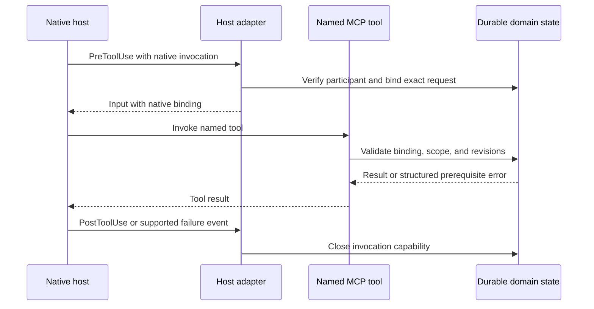

<!-- last_updated: 2026-09-14; synced_from: 243400e58ca74c7fd79bcdd86b488953fa743b97 -->
# Connecting native host events to project work

[한국어](../../ko/contributing/hosts.md)

Neurath integrates with Claude Code and Codex through installed instructions, skills, hooks, and a named MCP server. The host runs the agent and its native tools. Neurath uses host events to connect that activity to the current request and project state.

A **session** is the native conversation, an **actor** is a participating agent, and the **root actor** owns the session's task list. A **foreground turn** is the current period of work on a native request. A **worktree claim** records the actor that owns coordinated work in the checkout. A **receipt** records an event or report; here, native receipts establish which host invocation occurred. These definitions matter because the same tool name can appear in several sessions at once.

## Inspect four separate prerequisites

Use `session_status` to inspect installation, native activation, effective execution mode, and ownership. Its default summary avoids the full capability catalog; `detail: "full"` includes it. Follow with `session_inspect`, `turn_inspect`, or `worktree_inspect` when the relevant state needs closer examination.

| Observation | What it establishes | What remains to check |
| --- | --- | --- |
| Installed projections exist | Project configuration and assets were written | The current host loaded them |
| Native activation is observed | This host supplied the required activation evidence | Current prompt, policy, and ownership |
| Effective mode is observed | The current execution settings are known | Whether the intended action fits those settings |
| Current actor owns the claim | Coordinated ownership of this worktree | Task scope and action-specific prerequisites |

A diagnostic result does not authorize the agent to invent missing identity, acquire a foreign claim, or change mode. If the host has not supplied a required prerequisite, resolve that prerequisite through the supported native route.

## What the event adapter does

| Native event | Neurath responsibility |
| --- | --- |
| `SessionStart` | Validate startup and record the native connection and transcript relationship |
| `UserPromptSubmit` | Reconcile the foreground turn and the native instruction receipt |
| `PreToolUse` | Validate the current foreground, bind named MCP calls, enforce relevant worktree and capability checks, and observe native TODO submissions |
| `PostToolUse` | Close exact invocation capabilities and record applicable native results |
| `PostToolUseFailure` / `PermissionDenied` | Handle supported Claude Code failure or denial events without inventing success |
| `SubagentStart` | Reconcile child identity against the host's spawn evidence |
| `SubagentStop` | Validate the child's continuation and owned delegation obligations |
| `PreCompact` | Retain eligible context through the memory event path |
| `Stop` | Evaluate the current root's normal completion prerequisites |
| `SessionEnd` | Record disconnection and retire outstanding native call bindings |

The common installed event set and host-specific additions are defined in the installation projection and host adapter. The presence of a handler in source is implementation coverage; observed events from a real host establish native behavior.

## The exact-call binding

A named MCP tool appears to the host with a name such as `mcp__neurath_collaboration__task_list`. Before it runs, `PreToolUse` validates the native participant and issues `_neurath_binding` for that exact request. The binding includes the request identity and current turn context in durable state. It is closed by the corresponding host result.

The agent supplies task arguments and lets the hook supply the binding. It must not manufacture `_neurath_binding`, reuse a closed binding, or add caller identity fields to a tool's arguments. The MCP process itself starts without inherited actor authority. Its dispatcher accepts only the operation's schema and the host-bound invocation.

If bypass skipped a Codex user prompt, the first normal tool call checks the live native root transcript before restoring the missing foreground turn. Recovery accepts only host-classified user text for the exact current session, worktree, and turn, then uses ordinary prompt processing before issuing a binding. It does not trust tool arguments as prompt text, restart ended sessions, or convert peer messages into user authority. Existing tasks and workflows remain unfinished.

The current implementation limits a named task request to 64 KiB and the MCP frame to 128 KiB. Those transport limits are independent of smaller field and document limits in individual schemas.

## Root, child, and independent sessions

A root actor has no parent. A same-session subagent has a persisted parent and a delegated scope. Host-attested lineage proves the immediate parent when that evidence is available; a retained parent pointer alone can have weaker assurance.

Child startup can arrive before the host's spawn return receipt. In that interval the child may receive the assignment as context, while stateful tools remain gated. The adapter rejects shell and write tools for an unverified child instead of allowing inherited root authority.

The supported child route is a direct native child. Copied parent references or nested spawning do not establish supported lineage. A peer-resumed delegation can bind an exact in-progress task revision and definition digest; migration or a changed task scope invalidates that grant.

An independent provider run creates another native session with its own root. Its plan and execution policy must match the authorized assignment. `provider_capabilities` describes implemented routes; current native availability requires observation. A durable `run_id` confirms admission, and app visibility remains a separate observation.

In the shared documentation example, the user's web application loses a saved filter on reload. The implementer may ask a child or independent participant to inspect the API contract, when that participation is authorized. The reviewer needs a real native identity and bounded assignment whichever route is used. The filter feature belongs to the example application, not to Neurath.

## Session resume and app affiliation

Normal host `SessionEnd` records disconnection while preserving resumable session state, tasks, enclave facts, and the claim. The kernel `SessionEnded` transition is permanent. A verified resume or root prompt can retire an interrupted older foreground while preserving unfinished work. A fork creates a new root that needs its own claim.

`session_status.app_project` is a bounded, read-only diagnosis of local app-owned affiliation for a verified root. It distinguishes `assigned`, `unassigned`, and `unobserved`. A matching local project record proves assignment; an explicit projectless record proves unassignment. Missing, conflicting, invalid, unsupported, unavailable, or oversized local state stays unobserved. The read is capped at 16 MiB and returns only relevant affiliation data. Native provider project metadata is not app-membership evidence, and affiliation is not remote UI observation or permission evidence.

An app-created root can be reconciled from paired actual creation/message delivery and completion with a matching native turn. Known host context may accompany it; missing completion, wrong turns, unknown context, or conflicting human input reject reconciliation. This can establish an active native turn without a new user prompt receipt or approval. Use the app creation route when the user requests an app-associated task; provider execution and app affiliation remain distinct.

## Host TODO tools

Neurath projects the task list to Codex `update_plan` or Claude Code `TodoWrite`. Native `PreToolUse` and result events pair the exact submitted rows with their outcome. The receipt's scope is `native-tool-submission`; it does not prove that the app rendered the list or that the underlying tasks succeeded.

A host capability begins as `unobserved` until a relevant native submission is observed. An unsupported runtime returns `unsupported-runtime`. Read [task and TODO contract](task-todo-contract.md) before treating a native “completed” marker as a successful task outcome.

## Stop validation and response delivery

Neurath checks the current root, turn, transcript, and connection before attempting canonical completion. Unresolved task or workflow prerequisites still reject that state transition. They do not authorize another model invocation: the root Stop adapter returns exit code 1, an empty JSON object, and a diagnostic on stderr instead of a blocking decision or exit code 2. The host can return the response while unfinished work and its completion checks remain intact.

This behavior applies from the first failed Stop. There is no retry counter, prompt keyword classifier, or special case for status questions. `stop_hook_active` supplies no completion evidence. A successful close still requires the existing domain checks. A stale or already terminal event uses the read-only route and cannot complete newer work. Explicit user interruption remains controlled by the host.

## Diagnosing a missing observation

When installation is present but activation is absent, inspect the installed host configuration and current native event path. When a child is unverified, reconcile actual spawn evidence. When a call reports a changed prompt or turn, read current native state and make a new valid invocation. When a claim belongs to another actor, preserve it and use an authorized work arrangement.

Do not substitute synthetic environment variables, copied tokens, edited SQLite rows, or status output for missing native evidence. Source tests can demonstrate rejection behavior and state transitions; a real-host observation is still required for claims about the host currently running the harness.

The [runtime lifecycle](runtime-lifecycle.md) explains how these events surround task work. [Task tools](task-tools.md) explains the public call contract.
