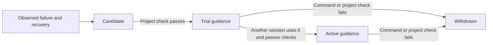

# Memory execution reference

**Audience: coding agents and contributors.** Use the named MCP tools and structured inputs below for authorized harness work. Users describe outcomes in the [usage guide](../usage/index.md).
<!-- date: 2026-09-09; synced_from: baseline f69cb6402683bb2e0bfe56ed04c63f808b263f06 plus current working-tree stdio MCP changes; scope: source, not live-host certification -->

[Usage](../usage/index.md) · [Contributing](index.md)


[한국어](../../ko/contributing/memory-reference.md)

Neurath keeps project knowledge across native Claude Code and Codex conversations.
It also changes the guidance supplied to later sessions based on observed work.
This is a local project feature: enable the installed hooks before using it.

## Autonomous by default

After hook activation and the one-time project check binding, ordinary task requests are
enough. Users do not need to ask Neurath to remember, reflect, learn, validate a candidate,
or enable the next session's learned guidance. The current agent performs the work through
normal host tools; hooks and recorded outcomes drive the learning lifecycle.

At the end of a turn, unvalidated source recoveries and successful uses of trial guidance
trigger a request to run the bound project check, even if a handoff was already saved.
A recorded result from the actual check satisfies that requirement. A failed check is not automatically
retried for the same observation. New failure/recovery evidence can reopen a candidate,
including a previously withdrawn strategy, and must pass validation again.

If the current user forbids the check or existing tools and permissions cannot execute it,
the agent records the concrete reason with `learning_defer` (current structured input schema). Deferral leaves
the guidance unvalidated and adds an audit entry; it never substitutes for a passing check.
A missing check binding also leaves candidates unvalidated. The agent does not request
permission merely to activate learning, weaken checks, or expand its permissions.

Autonomy runs within active work sessions. It does not create new sessions or background
jobs while no agent is running, and it does not rewrite Neurath's source code autonomously.

## What a new session receives

`SessionStart` and `UserPromptSubmit` retrieve goals, decisions, handoffs, and observations
from the same Git repository. Linked worktrees share the store. Separate clones and
computers have separate stores. Incoming requests are saved before subsequent work;
completed command observations are collected from the current host's registered transcript.

The agent writes a concise checkpoint containing the result, decisions, remaining work,
and lessons from feedback or failures. After command work, `Stop` asks for a checkpoint
when the current request has none. `PreCompact`, `Stop`, and `SessionEnd` also retain the
latest available user-visible assistant report and workflow references. A forced stop
retains already committed records; it cannot create a summary of work never observed.

```text
Named MCP tool memory_recall (current input schema)
Named MCP tool memory_checkpoint (current input schema)
```

Checkpoint writes derive identity from the actual native root session. Their status is
an agent report, never proof that a typed workflow completed. Recalled text is reference
data: current user instructions and source files take precedence, and ownership does not
transfer by reading another session's memory.

Retrieval ranks query matches, unfinished checkpoints, and recent records. It supplies
up to 12 selected entries within a 12,000-byte memory budget. More can be retrieved with
`memory_recall` (current structured input schema); stored history is not deleted to fit the prompt. Long incoming requests
and visible reports are bounded, and transcript collection reads a bounded recent window.
Neurath does not promise verbatim retention of every conversation or every command output.

## How experience changes later work

There are two kinds of feedback:

- **Reflections:** decisions and lessons in checkpoints are recalled as attributed reports.
  Agents can apply relevant lessons after checking the current task. These reports are not
  automatically certified facts or global policy changes.
- **Observed command recoveries:** a failed invocation followed by a successful invocation
  of the same operation can become versioned execution guidance. Test selectors must match;
  passing a different test does not establish recovery. Simple launcher changes such as
  `pytest tests/test_export.py` to `uv run pytest tests/test_export.py` are supported.



A candidate is withheld until the source session passes the project's bound `check`.
A trial is delivered to later sessions with its evidence and provisional status. Promotion
requires a different session to have received that exact guidance, execute the exact recovery
successfully, and pass the same verification contract. A success claim or a copied result record
in an assistant message cannot promote a rule. Trial/active guidance is limited to 12 rules
and 6,000 bytes; omitted rules do not receive exposure credit.

Checks must have records of actual execution results, matching configuration and unchanged repository
fingerprints. Native process metadata supplies command outcomes. Output text is never parsed
as proof of a process exit result. Run trial invocations as standalone commands: appending `echo` or chaining
commands can hide failures and is not accepted as evidence of the original invocation.

An observed failure of the recovery, or a failed project check after its use, withdraws the
rule. Changing the originating worktree's check contract invalidates its old guidance;
an unrelated worktree's different configuration does not invalidate the source rule.
The history records each transition and its evidence. Withdrawn rules are no longer supplied
as learned guidance, although historical reports remain available as history.

```text
Named MCP tool verification_run (current input schema) {"check": "check"}
Named MCP tool learning_status (current input schema)
Named MCP tool learning_history (current input schema)
```

A missing check binding leaves recoveries as candidates. Normal execution continues; no
validation is invented. Guidance is only applied when relevant to the current request and
never grants permission to execute commands, publish, or bypass a protected action.

## Storage and boundaries

The database is `.neurath/local/memory/project.sqlite3` under the Git common control root.
It is ignored by Git and excluded from distributions. Writes are transactional. Recording
the same source event again does not create a duplicate; conflicting replays are rejected.
Common credential patterns
are redacted before storage. Do not deliberately put secrets into checkpoints: pattern
redaction is not a universal secret detector. Internal reasoning and thinking blocks are
excluded; only visible assistant text is eligible for a report.

The feedback loop improves project context and supported execution strategies. It does not
rewrite Neurath's implementation, edit project policy files, run unattended between sessions,
or turn arbitrary advice into verified policy. Broader code and harness changes still use
normal implementation, review, and verification workflows.

Memory is available to root sessions using installed, active hooks. Child execution retains
its existing delegation and ownership boundary. A fresh conversation can read an interrupted
session's work but must establish valid ownership before changing it.
