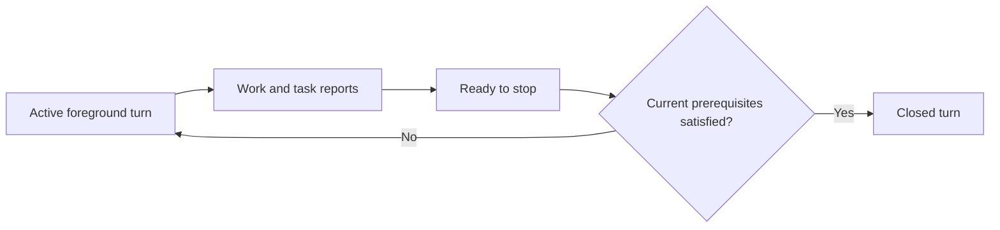

<!-- last_updated: 2026-09-14; synced_from: 243400e58ca74c7fd79bcdd86b488953fa743b97 -->
# From a user request to a finished native turn

[한국어](../../ko/contributing/runtime-lifecycle.md)

Neurath connects the user's requested result to task state, native execution, and the eventual return of control. The lifecycle is easiest to follow with a concrete example: a user's web application loses its saved filter after refresh. The requested result is that saving and reloading preserves the filter. Neurath records and coordinates that repair; the filter is not a Neurath feature.

A **goal** describes the required result. A **task** makes part of that result measurable through **acceptance conditions**. The **root actor** owns these tasks inside a native **session**. A **worktree claim** coordinates ownership of the checkout. A **receipt** records a particular event or report. A skill may organize work into **phases**, and an independent **review** may assess the implementation and its evidence.

## 1. Establish the current request and owner

Native startup and prompt events establish the active session, root actor, foreground turn, and instruction receipt. `session_status` separates installation, activation, effective mode, and ownership. `task_list` returns the current ledger and the `current_prompt_source` available for task intake.

The agent checks the current worktree claim before work that requires ownership. A claim request applies only to the current native actor and current checkout. A conflict does not authorize takeover. See [host integration](hosts.md) for the native evidence behind these operations.

## 2. Record an observable result and choose the next work

Define the task from the user's requirement: reproduce the disappearing filter, restore persistence, and observe the chosen filter after reload. Acceptance should describe the expected application behavior. Record necessary follow-up when it becomes concrete, preserving the original instruction source.

The owner starts a pending task with the exact list revision and task revision. Dependencies must be terminal before start. The dependency contract checks settlement, so the owner must still assess whether an unsuccessful dependency leaves the intended work viable.

If API review can proceed independently, assign a bounded question while implementation continues. The selected skill may also record phases through `phase_start`, `phase_current`, `phase_evidence_prepare`, `phase_complete`, and `phase_finalize`. These organize the procedure; their state is not another task-result ledger.

## 3. Perform native work and receive results

The host runs file edits, commands, and checks through its native tools. Named MCP operations manage the associated state and coordination. A prepared delegation is ready for the supported spawn path; it is not a child execution receipt. A provider run's `accepted` result is durable admission; the actual result arrives through its execution and delivery lifecycle.

A same-session delegation moves from `pending` to `reported` to `consumed`; cancellation before a report has its own terminal route. The owner must consume the review or delegated result, assess its scope, and connect it to task acceptance. A message acknowledgement records receipt, not task acceptance.

For the filter repair, a useful report distinguishes the reproduced save/reload failure, the changed persistence behavior, the API review conclusion, and the regression evidence. A test command discovered during investigation can be retained as a lesson once its usefulness is observed.

### When the authorized work includes a PR monitor

A PR monitor observes a specific workflow and pull request and can resume its owner only through its authorized route. `monitor_start` returns admission before actual startup. The worker must consume a single-use launch grant bound to its real PID and process start identity, generation, installed distribution, and the owner’s native policy. A supplied PID or a process merely being created is not that evidence.

Startup does not issue `thread/resume` while the owner is still in the turn that requested the monitor. The monitor records its subscription from the first observation; a later idle-owner resume checks the current native policy immediately before using the app-server route.

`poll_interval_seconds` defaults to `30` and accepts `5`–`600`; `once` and `observe_only` both default to `false`. An observe-only monitor does not resume the owner or claim resume delivery. `monitor_readback` reads the live process and subscription receipts. `monitor_ack` consumes the exact event occurrence using current live evidence and a compare-and-swap check of the workflow revision.

Before resuming a Codex owner, the monitor rereads that owner’s latest native policy even when the foreground turn is idle. Changed or unobserved approval policy, approvals reviewer, sandbox policy, or collaboration mode rejects resume and requires `monitor_recover`. Recovery first requires the actual previous process to have exited, then starts a new generation while retaining the workflow and PR scope. `monitor_cancel` requests cancellation through a durable flag and private authenticated control channel; inspect the terminal result before reporting cancellation complete.

## 4. Keep the goal in view while work continues

The goal reminder runs automatically on supported native root events. It adds reference context without changing tasks, granting authority, or deciding whether the goal is satisfied.

| Trigger | Current behavior |
| --- | --- |
| First eligible event with relevant task context | Deliver the initial reminder |
| New native prompt | Refresh the periodic reminder's prompt context |
| 12 unique tool completions | Deliver a periodic reminder; success and failure for one invocation count once |
| 300 seconds since the periodic notice | Deliver on the next eligible event; this is not a background timer |
| `PreToolUse` for named `task_define`, `task_start`, or `task_resolve` | Deliver an immediate decision reminder without resetting the periodic cadence |

The reference context is bounded to 2,400 UTF-8 bytes and at most four task excerpts. Each excerpt includes up to two acceptance conditions and, when available, a reported result. It prioritizes a selected task when a decision identifies one. An excerpt can omit sources and results; use `task_list` when the full record is needed. A bounded cursor remembers the latest 64 event identities to suppress duplicate callbacks. This metadata controls delivery frequency and has no execution authority.

Delivery is restricted to the verified active root: foreign or child events, migrated source sessions, and bypassed hooks do not receive the reminder. Once all recorded tasks report success, ordinary periodic reminders are suppressed; the immediate `task_define`, `task_start`, and `task_resolve` decision reminders remain eligible. They still do not reset the periodic counter or timestamp.

In the example, the reminder helps the agent notice that polishing its chosen testing method is consuming effort while save/reload behavior remains unverified. The appropriate response is to choose useful work toward the persisted-filter goal, not to add a separate reflection report.

## 5. Resolve the observed outcome

Before resolving a task, define any discovered necessary follow-up that is not already tracked. Submit `task_resolve` with exact current revisions, an outcome, references, and a summary. The service stores a content-addressed owner report bound to the task definition. Its assurance is `agent-report`.

Task outcomes are `succeeded`, `failed`, or `invalidated`. Terminal history is immutable. A failed attempt should identify the unmet condition, actual blocker, and next action. A status question, elapsed time, or Stop rejection is not failure or cancellation evidence. If required work remains after a failed attempt, preserve the report and define the remaining bounded work.

`all_terminal` means execution records have terminal outcomes. Inspect `all_succeeded` and `unsuccessful_task_ids` before describing the result as successful. A later successful task can cover remaining work without erasing the earlier failure.

## 6. Return control through the current foreground turn

The foreground turn has `active`, `ready-to-stop`, and `closed` states. A yield receipt can describe `completed`, `awaiting-input`, `failed`, or `incomplete`; the label itself does not waive domain checks. The normal Stop route verifies the current native event and completion prerequisites before closing the turn.

Where the task ledger is registered, unsettled tasks reject completion in the closing transaction. An explicit `awaiting-input` receipt may close the foreground turn while preserving every unfinished task. Task history is the task-completion authority; legacy phase and TODO display states are not extra task-completion gates. Independent domain obligations, including relevant incidents and unconsumed delegations, still have their own checks. Legacy workflows retain their applicable lifecycle rules where no ledger has been registered.

Canonical closure remains rejected until the prerequisites hold. The root Stop adapter returns a nonblocking diagnostic instead of requesting another model turn, so a response can return while unfinished work is preserved. Repeated rejection, `stop_hook_active`, and side questions do not establish completion. On detecting Neurath malfunctioning, the agent may autonomously enable harness bypass without additional user permission. A stale event cannot close a later turn. Explicit user interruption remains owned by the host.

## Continuing after context or transport loss

Use a checkpoint to retain the reproduction, decisions, outstanding evidence, and next useful step. Its `completed` value is an agent's handoff report, not task or workflow completion. `memory_recall` and memory preview supply reference context.

When continuation must move to another native session, `memory_pull` separates listing, preview, reading, and adoption. Adopt the exact immutable preview only after the source is quiescent and the revision prerequisites are satisfied. The receiving session keeps its own native settings. A committed migration fences source writes and preserves historical outcomes instead of falsely resolving them.

For transport uncertainty, inspect the owned run or message after the relevant event or failure, follow the returned recovery action, and preserve operation identity on uncertain retries. Recovery is not permission to resume a foreign live session or rerun completed product work.

See [task tools](task-tools.md) for exact input examples and the [capability map](capability-map.md) for the associated recovery tools.
