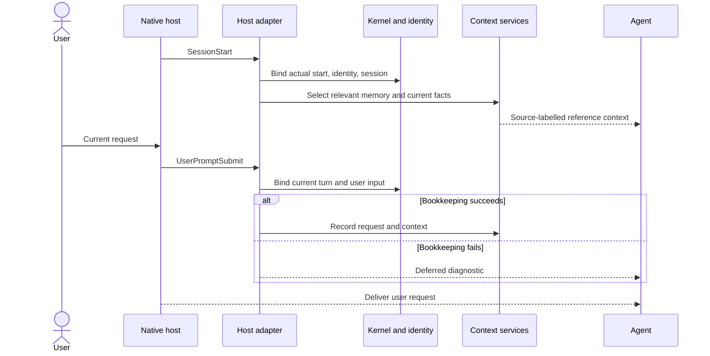
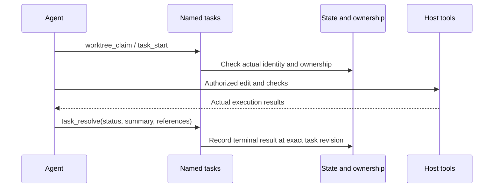
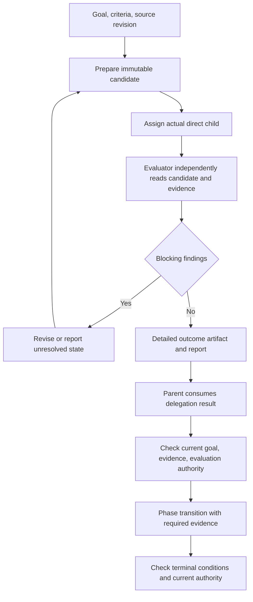
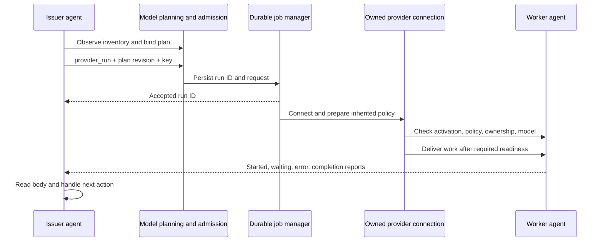
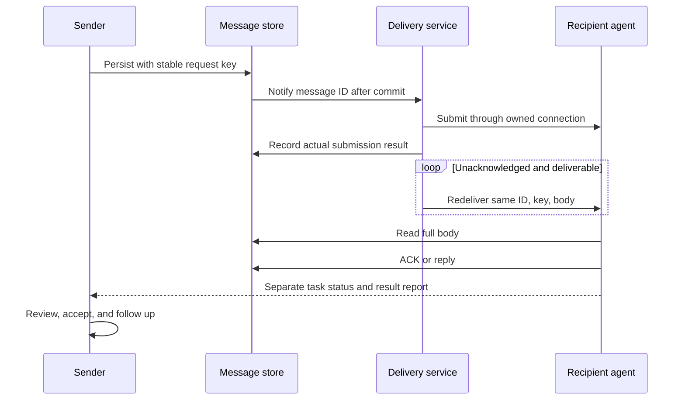
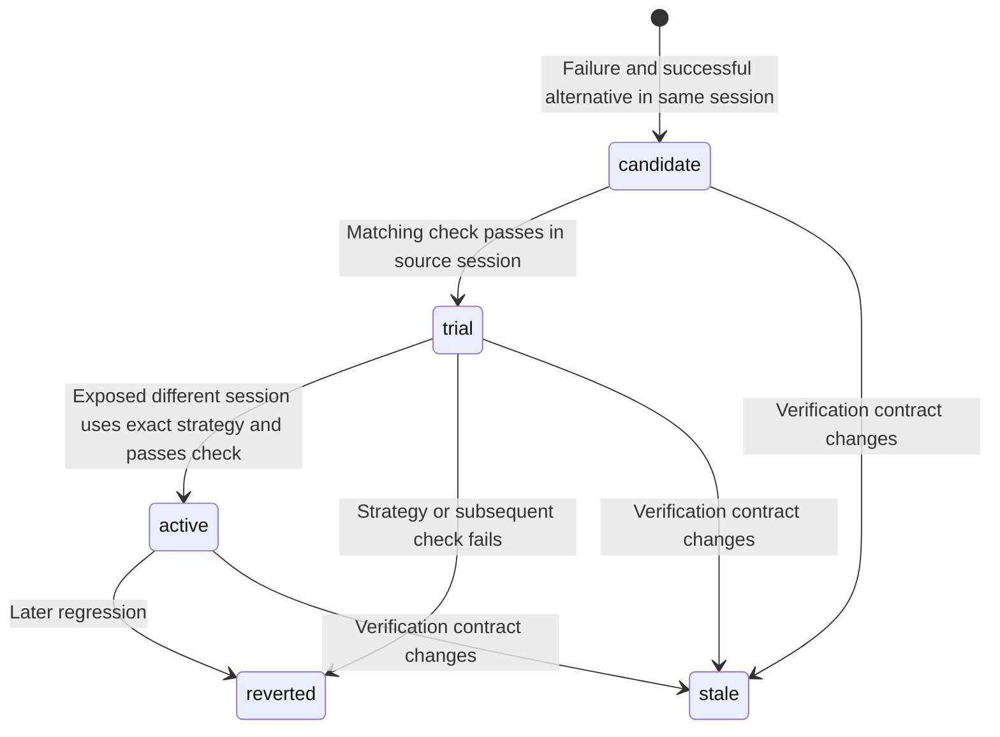
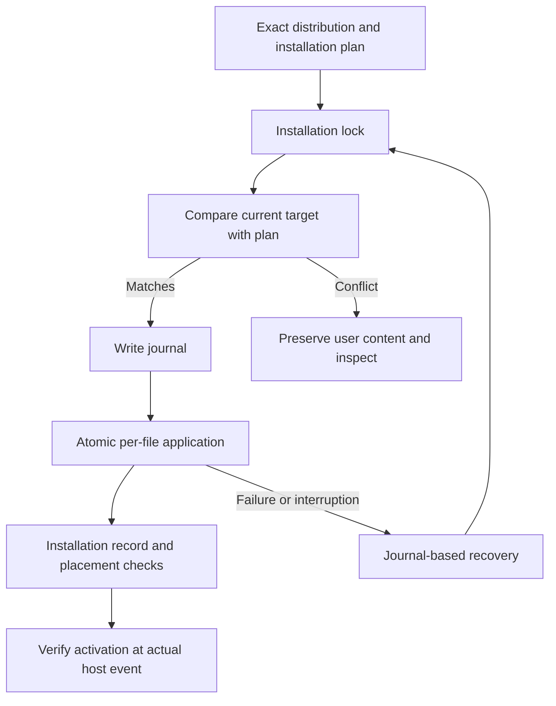

# Runtime lifecycle and recovery

<!-- date: 2026-09-09; synced_from: baseline f69cb6402683bb2e0bfe56ed04c63f808b263f06 plus current working-tree stdio MCP changes; scope: source, not live-host certification -->

**English** · [한국어](../../ko/contributing/runtime-lifecycle.md)

[Architecture](architecture.md) · [Design philosophy](design-principles.md) · [Capability map](capability-map.md)

This guide uses “implement task-record export” as an example request. It illustrates execution boundaries, not an export feature in Neurath. The learning diagram uses code status values; other diagrams summarize responsibilities across modules.

## 1. Session start and user input

A declared hook differs from a verified session start. The agent distinguishes installation, activation, effective policy, and ownership. New native turns are separate from earlier turns; missing outcomes remain unknown. Root-input bookkeeping failures do not suppress new instructions, while execution authority checks remain enforced.

Sources: [hooks.py](../../../src/neurath/hosts/hooks.py), [identity.py](../../../src/neurath/hosts/identity.py), [memory hooks](../../../src/neurath/memory/hooks.py).

## 2. Native editing and checks

The agent claims the worktree, edits with native host tools, runs the relevant checks and records one task result. It does not create a material batch for an ordinary edit.

MCP calls bind the actual actor, turn, worktree and input. Expired bindings cannot authorize other calls. Compare-and-swap checks the current revision; fencing tokens reject stale ownership. Unknown execution outcomes remain unknown. Legacy material and verification operations remain internal compatibility interfaces and are absent from public discovery.

Sources: [task ledger](../../../src/neurath/runtime/task_ledger_tasks.py), [host hooks](../../../src/neurath/hosts/hooks.py), [MCP](../../../src/neurath/agents/mcp.py).

## 3. Phase progression and independent evaluation

Skill contracts specify required evidence and terminal states. Workflows requiring adaptive control need a host-attested independent evaluator before initialization. Reading a phase file or describing a result does not advance the phase.

An independent peer session differs from a native direct child. Provider results are agent reports and cannot create evaluator authority. Candidates bind goal, intent revision, source revision, workflow revision, and content digest. Old evaluations cannot be reused for changed documents.

`EvaluationLoop` finding/round management and adaptive goal assessment are connected but separate responsibilities. Evaluators inspect source, tests, and documents instead of trusting the writer report. Writers consume findings and determine necessary revisions and rechecks. See [task tools](task-tools.md) for the control surface.

Sources: [phase runner](../../../src/neurath/_assets/scripts/skill_harness/phase_runner.py), [evaluation authority](../../../src/neurath/_assets/scripts/agent_harness/adaptive_control_authority.py), [workflow tasks](../../../src/neurath/runtime/workflow_tasks.py).

## 4. Independent provider execution and reports

Observe actual model inventory and record task difficulty, constraints, alternatives, and replanning conditions. Plans bind inventory, target worktree, assignment revision, and actual execution policy. The inherit selection omits model overrides and verifies the configured default after creation; a recommended catalog default is not the user's configured default.

Codex uses the official app-server connection and Claude the official Agent SDK route. Requested mode, applied mode, and observed OS restrictions are distinct. Default inheritance preserves the immediate creator's actual restrictions. Unsupported or unobservable mappings must not silently relax them.

Admission is not start or completion. Ordinary task lifetime is separate from connection/request deadlines. Cancellation requests differ from actual outcomes. Recovery handles recorded sessions of owned executions whose termination has been verified; it does not blindly replay the original assignment.

App project affiliation and user observation are not prerequisites in the current execution contract. Conversely, app-server connectivity does not prove Desktop integration or remote access. Report these observations separately.

Sources: [jobs.py](../../../src/neurath/providers/jobs.py), [execution readiness](../../../src/neurath/runtime/provider_execution.py), [model plans](../../../src/neurath/providers/model_planning.py), [transport reference](provider-transports.md).

## 5. Message delivery differs from task completion

Message status and delivery-attempt status are separate records. A `submitted` message remains an obligation without ACK. Attempt states such as `sending`, `uncertain`, and `failed` are not permanent abandonment. Recipients may receive duplicates and use IDs to recognize them.

Pending messages survive ordinary conversation TTL and close requests. Recovery holds preserve the body: inspect with `delivery_status`, repair the cause, then use `delivery_redrive` for the same message. This differs from creating a new task or polling for completion.

Owned executions can retain their connection after a turn completes when issued tasks or inbound messages remain. Without a supported Desktop ownership bridge, report the queued limitation. Notification at a later hook is not automatic resumption of an idle app. Newsroom is separate: active participants receive titles and explicitly fetch bodies.

Sources: [store](../../../src/neurath/agents/store.py), [delivery](../../../src/neurath/agents/delivery.py), [recovery](../../../src/neurath/agents/delivery_recovery.py), [SessionInbox](../../../src/neurath/providers/supervision.py), [Newsroom](../../../src/neurath/agents/newsroom.py).

## 6. Memory and command recovery learning

These are the principal learning transitions. Without a check binding, a candidate can remain a candidate; deferral is not success. Promotion needs actual exposure in the other session, native results for the exact command, and the matching verification contract. A printed success string is not a process exit result.

Reflection/checkpoints and learned strategies differ. A checkpoint is reference reporting for future work; learning narrowly validates, trials, retains, or reverts observed execution recovery. See [memory reference](memory-reference.md) for storage and selection limits.

Sources: [learning](../../../src/neurath/memory/learning.py), [native records](../../../src/neurath/memory/transcript.py), [verification](../../../src/neurath/runtime/verification.py).

## 7. Installation, updates, and interrupted recovery

Updates separate release checks/notices, exact wheel and change preparation, user choice for that target, and apply. Preparation is not installation consent. Reporting and contribution similarly check drafts, targets, existing consent, and distinct approval requirements. Uncertain results require reconciliation with recorded requests and actual targets rather than automatic execution again.

Sources: [transaction](../../../src/neurath/install/transaction.py), [updates](../../../src/neurath/updates.py), [apply and recovery](../../../src/neurath/release_install.py), [maintenance choices](../../../src/neurath/runtime/user_choices.py).

## Reading failures

| Observation | Meaning | Next evidence |
| --- | --- | --- |
| Installed, activation unverified | Placement only | Actual host event and identity |
| Worktree claim conflict | This actor lacks write ownership | Existing owner and normal ownership procedure |
| Missing phase evidence | Transition requirements unmet | Phase, candidate revision, evaluation record |
| Unknown material result | Actual outcome unobserved | Target read-back and invocation record |
| Queued/submitted message | Delivery or receipt can remain pending | Full body, ACK, owned connection |
| Candidate/trial learning | Validation or cross-session trial remains | Pending obligations, exposure, exact use, check |
| Uncertain maintenance | External effect is uncertain | Recorded request and external reconciliation |

Use “recorded,” “submitted,” “observed,” “verified,” and “accepted” according to the available evidence.

## MCP paths for phases and monitoring

A phase workflow follows `phase_start` → `phase_current` → `phase_evidence_prepare` → `phase_complete` →
`phase_finalize`. Preparation checks current required labels and exact revision, then returns an immutable
reference distinguishing Git readback from agent reports. An arbitrary stored artifact cannot substitute for
this registration. Changed owner, workflow or source invalidates reuse. Adaptive goals and independent
evaluation retain the real authority checks in `adaptive_*` and `evaluation_*`.

`monitor_start` admits monitoring authorized by the current owner and returns a run ID. A protected single-use
launch grant binds the actual child PID, process start, generation and code without creating a native agent
identity. Started is reported after the first observation and actual readback. Monitor lifetime differs from
the time limit on an individual GitHub request.

`monitor_cancel` uses a durable request and private control channel; admission alone does not establish exit.
`monitor_recover` verifies prior process termination and remaining leases before starting a new generation.
Before resume, the worker checks the owner's latest policy and omits arguments that overwrite it.
`monitor_ack`, `monitor_external_wait` and `monitor_handoff` retain the domain contracts for event consumption,
external waiting and retirement of prior monitoring. Observe-only monitoring does not resume the owner session.

An operational final phase may pass its contract's `terminal_state` to `phase_complete` for atomic completion.
Do not call `phase_finalize` again afterward. Contracts requiring separate final authority, including adaptive
workflows, retain separate finalization. Use the actual workflow_revision returned by the last operation;
after interruption, inspect `phase_current` before another mutation.
