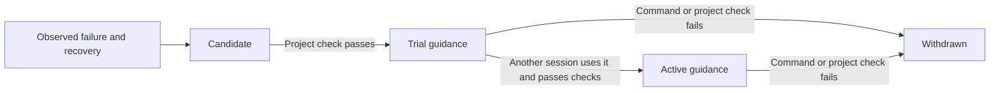

# Memory and learning

**English** · [한국어](../../ko/usage/memory.md)

<!-- date: 2026-09-07; synced_from: source and documentation at e1487a1718056b37b999d1343a1007b7e25f5c8c; English and Korean editions updated together -->

[Usage](index.md) · [Contributing](../contributing/index.md)

Neurath carries project context into later Codex and Claude Code sessions. With installed,
active hooks and the project's check connected, the agent handles remembering, reflection,
retrieval, and validation during ordinary work. There is no separate command or learning switch
for the user to operate.

## Continue from saved work

> Continue the work log export task. Read the previous decisions and remaining work, compare
> them with the current source, and finish the pending verification.

The agent retrieves relevant goals, decisions, handoffs, and observations from the same local
Git repository. Linked worktrees share them. Separate clones and computers have separate stores.

Requests and observed command results are recorded as work proceeds. The agent leaves a concise
handoff containing results, decisions, remaining work, and lessons. If execution is interrupted,
already saved records remain; Neurath cannot reconstruct work it never observed or promise a
verbatim archive of every message and command output.

## Ask about the context when useful

> What did we decide about export filenames, and what is still unfinished?

> Which execution strategies have been verified, and which are still being tried?

The agent retrieves additional records and explains their source and current status.
You do not need to inspect the memory database. Saved reports are reference material: the
current request and current source take precedence, and remembered permission or ownership
does not transfer to a new task automatically.

## How experience improves later work

Reflections preserve lessons as attributed reports. Command recovery has a stricter path:
a failed execution and a successful alternative for the same operation become a candidate
for guidance. Passing a different test is not evidence that the original failure was resolved.

The agent runs the connected project check before trying a candidate in another session.
Activation requires a different session to use that guidance successfully and pass the same
verification contract. Later failure withdraws it. A printed success message is not an
execution result, and copied claims cannot promote guidance.

A missing check or a check the agent cannot run leaves guidance unvalidated. The agent records
why it deferred validation. It does not repeatedly run a failed check on the same evidence;
new failure or recovery evidence can reopen validation. You do not need to request learning
or approve its activation separately.

## Boundaries

Memory is local and excluded from commits and distributions. Common credential patterns are
redacted, but that is not a universal secret detector; private reasoning is not recorded.
Do not include secrets in requests intended to become shared work records.

The agent selects relevant entries rather than loading every past conversation.
Learning changes supported execution guidance, not Neurath's source code or project policies.
It grants no additional permissions. It runs within active sessions and does not create
unattended background work. New sessions still establish valid ownership before editing.

The [memory execution reference](../contributing/memory-reference.md) documents internal
commands, retrieval budgets, storage, and evidence rules for agents and contributors.

[Usage](index.md) · [Collaboration](agents.md)
