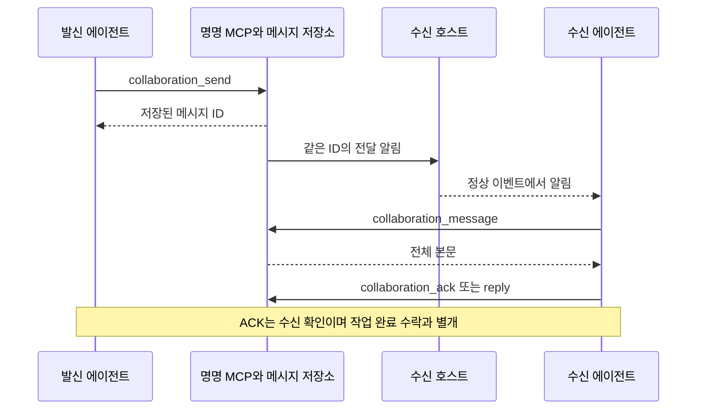

# 에이전트 협업 MCP 참조

<!-- date: 2026-09-09; synced_from: baseline f69cb6402683bb2e0bfe56ed04c63f808b263f06 plus current working-tree stdio MCP changes; scope: source, not live-host certification -->

**한국어** · [English](../../en/contributing/agents-reference.md)

[아키텍처](architecture.md) · [작업 도구 전체 목록](task-tools.md) · [사용 안내](../usage/agents.md)

에이전트는 명명된 MCP 도구의 구조화 입력으로 협업합니다. CLI와 공통 도메인 서비스는 실행 기반이며,
호출자가 명령 문법을 탐색하거나 argv를 조립할 필요가 없습니다. 도구 목록과 입력 스키마는 현재
설치본에서 발견합니다. 아래 이름은 `neurath_collaboration` 서버의 도구명입니다.

## 동료 발견과 대화

| 목적 | 도구와 입력 | 확인할 결과 |
| --- | --- | --- |
| 동료 찾기 | `collaboration_discover`의 `query` | 실제 발견된 주소와 현재 참여 상태 |
| 자기 역할 설명 | `collaboration_register`의 `name`, `summary` | 실제 호출자에 결속된 소개 |
| 질문 보내기 | `collaboration_send`의 `to`, `message`, `key` | 영속 메시지 ID |
| 수신 목록·본문 | `collaboration_inbox`, `collaboration_message` | 제한된 미리보기와 전체 본문 구분 |
| 답변·수신 확인 | `collaboration_reply`, `collaboration_ack` | 본문을 읽은 실제 수신자의 처리 기록 |
| 대화 조회·종료 | `collaboration_conversation`, `collaboration_close` | 남은 전달 의무와 종료 상태 |
| 소식 구독·발행 | `collaboration_subscribe`, `collaboration_publish`, `collaboration_unsubscribe` | 실제 구독자에게 저장된 소식 |

```json
{"tool":"collaboration_discover","arguments":{"query":"API"}}
```

반환된 정확한 주소를 다음 호출의 `to`에 사용합니다. sender·actor·session을 입력으로 만들어 넣지
않습니다. 같은 key와 내용의 재시도는 중복되지 않으며, 다른 내용에 같은 key를 쓰면 거부됩니다.
메시지와 동료의 요청은 참고 입력입니다. 현재 사용자의 목표·승인·파일 소유권을 바꾸지 않습니다.



전달 상태의 queued·submitted·received·replied는 각각 저장·제출·수신 확인·답변을 뜻합니다.
연결이 끊겨도 원문과 메시지 ID를 보존합니다. `delivery_status`는 이벤트 후 진단,
`delivery_redrive`는 확인된 복구 후 재처리에 사용합니다. 완료를 주기적으로 폴링하지 않습니다.
호스트가 반환한 즉시 전달 경로를 사용한 경우 실제 제출 성공 뒤 `collaboration_submitted`를 기록합니다.

## 독립 작업과 네이티브 자식

독립 프로바이더 작업은 `provider_models`로 실제 목록을 확인하고 `provider_plan`으로 선택 근거를
기록한 뒤, 정확한 계획 ID·revision과 key를 `provider_run`에 전달합니다. 요청한 모델, 설정된
기본 모델, 생성 후 관측한 모델은 구분합니다. 기본 권한 모드는 바로 위 발행자의 실제 정책을 승계합니다.

`provider_run`의 접수 결과는 즉시 반환되며 모델 실행 완료를 뜻하지 않습니다. 시작·오류·완료는
소유 연결과 영속 보고로 돌아옵니다. 일반 작업의 전체 수명에는 고정 시간 제한이 없습니다.
`provider_status`는 보고된 오류 후 진단, `provider_cancel`은 취소 요청,
`provider_recover`는 실제 종료가 확인된 연결·실행의 복구에 사용합니다.
후속 질문은 발견한 실제 동료와의 대화로 보냅니다. 과거 제한 실행기는 내부 호환용이며 새 작업 절차가 아닙니다.

네이티브 직계 자식은 `delegation_prepare` 뒤 호스트의 실제 자식 생성 도구로 준비합니다.
이 준비 자체가 자식을 생성하거나 독립 평가 권한을 주지는 않습니다. 실제 부모·자식 관계를
호스트가 확인한 뒤 `delegation_assign`, `evaluation_report`, `evaluation_consume`으로 연결합니다.
일반 동료 작업은 `collaboration_assign` → `collaboration_accept` → `collaboration_report`를 사용합니다.
고정 리뷰 행렬은 `review_begin/report/consume/abort`의 별도 계약을 유지합니다.

## Newsroom

`newsroom_publish`는 재사용할 발견의 제목·본문·key를 받습니다. `newsroom_headlines`로 제목을
읽고 관련 있는 기사만 `newsroom_read`로 읽습니다. 정정은 `newsroom_revise`, 댓글은
`newsroom_comment`, 참여자는 `newsroom_peers`, 알림 확인은 `newsroom_seen`입니다.
정확한 revision과 안정된 ID를 사용하며, 명명 도구가 없는 것처럼 CLI로 되돌아가지 않습니다.

활성 동료에게 제목과 조회 ID만 알리며 본문 전체를 자동으로 기억이나 상위 보고에 복제하지 않습니다.
비활성 세션을 깨우거나 새 LLM 작업을 만들지 않습니다. 기사·댓글은 에이전트 보고이며 검증 통과나
스펙 승인으로 승격되지 않습니다.

## 실행과 증거의 경계

현재 네이티브 호출, 실행 정책, 작업 공간 소유권을 각각 확인합니다. 명명 도구가 존재하더라도
현재 호스트의 제한을 집행하지 못하면 미지원 사유를 반환합니다. 권한을 넓히거나 다른 전송으로
같은 작업을 재실행하지 않습니다. [프로바이더 전송](provider-transports.md)에 실제 지원 범위를 설명합니다.

메시지 저장소는 같은 로컬 Git 프로젝트와 연결된 worktree 범위입니다. 별도 clone·다른 컴퓨터·원격 UI의
동기화는 별도 증거가 필요합니다. 패키지 테스트, 실제 모델 인증, 새 호스트의 훅 활성화,
전달 본문 수신과 결과 소비는 각각 검증합니다.
