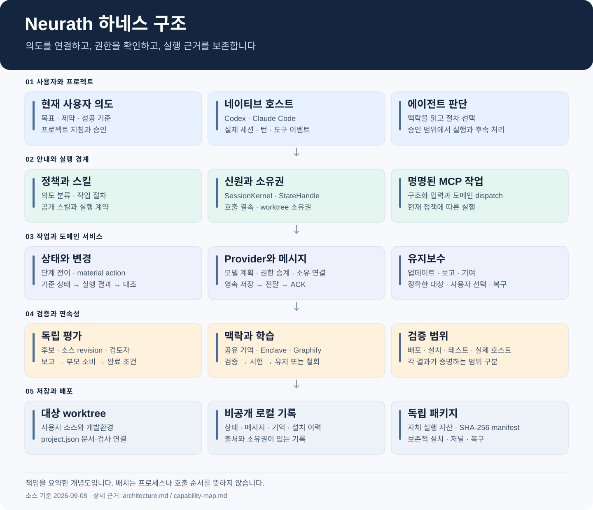
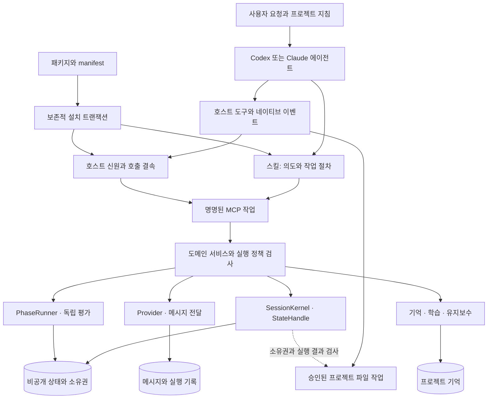
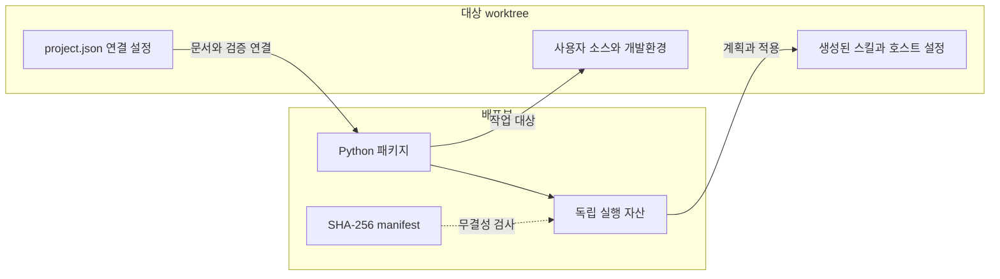

# Neurath 하네스 아키텍처

<!-- date: 2026-09-08; synced_from: 5e8d761c276ceb8ddc05dcf239bb2d020f4b0da5; scope: source architecture, not live-host certification -->

[English](../../en/contributing/architecture.md) · **한국어**

[기여 안내](index.md) · [설계 철학](design-principles.md) · [실행 수명주기](runtime-lifecycle.md) · [기능 지도](capability-map.md)

Neurath는 **코딩 에이전트의 작업을 프로젝트 맥락, 실제 호스트 권한, 검증 가능한 실행 기록에 연결하는 독립 하네스 키트**입니다. 에이전트가 다음 행동을 판단하는 동안 하네스는 누가 어떤 작업 공간에서 실행하는지, 어떤 근거가 남았는지, 그 근거로 다음 단계에 갈 수 있는지를 관리합니다.

이 문서 묶음은 현재 소스의 구조를 설명합니다. 구현의 존재, 테스트가 확인하는 성질, 설치된 호스트에서 관측한 동작은 서로 다른 근거입니다. 다이어그램은 주요 책임과 흐름을 요약하며 모든 함수 호출이나 데이터베이스 스키마를 표현하지는 않습니다.

## 읽는 순서

| 질문 | 문서 |
| --- | --- |
| 전체는 어떤 부분으로 구성되는가 | 이 문서의 구성도와 저장 경계 |
| 왜 이런 구조를 택했는가 | [설계 원칙과 철학](design-principles.md) |
| 요청·실행·평가·복구는 어떻게 이어지는가 | [실행 수명주기](runtime-lifecycle.md) |
| 각 기능과 스킬의 구현·검증 근거는 무엇인가 | [기능 지도](capability-map.md) |
| 실제 사용을 어떻게 요청하는가 | [사용 안내](../usage/index.md) |

## 전체 구성

그림의 세로 배치는 단일 프로세스나 순차 실행을 의미하지 않습니다.

## 안내·집행·연속성의 세 축

**안내:** 정책은 공통 실행 경계와 용어를, 스킬은 요청의 주된 목적과 입력 근거에 맞는 절차를 설명합니다. 실행 계약은 필요한 단계·근거·종료 조건을 정의합니다. 문장을 읽는 것과 계약을 통과하는 것은 별개입니다. 공개 스킬 `implement-issue`와 내부 계약 `process-ticket`처럼 이름이 다를 수 있으며 `skill_names.py`가 대응을 관리합니다.

**집행:** 호스트 어댑터가 세션·사용자 입력·도구 이벤트를 처리합니다. `SessionKernel`은 세션·actor·턴·workflow·위임의 상태와 전이를, `StateHandle`은 실제 호출자와 상태 접근의 결속을 담당합니다. worktree registry가 소유자를 확인합니다. 파일 변경은 호스트 편집·셸 도구가 수행하고 material action 서비스는 대상의 기준 상태, 도구 실행 결과와 변경 후 관측을 연결합니다. `material_prepare` 자체가 파일을 편집하지는 않습니다.

**연속성:** 공유 기억은 관련 목표와 결정을 다음 세션에 제공합니다. 메시지 저장소는 전달과 수신 확인을, provider 계층은 독립 실행과 소유 연결을 통한 보고를 관리합니다. 기억 조회가 작업 소유권을 넘기거나 ACK가 작업 완료를 승인하지 않습니다.

## 소스의 책임 분할

경로는 저장소 루트 기준입니다. [기능 지도](capability-map.md)에서 구현과 회귀 테스트를 직접 열 수 있습니다.

| 소스 | 책임 | 경계 |
| --- | --- | --- |
| `src/neurath/resources.py`, `src/neurath/manifest.json` | 배포 자산·무결성 | 대상 프로젝트를 빌드 입력으로 삼지 않음 |
| `src/neurath/install/` | 계획·배치·병합·충돌·적용·제거·복구 | 기존 사용자 파일·설정 보존 |
| `src/neurath/hosts/` | 이벤트·네이티브 신원·프로세스·호출 | payload 주장만으로 권한 생성 불가 |
| `src/neurath/runtime/` | 스키마·dispatch·정책·검증·상태·모델·유지보수 | 임의 셸이나 상태 패치 대신 정의된 작업 |
| `src/neurath/_assets/scripts/agent_harness/` | 커널·소유권·변경 결과·적응 제어·평가 | 목표·revision·근거·actor 대조 |
| `src/neurath/_assets/scripts/skill_harness/` | 계약·단계 진행·종료 | 필요한 근거 없는 완료 거부 |
| `src/neurath/_assets/.agents/` | 규칙·스킬·계약 원본 | 설치된 사본과 구분 |
| `src/neurath/providers/` | 모델 계획·권한 승계·실행·취소·복구 | 실제 설정과 소유자 확인 |
| `src/neurath/agents/` | 메시지·작업 보고·전달·Newsroom·MCP | 저장·전송·수신·수락 구분 |
| `src/neurath/memory/` | 기록·맥락 선택·학습·철회 | 참고 정보가 현재 권한이 되지 않음 |
| `src/neurath/updates.py`, `src/neurath/release_install.py`, `src/neurath/reporting.py` | 버전 안내·업데이트·보고·기여 | 정확한 대상·동의·복구·개인정보 |
| `tests/`, `tests/runtime/`, `tools/` | 회귀·계약·빌드·검사 | 검증 범위를 구분 |

## 배포 루트와 작업 루트

`_assets`는 하네스가 소유하는 독립 자산입니다. 설치기는 필요한 내용을 대상 프로젝트에 배치하지만 엔진은 패키지 자산 루트를 명시적으로 사용합니다. `runtime/engine.py`는 모듈이 번들에 있는지 검사하고 대상 루트에서 작업합니다. 공개 실행기는 격리된 Python 경로를 사용해 대상의 동명 `scripts` 패키지가 하네스를 가리지 않게 합니다. 프로젝트 의존성과 하네스 도구 환경도 분리합니다.

## 저장 경계

| 데이터 | 위치와 공유 범위 |
| --- | --- |
| 소스·공개 문서·프로젝트 연결 | Git worktree의 버전 관리 대상 |
| 설치 소유 목록 | 대상 `.neurath/install.json`; 원문 복원 기록은 Git 비공개 영역 |
| 커널 실행 상태·자원 소유권 | Git 공통 control root의 `.neurath/local/runs`, `.neurath/local/resources` |
| 프로젝트 기억·학습 | 같은 control root의 `.neurath/local/memory/project.sqlite3` |
| 메시지·실행 기록 | 같은 control root의 `.neurath/local/agents` |
| 업데이트·보고 선택 | 기능별 Git 비공개 상태; 정확한 버전·초안·대상에 결속 |

control root는 Git 공통 디렉터리를 바탕으로 계산합니다. 연결된 worktree는 기억을 공유하지만 별도 clone이나 다른 컴퓨터를 자동 동기화하지 않습니다. 기억과 메시지는 SQLite 트랜잭션을 사용합니다. 커널 상태와 설치 저널까지 하나의 데이터베이스에 넣는 구조는 아닙니다.

## 검증 가능한 주장으로 나누기

| 질문 | 필요한 근거 | 이것만으로 알 수 없는 것 |
| --- | --- | --- |
| 배포 내용이 맞는가 | manifest·무결성 검사 | 호스트의 훅 신뢰 |
| 파일이 설치됐는가 | 계획·적용·배치 검사 | 현재 세션 활성화 |
| 이벤트 형식을 처리하는가 | 프로토콜 fixture | 실제 신원·권한 |
| 회귀가 없는가 | 관련 테스트·등록 검사 | 앱 접근성과 실제 모델 왕복 |
| 현재 actor가 실행 가능한가 | 활성화·정책·소유권 | 변경 결과·독립 평가 |
| 목표가 달성됐는가 | 목표별 결과·평가·근거 소비 | 공개 배포·원격 반영 |

각 질문을 따로 관측해야 합니다. [검증 안내](validation.md)는 검사 방법을, [실행 수명주기](runtime-lifecycle.md)는 근거 생성·소비를 설명합니다. 요구 계약은 [협업](collaboration-contract.md)과 [모델 계획](model-planning-mcp.md), 현재 제어 표면은 [작업 도구](task-tools.md)를 기준으로 읽으세요.
