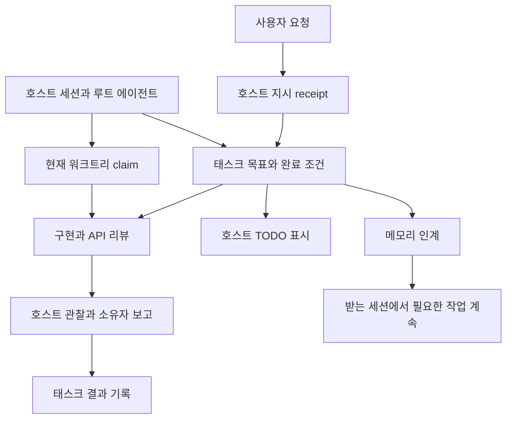

<!-- last_updated: 2026-09-14; synced_from: 243400e58ca74c7fd79bcdd86b488953fa743b97 -->
# 에이전트의 작업을 하나의 목표에 연결하는 구조

[English](../../en/contributing/architecture.md)

Neurath는 Claude Code와 Codex에 설치하는 하네스입니다. 코딩 에이전트 주변에 프로젝트 지침, 스킬, 호스트 훅, 이름이 정해진 MCP 도구를 더합니다. 모델과 기본 편집 도구는 호스트가 실행합니다. Neurath는 작업이 어떤 요청을 위한 것인지, 누가 맡고 있는지, 보고된 결과에 어떤 근거가 있는지를 기록합니다.

사용자가 “페이지를 새로고침하면 저장한 필터가 사라져요. 고쳐 주세요”라고 요청했다고 가정하겠습니다. 필요한 결과는 저장하고 다시 불러와도 필터가 유지되는 것입니다. 실패 재현, 저장 코드 수정, API 계약 리뷰, 회귀 검증은 그 결과에 도달하는 방법입니다. 여러 에이전트가 참여하거나 다른 세션에서 이어서 작업하더라도 이 방법들을 원래 요청에 연결하는 것이 Neurath 구조의 역할입니다. 필터는 예시 웹앱의 기능입니다.

## 서로 연결되는 개념

**목표**는 사용자가 필요한 결과입니다. **태스크**는 그 결과의 한 부분을 지시 출처와 **완료 조건**에 연결한 기록입니다. 완료 조건은 성공과 실패한 시도를 구별할 수 있는 관찰을 뜻합니다. 예시에서는 “저장 후 다시 불러와도 선택한 필터가 유지된다”가 완료 조건입니다. “테스트를 실행한다”만으로는 사용자가 원하는 동작을 설명하지 못합니다.

**세션**은 Neurath가 인식하는 호스트 대화입니다. **에이전트(actor)**는 그 세션의 참여자입니다. **루트 에이전트**는 부모가 없고 세션의 태스크 목록을 소유합니다. 하위 에이전트는 기록된 부모와 위임받은 작업을 가집니다. 독립 제공자 세션에는 별도 루트가 있습니다. 이 역할 자체가 사용자 요청을 변경할 권한을 주지는 않습니다.

**워크트리**는 현재 Git 체크아웃입니다. **claim**은 그곳의 작업을 소유하는 호스트 에이전트를 기록합니다. lease epoch와 fencing token은 현재 소유권과 오래된 소유권 기록을 구별합니다. **receipt**는 특정 관찰이나 보고를 남긴 영속 기록입니다. 호스트 도구 receipt, 에이전트의 태스크 결과, 리뷰 결과는 생산자가 다르므로 입증하는 사실도 다릅니다.

**워크플로**는 스킬 실행을 구성합니다. **phase**는 조사·리뷰처럼 절차의 한 단계와 진행 상태를 기록합니다. **리뷰**는 다른 참여자가 정해진 범위를 평가하고 소유자가 그 보고를 수용하는 과정입니다. 태스크는 필요한 결과를 설명하고, phase와 리뷰는 그 결과를 얻고 평가하는 방법을 구성합니다.

그림은 요소 간 관계를 보여 줍니다. 모든 요청이 리뷰어를 실행하거나 세션을 이전한다는 뜻은 아닙니다. 사용자 요청과 적용한 스킬에 따라 필요한 작업을 선택합니다.

## 네 가지 구현 계층

| 계층 | 역할 | 소스 위치 |
| --- | --- | --- |
| 설치와 자산 | 독립 실행 자산과 프로젝트 설치 결과를 구성하고 기존 설정 보존 | `src/neurath/install/`, `src/neurath/_assets/` |
| 호스트 어댑터 | 실제 이벤트 검증, 정확한 도구 호출 연결, 결과 관찰, 정상 Stop 검사 | `src/neurath/hosts/`, `src/neurath/agents/hooks.py` |
| 태스크와 서비스 어댑터 | 이름이 정해진 도구의 입력을 검증하고 도메인 작업으로 전달 | `src/neurath/runtime/`, `src/neurath/agents/mcp.py` |
| 영속 도메인 상태 | 태스크·에이전트·워크플로·소유권·artifact·전송 기록의 일관성 유지 | `src/neurath/_assets/scripts/agent_harness/`, `src/neurath/runtime/database.py` |

`src/neurath/_assets`는 패키지가 직접 소유한 실행 자산 원본입니다. 설치된 `.agents/skills`와 `.neurath/rules`는 이 원본을 반영한 결과입니다. 구현은 소스에서 바꾸고 자산 manifest와 해당 검증을 갱신합니다. 설치된 스킬만 수정하면 패키지는 바뀌지 않습니다.

런타임은 명시적인 대상 루트를 기준으로 번들 모듈을 활성화합니다. 대상 프로젝트는 프로필과 등록된 검사를 제공하고 번들은 하네스를 제공합니다. 다른 저장소는 빌드 입력이 아닙니다.

## 요청이 영속 상태에 도달하는 경로

호스트가 사용자 입력을 받으면 어댑터가 현재 전경 턴과 지시 receipt를 확립합니다. 이름이 정해진 MCP 도구를 호출하기 직전에는 실제 호스트 이벤트가 정확한 요청을 에이전트·세션·턴·워크트리·호출 ID에 연결합니다. MCP 프로세스는 시작됐다는 이유만으로 호출자 권한을 얻지 않습니다. 디스패처가 닫힌 입력 스키마와 현재 연결을 검증한 뒤 서비스를 실행합니다.

변경 가능한 런타임의 기준 상태는 Git 공통 경로에서 정한 관리 루트 아래 `.neurath/local/runtime.sqlite3`에 저장됩니다. 연결된 워크트리는 이를 공유하지만 별도 클론이나 다른 컴퓨터가 자동으로 동기화되지는 않습니다. 네임스페이스·코덱·리비전·다이제스트가 도메인 기록을 구분합니다. 설치 계획, 복원 원본, 비공개 프로세스 자료는 용도에 맞는 별도 파일을 유지합니다.

비공개 데이터베이스는 관리 디렉터리 경로의 심볼릭 링크와 데이터베이스·저널의 심볼릭 링크를 거부합니다. 관리 디렉터리는 소유자만 접근하는 `0700`, 데이터베이스 파일은 `0600` 권한으로 생성합니다. 가져온 이전 형식 기록에는 원본 내용의 다이제스트를 남깁니다. 그 원본이 바뀌거나 심볼릭 링크로 대체되거나 읽을 수 없으면 변경을 조용히 받아들이지 않고 접근을 거부합니다. 이는 신원·리비전 판단에 쓰는 상태를 보호하는 검사이며 다른 체크아웃을 동기화하거나 실행 권한을 부여하지 않습니다.

태스크 접근 허용 검사와 태스크 쓰기는 관련 세션 상태 검사와 하나의 SQLite 트랜잭션을 사용합니다. 그 안에서 실제 참여자와 현재 지시가 여전히 일치하는지 확인합니다. 리비전 비교는 오래된 목록을 기준으로 한 쓰기가 새로운 작업을 덮어쓰지 못하게 합니다. 내용 주소로 식별하는 artifact에는 해당 태스크 정의에 연결된 결과 보고를 보관합니다.

호스트 도구가 끝나면 결과 이벤트가 그 호출의 권한 연결을 닫습니다. 다음 호출에는 새 연결이 필요합니다. 따라서 이전 `_neurath_binding`을 복사해 다른 호출에 넣을 수 없고, 세션 ID도 호출자 권한을 입증하는 값이 아니라 대상을 가리키는 값입니다.

## 필터 수정에 적용하기

루트는 필터 유지 목표를 기록하고 저장 후 새로고침으로 실패를 재현합니다. 독립 API 리뷰가 필요하고 승인된 범위라면 “저장·조회 계약이 선택한 필터를 보존하는가”라는 제한된 질문을 맡깁니다. 구현 담당자는 관련 코드를 수정합니다. 리뷰 보고, 회귀 결과, 실제 저장·새로고침 관찰을 완료 조건과 비교합니다.

조사가 길어지면 목표 알림이 기록된 목적을 문맥에 다시 넣습니다. 아직 필터 동작이 해결되지 않았는데 불필요한 테스트 기반 재작성에 몰두하고 있는지 돌아볼 수 있습니다. 알림은 태스크를 바꾸거나 작업을 승인하거나 성공을 판단하지 않습니다.

다른 호스트 세션에서 이어가야 한다면 메모리 미리보기로 문맥을 확인하고 선행 조건을 충족한 뒤 adopt로 상태를 이전합니다. 올바른 프로젝트 테스트 명령에 관한 학습 기록은 받는 세션의 검사 선택에 도움이 됩니다. 과거 메모리는 현재 체크아웃과 검사 설정에 다시 대조해야 합니다.

## 어떤 근거가 어떤 질문에 답하는가

| 질문 | 확인할 근거 |
| --- | --- |
| 패키지에 올바른 원본 자산이 들어 있는가? | manifest와 원문 무결성 검증 |
| 빌드한 배포본을 실행할 수 있는가? | 패키지 실행 결과 |
| 설치가 기존 설정을 보존하고 의도한 구성을 만들었는가? | 설치 결과와 실제 설치 상태 |
| 이 호스트가 요청을 받아 도구 실행을 관찰했는가? | 활성화·지시·호출 기록 |
| 새로고침 후 필터가 유지되는가? | 해당 동작의 재현과 회귀 근거 |
| 소유자가 그 결과를 기록했는가? | 태스크 결과 artifact와 현재 목록 |
| 해당 변경에 대한 리뷰가 완료됐는가? | 검토한 리비전이 연결된 리뷰 보고와 수용 기록 |

여러 관찰을 함께 수집할 수 있지만 하나가 나머지 모두를 입증하지는 않습니다. 특히 태스크 결과의 보장 수준은 `agent-report`입니다. receipt 무결성은 출처를 보존하며 보고 내용의 의미를 독립적으로 증명하지 않습니다.

[호스트 통합](hosts.md), [실행 생명주기](runtime-lifecycle.md), [태스크와 TODO 계약](task-todo-contract.md)에서 각 경계를 자세히 설명합니다. [기능별 도구 안내](capability-map.md)에서는 필요한 작업으로 도구를 찾을 수 있습니다.
