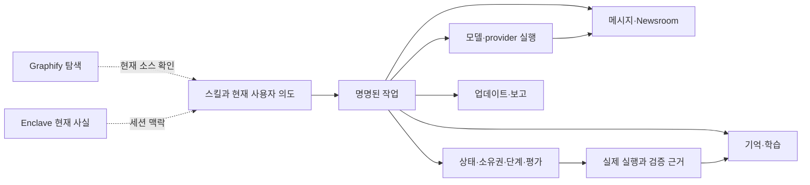

# 기능·소스·검증 지도

<!-- date: 2026-09-09; synced_from: baseline f69cb6402683bb2e0bfe56ed04c63f808b263f06 plus current working-tree stdio MCP changes; scope: source, not live-host certification -->

[English](../../en/contributing/capability-map.md) · **한국어**

[아키텍처](architecture.md) · [설계 철학](design-principles.md) · [실행 수명주기](runtime-lifecycle.md)

이 지도는 패키지의 주요 기능 영역과 현재 공개 스킬 31개를 빠짐없이 찾아가기 위한 색인입니다. 각 행은 기능의 책임과 대표 구현·회귀 근거를 연결합니다. 대표 테스트 링크는 해당 영역을 탐색하는 출발점이며, 그 파일 하나가 행의 모든 동작이나 실제 호스트 작동을 검증했다는 뜻은 아닙니다.

## 기능별 책임과 근거

| 기능 | 하는 일 | 구현·검증 출발점 |
| --- | --- | --- |
| 배포·독립 실행 | 자체 자산과 manifest로 하네스 코드를 고정하고 대상 프로젝트의 실행 환경과 분리합니다. | [resources.py](../../../src/neurath/resources.py) · [회귀](../../../tests/test_installer.py) |
| 설치·제거·복구 | 계획·원문·저널을 통해 파일을 적용하고 충돌과 중단을 보존적으로 처리합니다. | [transaction.py](../../../src/neurath/install/transaction.py) · [회귀](../../../tests/test_installer.py) |
| 프로필·연결·이름 | generic 프로필과 프로젝트 문서·검증 연결, 공개 스킬 별칭·접두어를 관리합니다. | [projection.py](../../../src/neurath/install/projection.py) · [회귀](../../../tests/test_publication.py) |
| 호스트 신원·수명 | 실제 호스트의 시작·재개·도구·자식 관계를 현재 세션에 연결합니다. | [identity.py](../../../src/neurath/hosts/identity.py) · [회귀](../../../tests/test_host_lifecycle.py) |
| 커널·상태 접근 | 세션·actor·턴·workflow·위임을 명시적으로 표현하고 전이를 검사합니다. | [session_kernel.py](../../../src/neurath/_assets/scripts/agent_harness/session_kernel.py) · [회귀](../../../tests/runtime/agent_harness/test_session_kernel.py) |
| 작업 공간 소유권 | 실제 작업 공간과 소유 actor를 lease·fencing 정보로 대조합니다. | [worktree_registry.py](../../../src/neurath/_assets/scripts/agent_harness/worktree_registry.py) · [회귀](../../../tests/runtime/agent_harness/test_worktree_registry.py) |
| 기존 변경 효과 기록 | 내부 호환 기록은 과거 대상과 관측을 보존하며, 일반 편집은 네이티브 도구를 사용합니다. | [material_action.py](../../../src/neurath/_assets/scripts/agent_harness/material_action.py) · [회귀](../../../tests/runtime/agent_harness/test_material_action.py) |
| 단계 계약 | 필수 근거·현재 단계·종료 조건을 검사합니다. | [phase_runner.py](../../../src/neurath/_assets/scripts/skill_harness/phase_runner.py) · [회귀](../../../tests/runtime/skill_harness/test_phase_runner.py) |
| 적응 제어·독립 평가 | 목표·모호성·근거·반증·정체를 현재 소스와 검토자에 결속합니다. | [adaptive_control_authority.py](../../../src/neurath/_assets/scripts/agent_harness/adaptive_control_authority.py) · [회귀](../../../tests/runtime/agent_harness/test_adaptive_control_authority.py) |
| 명명된 작업·MCP | 구조화 입력을 도메인 서비스로 전달하고 네이티브 호출 결속을 확인합니다. | [tasks.py](../../../src/neurath/runtime/tasks.py) · [회귀](../../../tests/test_communication_mcp.py) |
| 프로젝트 검증 | 연결된 argv·cwd·성공 조건·시간 제한과 전후 지문을 확인합니다. | [verification.py](../../../src/neurath/runtime/verification.py) · [회귀](../../../tests/test_learning.py) |
| 모델 계획 | 실제 목록, 선택 근거·제약·대안과 계획 revision을 저장합니다. | [model_planning.py](../../../src/neurath/providers/model_planning.py) · [회귀](../../../tests/test_model_planning.py) |
| 권한 승계·실행 | 직전 생성자의 실제 정책을 보존하며 영속 실행·취소·복구를 관리합니다. | [jobs.py](../../../src/neurath/providers/jobs.py) · [회귀](../../../tests/test_inherited_provider_modes.py) |
| 메시지·배정·보고 | 동료 요청과 작업 수락·상태 보고를 저장하고 발행자에게 연결합니다. | [lifecycle.py](../../../src/neurath/agents/lifecycle.py) · [회귀](../../../tests/test_provider_jobs.py) |
| 전달·복구 | commit 후 알림, 같은 메시지 재전달, ACK와 복구 보류를 관리합니다. | [delivery.py](../../../src/neurath/agents/delivery.py) · [회귀](../../../tests/test_delivery_recovery.py) |
| Newsroom | active 참여자에게 제목을 알리고 본문·정정·댓글을 별도 조회합니다. | [newsroom.py](../../../src/neurath/agents/newsroom.py) · [회귀](../../../tests/test_newsroom_mcp.py) |
| 프로젝트 기억 | 출처 있는 요청·인계·실행 이력을 저장하고 관련 맥락을 선택합니다. | [store.py](../../../src/neurath/memory/store.py) · [회귀](../../../tests/test_project_memory.py) |
| Enclave | 세션 내부의 제한된 최신 사실을 스냅샷으로 유지합니다. | [enclave_store.py](../../../src/neurath/_assets/scripts/agent_harness/enclave_store.py) · [회귀](../../../tests/runtime/agent_harness/test_enclave_store.py) |
| 실행 전략 학습 | 관측된 회복을 검증·시험·유지하고 회귀나 계약 변경 시 철회·무효화합니다. | [learning.py](../../../src/neurath/memory/learning.py) · [회귀](../../../tests/test_learning.py) |
| 업데이트·선택 | 버전 안내·정확한 배포 준비·네이티브 사용자 선택·적용·복구를 연결합니다. | [release_install.py](../../../src/neurath/release_install.py) · [회귀](../../../tests/test_user_choices_mcp.py) |
| 공통 보고·기여 | 개인정보 검토와 동의 범위에 맞는 초안·제출·대조를 관리합니다. | [reporting.py](../../../src/neurath/reporting.py) · [회귀](../../../tests/test_reporting.py) |

## 기능들이 만나는 지점



공통점은 같은 도구 이름 체계를 쓰는 데 있습니다. 권한·저장소·완료 의미까지 하나로 합쳐진 것은 아닙니다. 예를 들어 모델 목록 관측은 저장을 수반하고, release notice는 안내 소비를 기록하며, maintenance 선택은 정확한 사용자 입력을 대조합니다. 조회처럼 보이는 작업도 실제 스키마와 부수 효과를 읽어야 합니다.

## 명명된 작업 표면

현재 등록부는 공개 명명 작업 130개를 정의합니다. 정확한 전체 이름은 [작업 도구](task-tools.md), 스키마 원본은 [task_schema.py](../../../src/neurath/runtime/task_schema.py)에 있습니다. 다음은 역할별 탐색 경로입니다.

| 묶음 | 대표 작업 | 주의할 경계 |
| --- | --- | --- |
| 진단·경로 | session_status, provider_capabilities, provider_route | 진단과 경로는 실행·권한이 아님 |
| 상태·소유권 | session_inspect, worktree_claim, harness_bypass | 실제 actor·소유권·revision 유지 |
| 워크플로·평가 | phase_start, evaluation_prepare, evaluation_consume | 생성·보고·소비·종료는 별도 |
| 모델·실행 | provider_models, provider_plan, provider_run | 목록·계획·실제 모델 확인 구분 |
| 협업·보고 | collaboration_assign, collaboration_accept, collaboration_report | 동료 요청은 사용자 승인과 다름 |
| 메시지 전달 | collaboration_message, collaboration_ack, delivery_redrive | 본문 조회·수신·효과 수락 구분 |
| Newsroom | newsroom_headlines, newsroom_read, newsroom_publish | active 제목 알림과 본문 조회 분리 |
| 기억·학습 | memory_recall, memory_checkpoint, learning_status | 참고 보고와 검증된 전략 구분 |
| 검사 | 네이티브 호스트 명령 도구 | 현재 호스트 실행 정책에 따라 등록된 검사 실행 |
| 유지보수 | releases_prepare, reporting_submit, maintenance_choice_prepare | 정확한 대상·동의·결과 대조 |

등록 개수는 실행 준비도나 호스트별 통과 개수가 아닙니다. 실제 노출된 도구 스키마를 읽고 지원되는 경로를 선택합니다.

## 전체 공개 스킬

스킬 원본 링크는 내부 디렉터리를 가리킵니다. 공개 이름과 내부 식별자는 [skill_names.py](../../../src/neurath/skill_names.py)가 연결합니다. `explain-code`와 `graphify`는 상태를 소유하는 단계 계약이 없는 보조 스킬이며, 나머지 29개는 실행 계약을 갖습니다. 아래 표는 기능 설명이며, 이 문서를 읽는 것만으로 외부 게시나 새로운 작업 실행이 승인되지는 않습니다.

| 공개 스킬 | 주된 역할 | 내부 식별자 |
| --- | --- | --- |
| [`plan`](../../../src/neurath/_assets/.agents/skills/plan-issues/SKILL.md) | 새 제품 의도·결정을 명확히 하고 문서·이슈로 분해 | `plan-issues` |
| [`review-spec`](../../../src/neurath/_assets/.agents/skills/audit-spec/SKILL.md) | 구현 전 모호성·모순·정책 차이 검토 | `audit-spec` |
| [`create-issue`](../../../src/neurath/_assets/.agents/skills/create-ticket/SKILL.md) | 승인된 계획·후속 작업을 이슈로 작성 | `create-ticket` |
| [`update-status`](../../../src/neurath/_assets/.agents/skills/update-project-status/SKILL.md) | 이슈·프로젝트 상태 메타데이터 변경 | `update-project-status` |
| [`create-worktree`](../../../src/neurath/_assets/.agents/skills/create-worktree/SKILL.md) | 이슈 작업을 위한 격리 작업 공간 준비 | `create-worktree` |
| [`implement-issue`](../../../src/neurath/_assets/.agents/skills/process-ticket/SKILL.md) | 승인된 단일 작업의 분석·구현·검증·PR 진행 | `process-ticket` |
| [`autopilot`](../../../src/neurath/_assets/.agents/skills/autopilot/SKILL.md) | 명시적으로 요청한 여러 작업의 구현·리뷰·병합 조정 | `autopilot` |
| [`debug`](../../../src/neurath/_assets/.agents/skills/investigate/SKILL.md) | 결함·검사 실패를 재현하고 원인 격리 | `investigate` |
| [`qa`](../../../src/neurath/_assets/.agents/skills/automate-qa/SKILL.md) | 실제 배포 표면·저장 결과를 기대 동작과 대조 | `automate-qa` |
| [`review-code`](../../../src/neurath/_assets/.agents/skills/review-code/SKILL.md) | 구체적 결함 신호를 근거로 변경 검토 | `review-code` |
| [`review-pr`](../../../src/neurath/_assets/.agents/skills/pr-review/SKILL.md) | 검증된 로컬 리뷰를 정확한 PR head의 신호로 게시 | `pr-review` |
| [`pr-feedback`](../../../src/neurath/_assets/.agents/skills/triage-comments/SKILL.md) | 리뷰 의견의 수용·반론과 근거 정리 | `triage-comments` |
| [`watch-pr`](../../../src/neurath/_assets/.agents/skills/monitor-pr/SKILL.md) | PR 상태 변화를 보존하고 담당 작업을 깨움 | `monitor-pr` |
| [`commit`](../../../src/neurath/_assets/.agents/skills/commit/SKILL.md) | 승인되고 검증된 변경 커밋 | `commit` |
| [`create-pr`](../../../src/neurath/_assets/.agents/skills/create-pr/SKILL.md) | 승인된 전달 범위에서 push·PR 생성 | `create-pr` |
| [`checkpoint`](../../../src/neurath/_assets/.agents/skills/checkpoint/SKILL.md) | 되돌릴 수 있는 작업 중간 지점 보존 | `checkpoint` |
| [`finish-session`](../../../src/neurath/_assets/.agents/skills/finish-session/SKILL.md) | 승인된 커밋·push·Graphify·소유권 해제 수순 | `finish-session` |
| [`audit-deps`](../../../src/neurath/_assets/.agents/skills/dependency-audit/SKILL.md) | 의존성 보안·라이선스·최신성·환경 차이 점검 | `dependency-audit` |
| [`update-deps`](../../../src/neurath/_assets/.agents/skills/update-dependencies/SKILL.md) | 의존성을 통제된 범위에서 갱신·검증 | `update-dependencies` |
| [`sync-design`](../../../src/neurath/_assets/.agents/skills/sync-design/SKILL.md) | 저장소 토큰·컴포넌트 대응을 디자인으로 동기화 | `sync-design` |
| [`design-ui`](../../../src/neurath/_assets/.agents/skills/explore-ui/SKILL.md) | 구현 전 캔버스에서 UI 방향 탐색·선택 | `explore-ui` |
| [`implement-ui`](../../../src/neurath/_assets/.agents/skills/implement-ui/SKILL.md) | 승인한 정확한 디자인 노드를 구현 | `implement-ui` |
| [`review-ui`](../../../src/neurath/_assets/.agents/skills/review-ui/SKILL.md) | 승인 디자인과 실제 화면을 비교해 사용자 판단 요청 | `review-ui` |
| [`sync-docs`](../../../src/neurath/_assets/.agents/skills/sync-docs/SKILL.md) | 개발자·사용자 문서 범위를 판별하고 동기화 조정 | `sync-docs` |
| [`dev-docs`](../../../src/neurath/_assets/.agents/skills/sync-dev-docs/SKILL.md) | 현재 코드와 동작에 맞게 개발자 문서 갱신 | `sync-dev-docs` |
| [`user-docs`](../../../src/neurath/_assets/.agents/skills/sync-user-docs/SKILL.md) | 승인되고 구현된 동작을 사용자 안내에 반영 | `sync-user-docs` |
| [`optimize-harness`](../../../src/neurath/_assets/.agents/skills/optimize-harness/SKILL.md) | 기능과 집행을 유지하며 주입 프롬프트 축소 | `optimize-harness` |
| [`memory-to-rules`](../../../src/neurath/_assets/.agents/skills/promote-memory/SKILL.md) | 반복된 개인 기억을 검토해 승인된 프로젝트 규칙으로 승격 | `promote-memory` |
| [`test-harness`](../../../src/neurath/_assets/.agents/skills/evaluate-harness/SKILL.md) | 실패 시나리오로 선언과 집행의 차이 평가 | `evaluate-harness` |
| [`explain-code`](../../../src/neurath/_assets/.agents/skills/explain-code/SKILL.md) | 현재 소스·테스트로 코드 동작 설명 | `explain-code` |
| [`graphify`](../../../src/neurath/_assets/.agents/skills/graphify/SKILL.md) | 코드·문서의 지식 그래프 생성·조회 | `graphify` |

## Graphify와 문서의 역할

Graphify는 구조 탐색에 쓰는 보조 스킬입니다. 그래프의 노드·관계·출처 위치에서 관심 모듈을 찾은 뒤 현재 소스와 테스트를 읽습니다. 그래프 갱신은 문서 사실 검증이나 실제 호스트 검증과 다른 결과입니다. 특히 삭제된 파일의 노드나 오래된 정책 설명이 남을 수 있으므로 그래프 결과를 곧바로 현재 제품 설명으로 옮기지 않습니다.

이 문서 묶음의 Mermaid와 SVG는 검토 가능한 설명용 구조도입니다. 전체 그래프의 자동 시각화와 달리 핵심 책임을 선별했으며, 데이터 흐름인지 권한 검사인지 각 그림의 설명을 함께 읽어야 합니다.

## 검증을 재현하는 에이전트 참조

문서 변경의 로케일·링크·배포 규칙은 다음 검사로 확인합니다.

```sh
uv run --locked pytest -q tests/test_publication.py
```

전체 개발 검사는 다음 명령으로 수행합니다. 이 명령은 배포 무결성, Python 진단, 패키지·설치 테스트, 임시 저장소의 런타임 계약 회귀를 포함합니다.

```sh
uv run --locked python tools/check.py
```

검사 성공 뒤에도 새 설치본의 실제 호스트 활성화·provider 모델 왕복·앱 동작은 별도 관측이 필요합니다. 문서만 바꿨다면 실행 자산을 변경했다고 보고하거나 그 이유만으로 자기 설치를 갱신하지 않습니다. 실행 자산을 바꾸는 개발 작업의 manifest·빌드·설치 수순은 [기여 안내](index.md)에 있습니다.

## 설명을 더 확장할 때

기능을 추가하면 이 지도, 관련 상세 참조, 두 로케일을 함께 확인합니다. 구현되지 않은 요구는 [협업 계약](collaboration-contract.md)처럼 요구 문서의 성격을 명시하고, 구현·테스트·실제 호스트 관측을 같은 상태로 합치지 않습니다. 각 문서의 date와 synced_from은 어떤 소스를 기준으로 설명했는지 나타내며 릴리스 인증을 의미하지 않습니다.
