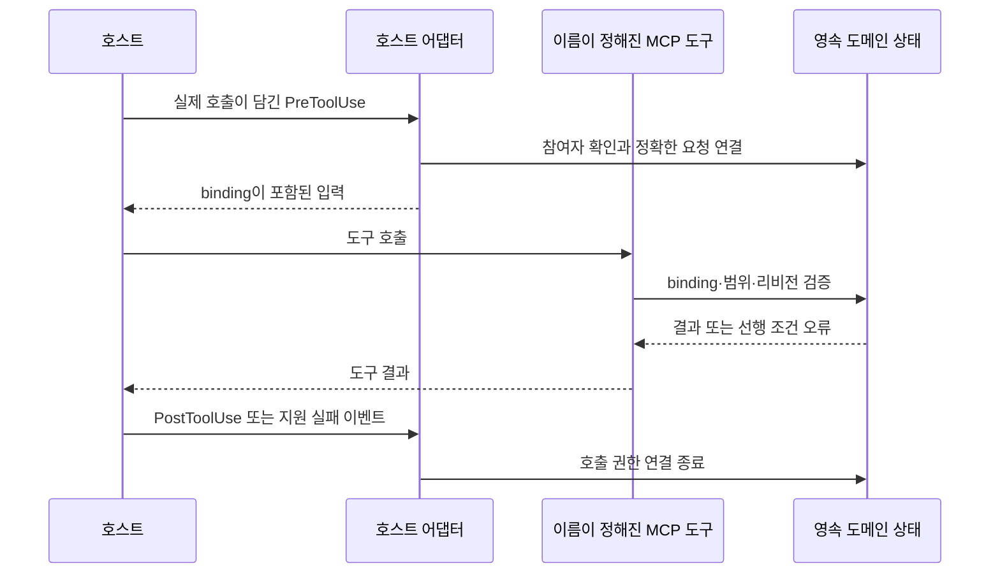

<!-- last_updated: 2026-09-14; synced_from: 243400e58ca74c7fd79bcdd86b488953fa743b97 -->
# 호스트 이벤트와 프로젝트 작업 연결하기

[English](../../en/contributing/hosts.md)

Neurath는 설치된 지침·스킬·훅·이름이 정해진 MCP 서버를 통해 Claude Code와 Codex에 연결됩니다. 호스트가 에이전트와 기본 도구를 실행하고, Neurath는 실제 호스트 이벤트로 그 활동을 현재 요청과 프로젝트 상태에 연결합니다.

**세션**은 호스트의 대화, **에이전트(actor)**는 참여자, **루트 에이전트**는 세션의 태스크 목록 소유자입니다. **전경 턴**은 현재 요청을 처리하는 작업 구간입니다. **워크트리 claim**은 체크아웃의 작업 소유권을 기록합니다. **receipt**는 이벤트나 보고의 기록이며, 이 문서의 호스트 receipt는 어떤 실제 호출이 일어났는지를 입증합니다. 같은 이름의 도구가 여러 세션에서 동시에 호출될 수 있으므로 이 구분이 필요합니다.

## 네 가지 선행 조건을 구분해 확인하기

`session_status`로 설치, 실제 호스트 활성화, 유효 실행 모드, 소유권을 확인합니다. 기본 요약에는 전체 기능 목록을 넣지 않으며 `detail: "full"`로 요청하면 포함합니다. 더 자세한 상태가 필요하면 `session_inspect`, `turn_inspect`, `worktree_inspect`를 사용합니다.

| 관찰 | 확인되는 사실 | 추가로 확인할 점 |
| --- | --- | --- |
| 설치 결과가 존재함 | 프로젝트 설정과 자산이 기록됨 | 현재 호스트가 이를 불러왔는가 |
| 실제 활성화가 관찰됨 | 이 호스트가 필요한 활성화 근거를 제공함 | 현재 지시·정책·소유권 |
| 유효 모드가 관찰됨 | 현재 실행 설정을 알 수 있음 | 의도한 작업이 해당 설정에 맞는가 |
| 현재 에이전트가 claim을 소유함 | 이 워크트리의 작업 소유권 | 태스크 범위와 작업별 선행 조건 |

진단 결과는 누락된 신원을 만들거나 다른 에이전트의 claim을 가져오거나 모드를 바꿀 권한을 주지 않습니다. 필요한 선행 조건이 호스트에서 제공되지 않았다면 지원되는 실제 호스트 경로로 해결해야 합니다.

## 이벤트 어댑터가 하는 일

| 호스트 이벤트 | Neurath의 역할 |
| --- | --- |
| `SessionStart` | 시작을 검증하고 실제 연결과 transcript 관계 기록 |
| `UserPromptSubmit` | 전경 턴과 실제 사용자 지시 receipt 대조 |
| `PreToolUse` | 현재 전경 확인, MCP 호출 연결, 워크트리·기능 검사, TODO 제출 관찰 |
| `PostToolUse` | 정확한 호출 권한 연결 종료와 해당 실행 결과 기록 |
| `PostToolUseFailure` / `PermissionDenied` | 지원되는 Claude Code 실패·거부 이벤트를 성공으로 바꾸지 않고 처리 |
| `SubagentStart` | 호스트 spawn 근거와 자식 신원 대조 |
| `SubagentStop` | 자식의 계속 실행 및 위임 의무 확인 |
| `PreCompact` | 메모리 이벤트 경로로 적격 문맥 보존 |
| `Stop` | 현재 루트의 정상 완료 선행 조건 검사 |
| `SessionEnd` | 연결 종료 기록과 남아 있는 호스트 호출 연결 회수 |

공통 설치 이벤트와 호스트별 추가 이벤트는 설치 구성 및 호스트 어댑터에 정의됩니다. 소스에 처리기가 있다는 사실은 구현 범위를 설명합니다. 현재 실제 호스트 동작은 그 호스트에서 관찰한 이벤트로 확인해야 합니다.

## 정확한 호출에 대한 연결

호스트에는 `mcp__neurath_collaboration__task_list` 같은 이름으로 MCP 도구가 나타납니다. 실행 직전 `PreToolUse`가 실제 참여자를 검증하고 해당 요청에 대한 `_neurath_binding`을 발급합니다. 영속 상태에는 요청 ID와 현재 턴 문맥이 연결되며, 대응하는 결과 이벤트에서 이 연결을 닫습니다.

에이전트는 태스크 인자를 제공하고 binding은 훅에 맡깁니다. `_neurath_binding`을 만들어 넣거나 이미 닫힌 값을 재사용하거나 호출자 신원 필드를 임의로 추가하면 안 됩니다. MCP 프로세스 자체에는 물려받은 에이전트 권한이 없습니다. 디스패처는 작업 스키마와 호스트에서 검증된 호출만 받아들입니다.

현재 구현에서 이름이 정해진 태스크 요청은 64 KiB, MCP 프레임은 128 KiB로 제한됩니다. 개별 스키마의 더 작은 필드·문서 제한과는 별개의 전송 제한입니다.

## 루트·자식·독립 세션

루트 에이전트에는 부모가 없습니다. 같은 세션의 하위 에이전트에는 기록된 부모와 위임 범위가 있습니다. 호스트가 직접 입증한 계보는 바로 위 부모를 확인합니다. 저장된 부모 포인터만 있는 경우의 보장 수준은 이보다 낮을 수 있습니다.

호스트 spawn 결과보다 자식 시작 이벤트가 먼저 도착할 수 있습니다. 이때 자식은 작업 설명을 문맥으로 받을 수 있지만 상태를 바꾸는 도구에는 제한이 유지됩니다. 어댑터는 신원을 검증하지 못한 자식에게 루트 권한을 물려주는 대신 셸과 쓰기 도구를 거부합니다.

지원하는 자식 경로는 직접 생성한 호스트 자식입니다. 복사한 부모 참조나 중첩 spawn은 지원되는 계보를 입증하지 못합니다. 동료 메시지로 재개된 턴의 위임은 진행 중 태스크의 정확한 리비전과 정의 다이제스트에 연결할 수 있습니다. 이전이 일어났거나 태스크 범위가 달라졌다면 이 권한도 무효가 됩니다.

독립 제공자 실행은 별도 루트를 가진 새 호스트 세션입니다. 계획과 실행 정책은 승인된 작업과 일치해야 합니다. `provider_capabilities`는 구현된 경로를 설명하며 현재 호스트에서 사용할 수 있는지는 실제 관찰로 확인합니다. 영속 `run_id`는 실행 접수를 뜻하고 앱에서 보이는지는 별도 관찰입니다.

문서의 공통 예시는 사용자 웹앱의 저장 필터가 새로고침 후 사라지는 문제입니다. 승인된 참여가 필요할 때 구현 담당자는 자식 또는 독립 참여자에게 API 계약을 검토하게 할 수 있습니다. 어느 경로든 리뷰어에게는 실제 호스트 신원과 한정된 작업이 필요합니다. 필터는 Neurath 기능이 아닙니다.

## 세션 재개와 앱 프로젝트 소속

일반적인 호스트 `SessionEnd`는 연결 종료를 기록하면서 재개 가능한 세션 상태·태스크·enclave 사실·claim을 보존합니다. 커널의 `SessionEnded` 전이는 영구 종료입니다. 검증된 재개나 루트 사용자 입력은 이전의 중단된 전경 턴을 종료 처리하면서 미완료 작업을 유지할 수 있습니다. 포크는 새 루트이므로 자체 claim이 필요합니다.

`session_status.app_project`는 검증된 루트에 대해 앱이 소유한 로컬 프로젝트 소속을 제한된 읽기 전용 범위에서 진단합니다. 상태는 `assigned`, `unassigned`, `unobserved`입니다. 일치하는 로컬 프로젝트 기록이 배정을, 명시적인 projectless 기록이 미배정을 입증합니다. 기록 누락·충돌·오류·지원하지 않는 유형·읽기 불가·크기 초과는 미관찰로 남습니다. 로컬 읽기 상한은 16 MiB이며 관련 소속 정보만 반환합니다. 제공자의 프로젝트 메타데이터는 앱 소속 증거가 아니며 소속 자체도 원격 화면 관찰이나 권한 증거가 아닙니다.

앱이 만든 루트는 실제 생성·메시지 전달과 완료 이벤트가 올바른 호스트 턴에 대응할 때 대조할 수 있습니다. 알려진 호스트 문맥은 동반할 수 있으나 완료 누락, 다른 턴, 알 수 없는 문맥, 충돌하는 사람 입력은 거부합니다. 이 경로는 새 사용자 지시 receipt나 승인 없이 활성 호스트 턴을 확립할 수 있습니다. 사용자가 앱 프로젝트에 속한 태스크를 요청했다면 앱 생성 경로를 사용합니다. 제공자 실행과 앱 소속은 별도입니다.

## 호스트 TODO 도구

Neurath는 태스크 목록을 Codex의 `update_plan` 또는 Claude Code의 `TodoWrite` 입력으로 변환합니다. 실제 `PreToolUse`와 결과 이벤트가 정확한 행과 실행 결과를 연결합니다. receipt의 범위는 `native-tool-submission`입니다. 앱이 목록을 표시했다거나 태스크가 성공했다는 증거가 아닙니다.

관련 제출이 실제 관찰되기 전 기능 상태는 `unobserved`이며 지원하지 않는 런타임은 `unsupported-runtime`을 반환합니다. 화면의 “completed”를 태스크 성공으로 해석하기 전에 [태스크와 TODO 계약](task-todo-contract.md)을 확인하세요.

## 정상 Stop과 사용자 중단

현재 루트의 정상 Stop은 도메인 선행 조건을 충족해야 하며 실제 루트·턴·transcript·연결을 다시 확인합니다. 미해결 조건이 있으면 현재의 모든 정상 Stop을 거부합니다. `stop_hook_active`는 검사 면제 사유가 아니고 상태 질문이나 재시도 횟수도 완료 근거가 아닙니다.

오래되거나 이미 종료된 이벤트는 읽기 전용 경로가 따로 있습니다. 그 응답은 현재 상태를 바꾸지 않으며 새 턴의 완료를 입증하지도 않습니다. 잘못되거나 다른 주체의 이벤트가 다른 에이전트 권한으로 계속 실행을 요청할 수 없습니다. 명시적인 사용자 중단은 호스트가 제어합니다.

## 누락된 관찰 진단하기

설치는 있지만 활성화가 없으면 설치된 호스트 설정과 현재 이벤트 경로를 확인합니다. 자식 신원이 미검증이면 실제 spawn 근거를 대조합니다. 지시나 턴이 바뀌었다는 오류가 오면 현재 호스트 상태를 읽고 새 유효 호출을 만듭니다. claim이 다른 에이전트에게 있으면 보존하고 승인된 작업 구성을 사용합니다.

누락된 호스트 근거를 합성 환경 변수, 복사한 토큰, SQLite 직접 수정, 상태 출력으로 대신하지 않습니다. 소스 테스트는 거부 동작과 상태 전이를 검증할 수 있지만 현재 실행 중인 호스트에서 하네스가 작동한다는 주장에는 실제 호스트 관찰이 필요합니다.

[실행 생명주기](runtime-lifecycle.md)는 이 이벤트들이 작업을 어떻게 감싸는지, [태스크 도구](task-tools.md)는 공개 호출 계약을 설명합니다.
