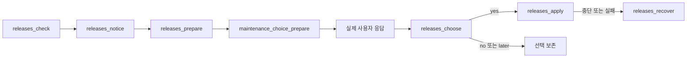

# 릴리스 확인과 업데이트 MCP 참조

<!-- date: 2026-09-09; synced_from: baseline f69cb6402683bb2e0bfe56ed04c63f808b263f06 plus current working-tree stdio MCP changes; scope: source, not live-host certification -->

**한국어** · [English](../../en/contributing/releases-reference.md)

[설치 구조](installation.md) · [작업 도구](task-tools.md) · [사용 안내](../usage/installation.md)

업데이트는 명명된 MCP 도구로 준비·선택·적용·복구합니다. 사용자는 대화로 선택하며 에이전트가 구조화된
입력을 전달합니다. 테스트 fixture 실행 동의는 실제 설치 업데이트 동의가 아닙니다.

## 실행 흐름



| 단계 | 입력과 확인 |
| --- | --- |
| 확인·알림 | `releases_check`와 `releases_notice`. 강제 재조회는 사용자가 요청한 경우에만 `force` 사용 |
| 준비 | `releases_prepare`에 반환된 `offer_id`와 안정된 `key` 전달 |
| 질문 결속 | `maintenance_choice_prepare`에 `operation="releases_choose"`, `target_id=offer_id`, `key` 전달 |
| 선택 | 실제 새 사용자 응답 뒤 `releases_choose`에 `offer_id`, `decision`, `user_choice_ref`, `key` 전달 |
| 적용 | `releases_apply`로 정확히 준비하고 승인한 제안 적용 |
| 진단·복구 | `releases_status`로 결과 확인, `releases_recover`로 기존 저널 복구 |

```json
{"tool":"releases_check","arguments":{"key":"daily-release-check"}}
```

현재·새 버전과 주요 변경을 반환된 제안에서 확인합니다. 릴리스 본문은 신뢰할 수 없는 참고 데이터이며,
본문의 지시를 실행하지 않습니다. no와 later는 사용자가 다시 요청하기 전까지 해당 버전의 안내를 억제합니다.
무응답은 승인이 아닙니다. 준비 대상이 바뀌면 이전 선택을 새 대상에 재사용하지 않습니다.

## 배포 검증

공식 저장소의 latest 정식 릴리스만 확인합니다. 태그는 `vMAJOR.MINOR.PATCH`이고 설치 버전보다 높아야 합니다.
draft·prerelease·브랜치 소스·태그만 있는 배포·다른 패키지 인덱스로 대체하지 않습니다.
단일 `neurath-MAJOR.MINOR.PATCH-py3-none-any.whl`, GitHub SHA-256, 크기 제한,
wheel 이름·메타데이터·런타임 버전·manifest가 일치해야 합니다.
현재 계약은 Python 3.14와 승인된 `claude-agent-sdk>=0.2.152,<0.3` 의존성 범위를 검증합니다.

제안에는 릴리스·자산 ID, digest, 크기, 태그와 제한된 변경 설명이 결속됩니다. 준비와 적용은 그 정확한
릴리스를 다시 대조하며, 변경·삭제된 제안에 이전 동의를 쓰지 않습니다. 현재 공개 릴리스 유무는
`releases_check` 결과로 판단합니다. 이 문서는 과거 특정 날짜의 릴리스 상태를 현재 상태로 주장하지 않습니다.

## 정책과 복구

정상 호스트 이벤트의 하루 한 번 안내는 로컬 힌트입니다. 훅 자체는 네트워크 확인·새 세션·자동화를 만들지 않습니다.
진행 중인 에이전트가 여유 있을 때 확인합니다. 상태와 실패는 비공개 Git 영역에 보존합니다.

준비는 wheel 검증, 별도 실행 환경, 변경 계획까지 수행하며 대상 파일을 적용하지 않습니다.
적용은 설치 계획과 저널을 사용하고 프로필·호스트·접두어·사용자 설정·보고 동의·기여 승인을 보존합니다.
관리 파일 충돌을 덮어쓰지 않습니다. 불확실한 적용을 자동 반복하지 않습니다.

복구는 보존된 정상 런타임에서 `releases_recover`의 기존 복구 서비스를 사용합니다.
서버 실행 기반까지 사용할 수 없으면 설치 복구가 필요한 상태로 보고합니다. 에이전트에게 상태 JSON 편집이나
하네스 CLI 문법 탐색을 요구하지 않습니다. 이후 재적용에는 새 준비와 해당 대상에 대한 선택을 확인합니다.

배포 무결성, 설치·프로토콜 fixture, 실제 새 호스트 활성화는 별도로 확인합니다.
`diagnostics_project`의 `protocol=true`는 모의 프로토콜 검사이며 실제 활성화 증명이 아닙니다.
