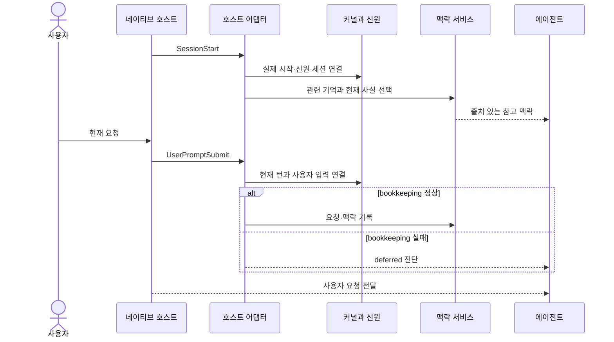
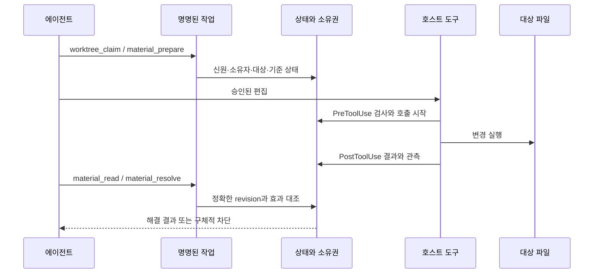
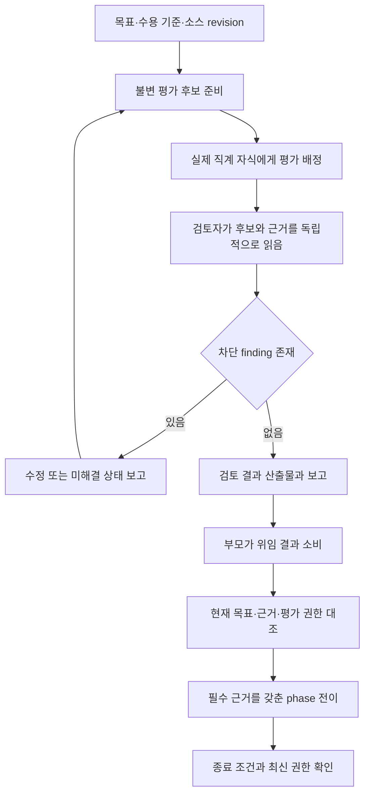
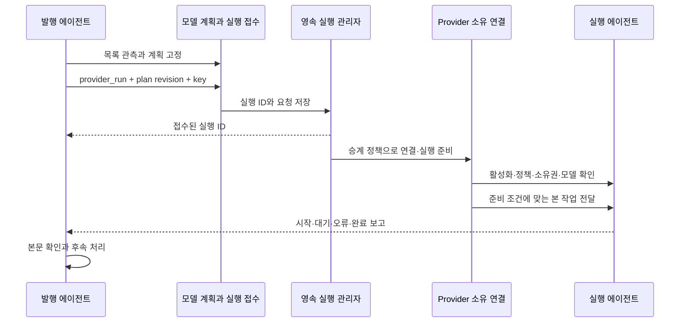
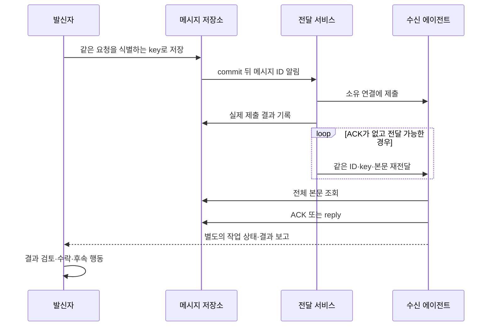
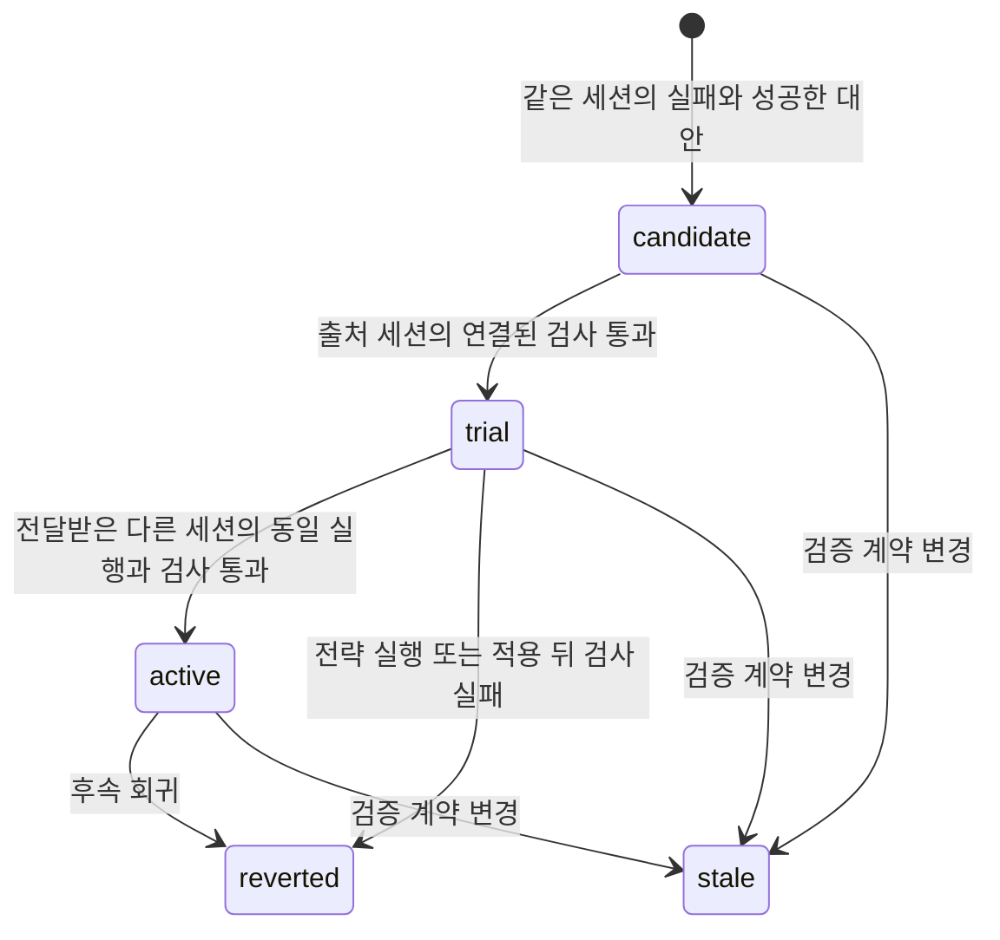
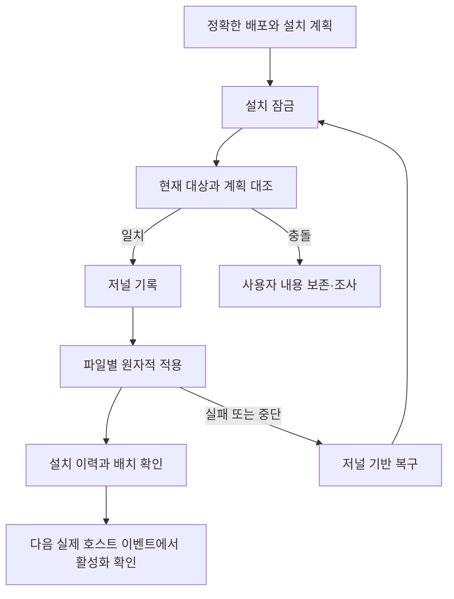

# 실행 수명주기와 복구

<!-- date: 2026-09-08; synced_from: 5e8d761c276ceb8ddc05dcf239bb2d020f4b0da5; scope: source flows and conceptual diagrams -->

[English](../../en/contributing/runtime-lifecycle.md) · **한국어**

[아키텍처](architecture.md) · [설계 철학](design-principles.md) · [기능 지도](capability-map.md)

이 문서는 “작업 기록 내보내기 기능을 구현해 달라”는 예시 요청을 통해 실행 경계를 설명합니다. 제품 예시는 흐름을 이해하기 위한 것이며 Neurath에 내보내기 기능이 있다는 뜻은 아닙니다. 아래 상태도 중 학습 상태 이름은 코드의 값을 사용하고, 나머지 그림은 여러 모듈의 책임을 요약합니다.

## 1. 세션 시작과 사용자 입력

호스트 설정에 훅이 선언된 것과 실제 세션 시작이 확인된 것은 다릅니다. 에이전트는 설치·활성화·실제 실행 정책·소유권을 구분해 확인합니다. 새 네이티브 턴은 이전 턴과 구분하며, 이전 실행 결과를 못 봤다면 성공으로 채우지 않습니다. 루트 입력의 bookkeeping 실패는 새 지시를 막지 않지만 실행 권한 검사는 남습니다.

관련 소스: [hooks.py](../../../src/neurath/hosts/hooks.py), [identity.py](../../../src/neurath/hosts/identity.py), [기억 훅](../../../src/neurath/memory/hooks.py).

## 2. 호출 전 검사와 변경 효과

에이전트가 문서를 수정하기로 결정했다고 가정합니다. 먼저 현재 worktree의 소유권과 변경 대상의 기준 상태를 확인합니다. material batch는 대상과 기대 변화(created·changed·deleted·unchanged)를 기록합니다. 다음 그림에서 변경 실행은 호스트 도구가 담당합니다.

호출 결과가 유실되면 `material_abandon`은 unknown·blocked로 정리하는 경로입니다. 성공을 만드는 도구가 아닙니다. CAS는 읽었던 revision이 아직 현재인지 확인하는 조건부 갱신이며, fencing token은 오래된 소유자가 새 소유권을 이용하지 못하도록 대조하는 값입니다. 충돌은 현재 상태를 다시 읽고 원인을 확인해야 합니다.

MCP 호출은 PreToolUse에서 실제 actor·턴·worktree·정확한 입력에 결속되고 PostToolUse에서 닫힙니다. 요청 변경, 만료, 종료된 연결의 결속을 다른 호출에 사용할 수 없습니다. 명명된 도구가 임의 파일 편집을 대신하는 것은 아닙니다.

관련 소스: [상태 작업](../../../src/neurath/runtime/state_tasks.py), [변경 작업 모델](../../../src/neurath/_assets/scripts/agent_harness/material_action.py), [MCP](../../../src/neurath/agents/mcp.py).

## 3. 단계 실행과 독립 평가

스킬 계약은 단계별 필수 근거와 종료 상태를 정의합니다. 적응 제어가 필요한 workflow는 실제 호스트에서 확인한 독립 검토자가 있어야 시작할 수 있습니다. 단계 파일을 읽거나 결과를 서술하는 것만으로 다음 단계에 진입하지 않습니다.

일반 동료 세션과 네이티브 직계 자식은 다릅니다. provider 실행 결과는 에이전트 보고이며 자체적으로 독립 검토자 권한을 만들지 않습니다. 평가 후보는 목표·intent revision·source revision·workflow revision·내용 digest에 결속됩니다. 오래된 평가를 바뀐 문서에 재사용할 수 없습니다.

`EvaluationLoop`의 finding·회차 관리와 적응 제어의 목표 판정은 서로 연결되는 별도 책임입니다. 검토자는 작성자의 보고를 그대로 믿지 않고 코드·테스트·문서를 읽습니다. 작성자는 결과를 소비하고 수정 후 재검토가 필요한지 판단합니다. 상세 도구는 [작업 도구](task-tools.md)를 참고하세요.

관련 소스: [단계 실행기](../../../src/neurath/_assets/scripts/skill_harness/phase_runner.py), [평가 권한](../../../src/neurath/_assets/scripts/agent_harness/adaptive_control_authority.py), [워크플로 작업](../../../src/neurath/runtime/workflow_tasks.py).

## 4. 독립 provider 실행과 보고

먼저 실제 모델 목록을 관측하고 작업의 난이도·제약·대안·재계획 조건을 계획에 기록합니다. 계획은 목록, 대상 worktree, 작업 revision과 실제 실행 정책에 결속됩니다. inherit 선택은 모델 override를 생략하고 실행 후 실제 기본값을 확인하는 방식입니다. 목록의 추천 기본값을 사용자 설정으로 오인하지 않습니다.

Codex는 공식 app-server 연결을, Claude는 공식 Agent SDK 경로를 사용합니다. 요청한 모드·실제 적용된 모드·OS 제한의 관측 여부는 별개입니다. 기본 정책 승계는 바로 위 발행자의 실제 제한을 보존합니다. 지원되지 않거나 확인할 수 없는 매핑은 조용히 완화하지 않습니다.

접수는 실행 시작이나 완료가 아닙니다. 일반 작업 수명과 연결·요청 제한 시간은 구분합니다. 취소도 요청과 실제 결과가 다릅니다. 복구는 종료가 확인된 소유 실행에 대해 기록된 세션을 다루며 원래 과제를 무조건 다시 실행하지 않습니다.

앱 프로젝트 소속·사용자 관측 여부는 현재 실행 계약의 선행 조건이 아닙니다. 동시에 app-server 연결 성공이 Desktop 통합이나 원격 접근을 증명하지도 않습니다. 각 관측을 따로 보고합니다.

관련 소스: [jobs.py](../../../src/neurath/providers/jobs.py), [실행 준비](../../../src/neurath/runtime/provider_execution.py), [모델 계획](../../../src/neurath/providers/model_planning.py), [전송 참조](provider-transports.md).

## 5. 메시지 전달과 작업 완료는 다른 흐름

메시지 저장 상태와 전달 시도 상태는 서로 다른 기록입니다. 메시지가 `submitted`여도 ACK가 없으면 전달 책임이 끝나지 않습니다. 전달 시도의 `sending`·`uncertain`·`failed`도 영구적인 포기 상태로 취급하지 않습니다. 같은 메시지를 중복 수신할 수 있으며 수신자는 ID로 구분합니다.

대기 메시지는 일반 대화 TTL이나 close 요청으로 버리지 않습니다. 복구 보류는 원문을 보존하고 `delivery_status`로 조사한 뒤, 원인을 수리하고 `delivery_redrive`로 같은 메시지를 다시 전달합니다. 이는 새 작업 생성이나 완료 감시용 폴링과 다릅니다.

소유 연결이 살아 있는 실행에서는 턴이 끝나도 미완료 발행 작업·대기 메시지를 확인해 연결을 유지합니다. 지원되는 Desktop 소유 전달 bridge가 없다면 queued의 제약을 밝힙니다. 다음 훅에서 알림이 보이는 것을 idle 앱의 자동 재개로 표현하지 않습니다. Newsroom은 이 흐름과 달리 active 참여자에게 제목을 알리고 본문을 명시 조회하는 별도 공유 채널입니다.

관련 소스: [저장소](../../../src/neurath/agents/store.py), [전달](../../../src/neurath/agents/delivery.py), [복구](../../../src/neurath/agents/delivery_recovery.py), [SessionInbox](../../../src/neurath/providers/supervision.py), [Newsroom](../../../src/neurath/agents/newsroom.py).

## 6. 기억과 실행 전략 학습

이 그림은 주요 학습 전이를 나타냅니다. 검사 연결이 없으면 candidate로 남을 수 있고, 검사 보류는 성공 상태가 아닙니다. trial 전략이 다른 세션에 실제 전달됐다는 exposure 기록, 동일 명령의 네이티브 결과, 같은 검증 계약이 중요합니다. 표준 출력에 쓰인 성공 문구를 프로세스 종료 결과로 믿지 않습니다.

회고·인계와 학습 전략은 구분합니다. 인계는 다음 작업을 돕는 참고 보고이고, 학습은 관측된 실행 회복을 제한적으로 검증·시험·유지·철회하는 과정입니다. 상세 저장·선택 제한은 [기억 참조](memory-reference.md)에 있습니다.

관련 소스: [학습](../../../src/neurath/memory/learning.py), [네이티브 기록](../../../src/neurath/memory/transcript.py), [검증](../../../src/neurath/runtime/verification.py).

## 7. 설치·업데이트와 중단 복구

업데이트는 새 버전 확인·안내, 정확한 wheel과 변경 목록 준비, 해당 대상에 대한 사용자 선택, 적용으로 나뉩니다. 준비가 설치 동의를 대신하지 않습니다. 공통 보고·기여도 초안과 대상, 기존 동의와 별도 승인을 확인합니다. 결과가 불확실하면 기록과 실제 대상을 대조하고 자동 재실행하지 않습니다.

관련 소스: [트랜잭션](../../../src/neurath/install/transaction.py), [업데이트](../../../src/neurath/updates.py), [적용·복구](../../../src/neurath/release_install.py), [유지보수 선택](../../../src/neurath/runtime/user_choices.py).

## 실패를 읽는 방법

| 관측 | 의미 | 다음 확인 |
| --- | --- | --- |
| 설치됨, 활성화 미확인 | 파일 배치만 확인 | 실제 호스트 이벤트와 신원 |
| worktree claim 충돌 | 현재 actor의 쓰기 소유권 없음 | 기존 소유자와 정상 소유권 절차 |
| phase 근거 부족 | 요구한 전이의 조건 미충족 | 해당 phase·후보 revision·검토 기록 |
| material 결과 unknown | 실제 도구 결과 미관측 | 대상 read-back과 호출 기록 |
| 메시지 queued/submitted | 전달·수신 책임이 남을 수 있음 | 본문 조회·ACK·소유 연결 |
| 학습 candidate/trial | 검증 또는 다른 세션 시험이 남음 | pending·exposure·동일 전략·검사 |
| maintenance uncertain | 외부 효과가 불확실 | 저장된 요청과 외부 결과 대조 |

이 분류가 문서의 성공 표현을 결정합니다. “기록됨”, “제출됨”, “관측됨”, “검증됨”, “수락됨”을 실제 근거에 맞게 사용하세요.
