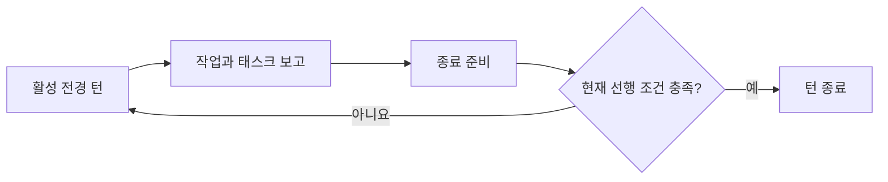

<!-- last_updated: 2026-09-14; synced_from: 243400e58ca74c7fd79bcdd86b488953fa743b97 -->
# 사용자 요청에서 호스트 턴 종료까지

[English](../../en/contributing/runtime-lifecycle.md)

Neurath는 사용자가 원하는 결과를 태스크 상태, 실제 실행, 제어권 반환에 연결합니다. 사용자 웹앱에서 저장한 필터가 새로고침 후 사라지는 경우를 따라가면 흐름을 이해하기 쉽습니다. 필요한 결과는 저장하고 다시 불러와도 필터가 유지되는 것입니다. Neurath는 이 수정을 기록하고 조정하며 필터 자체는 Neurath 기능이 아닙니다.

**목표**는 필요한 결과입니다. **태스크**는 그 결과의 일부를 관찰 가능한 **완료 조건**으로 구체화합니다. 호스트 **세션**의 **루트 에이전트**가 태스크를 소유합니다. **워크트리 claim**은 체크아웃의 작업 소유권을 조정합니다. **receipt**는 이벤트나 보고의 기록입니다. 스킬은 작업을 **phase**로 구성할 수 있고 독립 **리뷰**는 구현과 그 근거를 평가합니다.

## 1. 현재 요청과 소유자 확인

호스트 시작과 사용자 입력 이벤트가 활성 세션, 루트 에이전트, 전경 턴, 지시 receipt를 확립합니다. `session_status`는 설치·활성화·유효 모드·소유권을 구분해서 보여 줍니다. `task_list`는 현재 목록과 태스크 등록에 쓸 수 있는 `current_prompt_source`를 반환합니다.

소유권이 필요한 작업 전에는 현재 워크트리 claim을 확인합니다. claim 요청은 현재 호스트 에이전트와 체크아웃에만 적용됩니다. 충돌이 생겨도 강제 인수할 권한이 생기지 않습니다. 각 작업의 호스트 근거는 [호스트 통합](hosts.md)을 참고하세요.

## 2. 관찰 가능한 결과를 기록하고 다음 작업 선택

사용자 요구에 맞춰 태스크를 정의합니다. 사라지는 필터를 재현하고 저장 동작을 수정한 뒤 새로고침 후 선택값을 관찰합니다. 완료 조건에는 기대하는 앱 동작을 적습니다. 필요한 후속 작업이 구체화되면 원래 지시 출처를 유지해 등록합니다.

소유자는 정확한 목록 리비전과 태스크 리비전으로 대기 태스크를 시작합니다. 의존 태스크는 시작 전에 종료 상태여야 합니다. 런타임은 종료 여부를 검사하므로 실패한 의존 태스크가 다음 작업의 의미를 없애지 않았는지는 소유자가 판단해야 합니다.

API 리뷰를 독립적으로 할 수 있다면 범위가 정해진 질문을 맡기고 구현을 진행할 수 있습니다. 선택한 스킬은 `phase_start`, `phase_current`, `phase_evidence_prepare`, `phase_complete`, `phase_finalize`로 절차의 단계를 기록할 수도 있습니다. 이는 절차를 구성하며 별도 태스크 결과 원장이 아닙니다.

## 3. 호스트 도구로 작업하고 결과 받기

호스트가 기본 도구로 파일을 편집하고 명령과 검사를 실행합니다. 이름이 정해진 MCP 도구는 관련 상태와 협업을 관리합니다. 위임이 준비됐다는 것은 지원되는 spawn 경로를 사용할 준비가 됐다는 뜻이며 자식 실행 receipt가 아닙니다. 제공자의 `accepted`는 영속 실행 접수입니다. 실제 결과는 실행·전송 생명주기를 거쳐 도착합니다.

같은 세션의 위임은 `pending` → `reported` → `consumed`로 진행하며 보고 전 취소에는 별도 종료 경로가 있습니다. 소유자는 리뷰나 위임 결과를 수용하고 범위를 평가해 태스크 완료 조건에 연결해야 합니다. 메시지 ACK는 수신 기록이며 태스크 완료 승인이 아닙니다.

필터 수정 보고에는 저장·새로고침 실패 재현, 바뀐 저장 동작, API 리뷰 결론, 회귀 근거를 구분해 담는 것이 좋습니다. 조사 중 찾은 올바른 테스트 명령은 실제 유용성이 관찰됐을 때 학습 기록으로 남길 수 있습니다.

### 승인된 작업에 PR 모니터가 포함될 때

PR 모니터는 특정 워크플로와 PR을 관찰하며 승인된 경로로만 소유자를 재개할 수 있습니다. `monitor_start`의 접수는 실제 시작보다 먼저 반환됩니다. worker는 실제 PID·프로세스 시작 식별값·세대·설치 배포본·소유자의 호스트 정책에 연결된 일회성 실행 허가를 소비해야 합니다. 호출자가 넣은 PID나 프로세스가 생성됐다는 사실만으로는 이 근거를 대신하지 못합니다.

`poll_interval_seconds`는 기본 `30`초이며 `5`~`600`초를 받습니다. `once`와 `observe_only`는 모두 기본 `false`입니다. 관찰 전용 모니터는 소유자를 재개하지 않고 재개 전달도 주장하지 않습니다. `monitor_readback`은 실제 살아 있는 프로세스와 구독 receipt를 읽습니다. `monitor_ack`는 현재 실행 근거와 워크플로 리비전의 비교 후 변경(CAS) 검사를 사용해 정확한 발생 이벤트를 소비합니다.

Codex 소유자를 재개하기 전에는 전경 턴이 idle이어도 해당 소유자의 최신 호스트 정책을 다시 읽습니다. 승인 정책, 승인 검토자, 샌드박스 정책, 협업 모드가 바뀌었거나 관찰되지 않으면 재개를 거부하고 `monitor_recover`가 필요합니다. 복구는 이전 프로세스가 실제 종료됐는지 먼저 확인한 뒤 같은 워크플로·PR 범위를 유지해 새 세대를 시작합니다. `monitor_cancel`은 영속 취소 플래그와 비공개 인증 제어 채널로 취소를 요청합니다. 취소 완료를 보고하기 전에 최종 결과를 확인해야 합니다.

## 4. 작업이 길어져도 목표를 문맥에 유지

목표 알림은 지원되는 루트 호스트 이벤트에서 자동으로 실행됩니다. 태스크를 바꾸거나 권한을 부여하거나 목표 달성을 판단하지 않고 참고 문맥만 추가합니다.

| 발생 조건 | 현재 동작 |
| --- | --- |
| 관련 태스크 문맥이 있는 첫 적격 이벤트 | 최초 알림 전달 |
| 새 호스트 사용자 입력 | 주기 알림의 지시 문맥 갱신 |
| 서로 다른 도구 호출 12개 완료 | 주기 알림 전달. 같은 호출의 성공·실패 이벤트는 한 번만 계산 |
| 주기 알림 후 300초 경과 | 다음 적격 이벤트에서 전달. 백그라운드 타이머가 아님 |
| 이름이 정해진 `task_define`, `task_start`, `task_resolve`의 `PreToolUse` | 즉시 의사결정 알림 전달. 주기 알림의 간격은 초기화하지 않음 |

문맥은 UTF-8 기준 2,400바이트와 최대 네 개 태스크 발췌로 제한합니다. 각 발췌에는 완료 조건을 최대 두 개 넣고 보고된 결과가 있으면 함께 담습니다. 의사결정에 태스크가 지정되면 해당 태스크를 우선합니다. 발췌에서 출처나 결과가 빠질 수 있으므로 전체 기록이 필요하면 `task_list`를 읽습니다. 최근 이벤트 ID 64개를 보관하는 커서로 중복 콜백을 제외합니다. 이 메타데이터는 전달 주기만 조정하며 실행 권한이 아닙니다.

알림은 검증된 활성 루트에만 전달합니다. 다른 주체·자식의 이벤트, 이전이 끝난 원본 세션, 우회 중인 훅에는 전달하지 않습니다. 기록된 모든 태스크가 성공한 뒤에는 일반 주기 알림을 생략하지만 `task_define`, `task_start`, `task_resolve` 직전의 의사결정 알림은 계속 전달 대상입니다. 즉시 알림은 주기 카운터와 시각을 초기화하지 않습니다.

예시에서는 저장·새로고침을 아직 검증하지 않았는데 선택한 테스트 방법을 다듬는 데 시간이 쓰이고 있음을 알림으로 돌아볼 수 있습니다. 별도 성찰 보고서를 추가하기보다 필터 유지 목표에 도움이 되는 다음 작업을 선택합니다.

## 5. 실제 관찰한 결과 기록

태스크를 마치기 전에 새로 발견한 필요한 후속 작업 중 아직 등록되지 않은 것을 정의합니다. `task_resolve`에는 정확한 현재 리비전, 결과 상태, 참조, 요약을 제출합니다. 서비스는 정의에 연결된 내용 주소 기반 소유자 보고를 저장합니다. 보장 수준은 `agent-report`입니다.

결과 상태는 `succeeded`, `failed`, `invalidated`입니다. 종료된 기록은 바꿀 수 없습니다. 실패 보고에는 충족하지 못한 조건, 실제 장애 요인, 다음 행동을 적습니다. 상태 질문·경과 시간·Stop 거부는 실패나 취소의 근거가 아닙니다. 실패한 시도 뒤에도 요구가 남았다면 그 보고를 보존하고 남은 작업을 새 태스크로 정의합니다.

`all_terminal`은 실행 기록이 모두 종료 상태라는 뜻입니다. 성공으로 설명하기 전에 `all_succeeded`와 `unsuccessful_task_ids`를 확인합니다. 이후 성공한 태스크가 남은 요구를 충족할 수 있지만 이전 실패 기록을 지우지는 않습니다.

## 6. 현재 전경 턴을 통해 제어권 반환

전경 턴의 상태는 `active`, `ready-to-stop`, `closed`입니다. yield receipt에는 `completed`, `awaiting-input`, `failed`, `incomplete`를 기록할 수 있지만 이름만으로 도메인 검사를 면제하지 않습니다. 정상 Stop은 현재 호스트 이벤트와 완료 선행 조건을 검증한 뒤 턴을 닫습니다.

태스크 원장이 등록되어 있다면 미완료 태스크가 턴 종료 트랜잭션 안에서 완료를 거부합니다. 명시적인 `awaiting-input` 기록이 있으면 모든 미완료 태스크를 보존한 채 전경 턴을 닫을 수 있습니다. 태스크 기록이 태스크 완료의 기준이며 이전 phase 상태와 TODO 표시가 추가 완료 게이트가 되지 않습니다. 해당 incident나 미수용 위임 결과처럼 독립된 도메인 의무에는 자체 검사가 남습니다. 원장이 등록되지 않은 이전 워크플로에는 해당 생명주기 규칙을 유지합니다.

선행 조건이 충족되지 않으면 커널의 완료 처리는 계속 거부됩니다. 루트 Stop 어댑터는 모델 재호출 대신 종료를 막지 않는 진단을 반환하므로, 미완료 작업을 보존하면서 답변을 전달할 수 있습니다. 반복된 거부, `stop_hook_active`, 곁가지 질문은 완료 근거가 아닙니다. Neurath의 이상동작을 감지한 에이전트는 별도 사용자 허가 없이 자율적으로 하네스 바이패스를 켤 수 있습니다. 오래된 이벤트는 이후 턴을 닫을 수 없습니다. 사용자의 명시적 중단은 계속 호스트가 담당합니다.

## 문맥이나 전송을 잃은 뒤 이어가기

체크포인트에 재현 방법, 결정, 남은 근거, 다음으로 유용한 작업을 보존합니다. 체크포인트의 `completed`는 에이전트의 인계 보고이며 태스크나 워크플로 완료가 아닙니다. `memory_recall`과 메모리 미리보기는 참고 문맥을 제공합니다.

다른 호스트 세션으로 옮겨야 한다면 `memory_pull`의 목록·미리보기·읽기·adopt를 구분합니다. 원본이 정지했고 리비전 선행 조건이 충족됐을 때 정확한 불변 미리보기를 adopt합니다. 받는 세션은 자신의 호스트 설정을 유지합니다. 반영된 이전은 원본의 쓰기를 막고 이전 결과 기록을 보존하며 미완료 기록을 성공으로 바꾸지 않습니다.

전송 결과가 불확실하다면 관련 이벤트나 실패 뒤에 소유한 실행 또는 참여한 메시지를 확인하고 반환된 복구 동작을 따릅니다. 불확실한 재시도에서는 작업 ID를 유지합니다. 복구는 다른 주체의 살아 있는 세션을 재개하거나 끝난 제품 작업을 다시 수행할 권한이 아닙니다.

정확한 입력 예시는 [태스크 도구](task-tools.md), 관련 복구 도구는 [기능별 도구 안내](capability-map.md)를 참고하세요.
