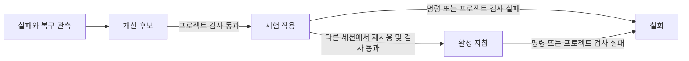

# 기억과 학습

[English](../../en/usage/memory.md) · **한국어**

<!-- date: 2026-09-07; synced_from: source and documentation at e1487a1718056b37b999d1343a1007b7e25f5c8c; English and Korean editions updated together -->

[사용 안내](index.md) · [기여자 안내](../contributing/index.md)

Neurath는 프로젝트의 맥락을 다음 Codex·Claude Code 세션으로 이어줍니다.
설치된 훅이 활성화되고 프로젝트 검사가 연결되면, 에이전트가 일상적인 작업 안에서
기억·회고·조회·검증을 처리합니다. 사용자가 별도 명령을 실행하거나 학습을 켤 필요는 없습니다.

## 저장된 작업 이어가기

> 작업 기록 내보내기를 이어서 진행해주세요. 이전 결정과 남은 일을 읽고 현재 소스와
> 대조한 뒤, 미완료 검증을 마쳐주세요.

에이전트는 같은 로컬 Git 저장소에서 관련 목표, 결정, 인계와 관측 기록을 불러옵니다.
연결된 worktree는 기억을 공유합니다. 별도로 복제한 저장소와 다른 컴퓨터는 저장소가 분리됩니다.

요청과 관측한 명령 결과는 작업 중에도 기록합니다. 에이전트는 결과, 결정, 남은 일과 교훈을
간결하게 인계합니다. 실행이 중단돼도 이미 저장한 기록은 남지만, 관측하지 못한 작업을
재구성하거나 모든 메시지와 명령 출력을 원문 그대로 보관한다고 보장하지는 않습니다.

## 필요할 때 맥락 물어보기

> 내보내기 파일 이름은 어떻게 정했나요? 아직 끝나지 않은 일도 알려주세요.

> 어떤 실행 방법이 검증됐고, 어떤 방법은 아직 시험 중인가요?

에이전트가 추가 기록을 조회하고 출처와 현재 상태를 설명합니다.
사용자가 기억 데이터베이스를 살펴볼 필요는 없습니다.
저장된 보고는 참고 자료입니다. 현재 요청과 소스가 우선하며, 과거의 권한이나 작업 공간
소유권이 새 작업으로 자동 이전되지는 않습니다.

## 경험이 다음 작업에 반영되는 과정

회고는 교훈을 출처가 있는 보고로 남깁니다. 명령 실행의 복구 방법은 더 엄격하게 다룹니다.
같은 작업에서 실패한 실행과 성공한 대안을 관측하면 지침 후보로 기록합니다.
다른 테스트가 통과했다는 사실로 원래 실패가 해결됐다고 판단하지 않습니다.

에이전트가 연결된 프로젝트 검사를 실행한 뒤 후보를 다른 세션에 시험 적용합니다.
다른 세션에서 해당 지침을 사용해 성공하고 같은 검증 조건을 통과해야 활성화합니다.
이후 실패하면 철회합니다. 출력에 성공이라고 적혀 있다는 사실은 실행 결과를 대신하지
않으며, 복사한 성공 주장만으로 지침을 승격하지 않습니다.

검사가 연결되지 않았거나 에이전트가 실행할 수 없으면 지침은 미검증 상태로 남습니다.
에이전트가 검증을 미룬 이유를 기록합니다. 같은 근거로 실패한 검사를 반복 실행하지는
않으며, 새로운 실패·복구 근거가 생기면 다시 검증할 수 있습니다.
사용자가 학습을 따로 요청하거나 활성화를 매번 승인할 필요는 없습니다.

## 동작 범위

기억은 로컬에 저장하며 커밋과 배포본에서 제외합니다. 흔한 자격 증명 패턴을 가리지만
모든 비밀을 탐지하는 기능은 아니며, 비공개 추론은 기록하지 않습니다.
공유 작업 기록으로 남길 요청에는 비밀 정보를 넣지 마세요.

과거 대화 전체를 불러오는 대신 관련 기록을 고릅니다.
학습은 지원하는 실행 전략을 바꾸며 Neurath 소스나 프로젝트 정책을 스스로 수정하지 않습니다.
추가 권한을 부여하지도 않습니다. 활성 세션 안에서 수행하며 무인 백그라운드 작업을 만들지
않습니다. 새 세션이 파일을 수정하려면 유효한 작업 공간 소유권을 확보해야 합니다.

내부 명령, 조회 한도, 저장 방식과 근거 조건은 에이전트와 기여자를 위한
[기억 실행 참조](../contributing/memory-reference.md)에 정리했습니다.

[사용 안내](index.md) · [협업](agents.md)
